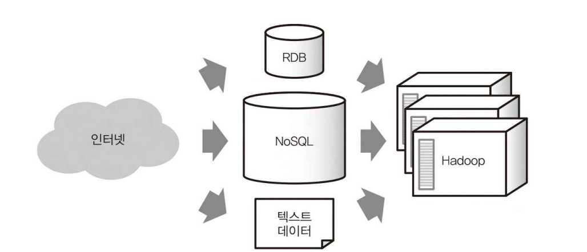

# 빅데이터를 지탱하는 기술: 1장 빅데이터의 기초 지식

<aside>
💡

빅데이터의 주변기술이 생겨난 역사적 배경 및 사고방식과 용어

</aside>

# 1-1. 빅데이터의 정착

---

<aside>
💡

**빅데이터의 주요 역사**

- ~ 2011년: Hadoop이나 NoSQL 데이터베이스 등 기반 기술의 발전
- ~ 2012: 클라우드 방식의 데이터 웨어하우스나 BI 도구의 발급
- ~ 2013: 스트림 처리나 애드 혹(AdHoc) 분석 환경의 확충
</aside>

## 1-1-1. 분산 시스템에 의한 데이터 처리의 고속화

**: 빅데이터의 취급하기 어려운 점을 극복한 두 가지 대표 기술**

- 빅데이터(big data): 시간이 지남에 따라 기하급수적으로 계속 증가하는 매우 크고 다양한 정형 데이터, 비정형 데이터, 반정형 데이터 모음
    - 출처: https://cloud.google.com/learn/what-is-big-data?hl=ko
    - 2011년 후반 ~ 2012년, 많은 기업이 데이터 처리에 분산 시스템을 도입하면서 이 단어가 대중 매체를 통해 널리 퍼지게 됨
- 빅데이터의 취급이 어려운 이유
    1. 데이터의 분석 방법을 모른다
    2. 데이터 처리에 수고와 시간이 걸린다
    - 데이터가 있어도 그 가치를 창조하지 못한다면 의미가 없고, 지식이 있어도 시간을 많이 소비한다면 할 수 있는 것은 한정된다.

### 빅데이터 기술의 요구

**: Hadoop과 NoSQL의 대두**

- 인터넷의 보급으로 전통적인 관계형 데이터베이스(RDB)로는 취급할 수 없을 만큼의 데이터가 쌓여가게 됨
    - 세계 곳곳에서 액세스되는 시스템이 증가했기 때문
    - 이때, 축적된 데이터 처리를 위한 기존과 다른 구조의 필요성 ⇒ Hadoop, NoSQL

### Hadoop

**: 다수의 컴퓨터에서 대량의 데이터 처리**

- **Hadoop: 다수의 컴퓨터에서 대량의 데이터를 처리하기 위한 시스템**
    - 분산 저장(HDFS) + 분산 처리(MapReduce) 프레임워크
        - MapReduce: 데이터를 작은 단위로 분할(split)하고, 분할된 각 데이터를 독립적으로 처리(map)한 뒤, 하나로 합치는(Reduce) 원리를 기반으로 동작하는 분산 처리 프레임워크
    - 목적: 모여진 데이터를 나중에 집계하는 것
    - 예) 전 세계 웹페이지를 모아 검색 엔진을 만들 경우, 방대한 데이터를 저장할 스토리지와 데이터를 순차적으로 처리할 수 있는 구조가 필요 → 수백, 수천 대 단위의 컴퓨터 필요 → 이를 관리하는 것이 Hadoop이라는 프레임워크
- 원래 구글에서 개발된 분산 처리 프레임워크, MapReduce 를 참고해 제작
    - 초기 Hadoop에서 MapReduce를 활용한 작업을 동작시키기 위해서는 자바 언어로 프로그래밍을 해야했음 → 누구나 간단히 사용 불가
- SQL과 같은 쿼리 언어를 Hadoop에서 실행하기 위해, Hive 개발
    - Hive: SQL 기반으로 Hadoop 실행이 가능하도록 설계한 소프트웨어
        - 사용자가 SQL 쿼리를 작성하면 내부적으로 MapReduce로 변환해 실행하는 것
    - Hive 도입을 이용해 점차 사용자를 확대
- Hadoop의 중요 역사 (~2011)
    - 2004.12: 구글에서 MapReduce 논문 발표
    - 2007.9: Hadoop의 최초 버전(0.14.1) 배포
    - 2009.5: Hive의 최초 버전(0.3.0) 배포
    - 2011.12: Hadoop 1.0.0 배포

### NoSQL 데이터베이스

**: 빈번한 읽기/쓰기 및 분산 처리가 강점**

- NoSQL: 전통적인 RDB의 제약을 제거하는 것을 목표로 한 데이터베이스의 총칭
    - 애플리케이션에서 온라인으로 접속하는 DB
    - Not Only SQL
    - RDB보다 고속의 읽기/쓰기 가능
    - 분산 처리에 뛰어남
- NoSQL DB의 종류
    - key-value store (KVS): 다수의 카와 값을 관련지어 저장
    - document store: JSON 과 같은 복잡한 데이터 구조를 저장
    - wide-column store: 여러 키를 사용하여 높은 확장성을 제공
- 주요 NoSQL DB의 역사(~2011)
    - document store:
        - 2009.8: MongoDB 1.0 배포
        - 2010.7: CouchDB 1.0 배포
    - key-value store
        - 2011.9: Riak 1.0 배포
        - 2011.12: Redis 1.0 배포
    - wide-column store
        - 2011.10: Cassandra 1.0 배포

### Hadoop과 NoSQL DB의 조합

**: 현실적인 비용으로 대규모 데이터 처리 실현**

- “NoSQL DB에 기록하고, Hadoop으로 분산 처리하기”
    - 이러한 흐름이 2011년 말까지 정착되고, 2012년부터는 일반에 널리 퍼지게 됨
    - 방대한 규모로 계속 증가하는 데이터에 대해 기존의 기술로는 불가능하거나 고가의 하드웨어가 필요한 경우에도 현실적인 비용으로 데이터를 처리하게 된 것
- Hadoop과 NoSQL의 위치 관계
    
    
    
    Hadoop과 NoSQL의 위치 관계
    
    - 인터넷에서 RDB, NoSQL, 텍스트 데이터와 같이 각각 다른 형태로 데이터가 저장되고, 그 후 모든 데이터가 Hadoop에 모여 대규모 처리가 실행됨

## 1-1-2. 분산 시스템의 비즈니스 이용 개척

**: 데이터 웨어하우스와의 공존**

- 데이터 웨어하우스(data warehouse(DWH), or 엔터프라이즈 데이터 웨어하우스(EDW))
    - 일부 기업에서는 이전부터 데이터 분석을 기반으로 하는 시스템은 데이터 웨어하우스를 도입
        
        → 매출, 고객 정보 등 오랜 기간에 걸쳐 축적된 데이터를 분석함으로써 중요한 의사결정을 위한 자료로 활용
        
- 전통적인 데이터 웨어하우스에서도 대량의 데이터 처리 가능
    - 하지만 데이터 웨어하우스를 사용 중임에도 Hadoop을  사용하는 경우 증가
    - 일부는 여러 방면에서 Hadoop보다 우수했지만, 안정적인 성능 실현을 위해서는 하드웨어와 소프트웨어가 통합된 통합 장비(appliance)로 제공되어 확장성이 좋지 않았음
    
    → 가속도적으로 늘어나는 데이터 처리는 Hadoop
    
    → 비교적 작은 데이터, 중요한 데이터만 데이터 웨어하우스
    
- 예) 야간 배치 등 심야에 대량으로 발생하는 데이터 처리에 Hadoop을 사용
    - 이때 발생하는 데이터를 집계해 다음 날 아침까지 보고서로 정리
    - 데이터양이 증가하면 배치 처리 또한 시간이 걸리기 때문에 확장성이 뛰어난 Hadoop에 데이터 처리를 맡김 (= 데이터 웨어하우스의 부하를 줄임)


Hadoop에 의한 데이터 웨어하우스의 증가

## 1-1-3. 직접 할 수 있는 데이터 분석 폭 확대

**: 클라우드 서비스와 데이터 디스커버리로 가속하는 빅데이터의 활용**

- 빅데이터의 특징: 여러 컴퓨터에 분산 처리한다
- 이전에는 분석 환경을 준비하고 관리하는 것에 많은 노력과 비용이 들었으나, 클라우드 서비스 이용 방법만 안다면 시간 단위로 필요한 자원을 손쉽게 확보하기가 가능하다
- 데이터 처리를 위한 클라우드 서비스의 역사
    - 데이터 웨어하우스
        - 2009.4: Amazon Elastic MapReduce 발표
        - 2012.10: Azure HDInsight 발표
    - 클라우드를 위한 Hadoop
        - 2010.5: 구글 BigQuery 발표
        - 2012.11: Amazon Redshift 발표

<aside>
💡

**스몰 데이터와 빅데이터의 활용**

- 스몰 데이터(small data): 기존 기술을 이용하여 취급할 수 있는 작은 데이터
    - 예) 한 대의 노트북에서 큰 부담 없이 처리할 수 있을 만큼의 데이터
    - 레코드 수: 약 수백만 ~ 수천만 건
    - 데이터양: ~ 수 GB
- 대량의 데이터를 최근에서야 처리할 수 있게 된 것, 빅데이터와 본질적인 차이는 없다
- 데이터 분석 방식은 스몰 데이터 시절부터 이미 존재하였으므로 결국은 효율의 문제
- 빅데이터 분석 기술과 스몰데이터 분석 기술 중 절대적으로 좋고 나쁜 것은 없으며, 각 데이터 기술의 특성에 따라 적절히 활용할 줄 알아야 한다!


</aside>

### 데이터 디스커버리의 기초지식

- 데이터 디스커버리(data discovery): 대화형으로 데이터를 시각화하여 가치 있는 정보를 찾으려고 하는 프로세스
    - 데이터 웨어하우스에 저장된 데이터를 시각화하려는 방법으로 인기를 끌었음
    - 2012년 경부터 사용된 용어
    - 셀프서비스용 BI 도구
- BI 도구(business intelligence tool): 예전부터 데이터 웨어하우스와 조합되어 사용된 경영자용 시각화 시스템
    - 대기업의 IT 부서에 의해 도입되는 대규모 도구
    - 셀프서비스용 BI 도구는 개인도 도입할 수 있을 정도로 단순화한 것
        
        → 점차 많은 사람이 데이터를 살펴볼 수 있게 됨
        
    
    
    
- 2013년 이후에도 빅데이터 기술은 높은 효율과 편리성 실현을 위해 계속해서 개발되고 있다
    - Apache Spark와 같은 새로운 분산 시스템 용 프레임워크가 보급됨으로써 MapReduce보다도 효율적으로 데이터 처리가 가능해짐
    - 배치 처리 뿐만 아니라 실시간 데이터 처리를 위한 시스템도 다수 만들어지고 있음
    - 대규모의 데이터 분석 업무는 기술상의 제약이 없어져 누구나 사용 가능한 주변 기술이 되었음

# 1-2. 빅데이터 시대의 데이터 분석 기반

---

빅데이터 기술이 기존의 데이터 웨어하우스와 다른 점: 다수의 분산 시스템을 조합하여 확장성이 뛰어난 데이터 처리 구조를 만든다

## 1-2-1. 빅데이터의 기술

: 분산 시스템을 활용해서 데이터를 가공해 나가는 구조

- (이 책에서 다루는) 빅데이터 기술: 분산 시스템을 활용하면서 데이터를 순차적으로 가공해 나가는 일련의 구조
    - 아래와 같이 여러 서브 시스템을 조합함으로써 실현 가능
    
    
    

### 데이터 파이프라인(data pipeline)

: 데이터 수집에서 워크플로 관리까지

- 데이터 파이프라인(data pipeline): 일반적으로 차례대로 전달해나가는 데이터로 구성된 시스템
    - 어디에서 수집하여 무엇을 실현하고 싶은 지에 따라 변화

### 데이터 수집(data transfer)

: 벌크 형과 스트리밍 형의 데이터 전송


- 데이터는 여러 장소에서 발생하며 각각 다른 형태를 가짐
    - 예) DB에 쓰인 거래처 데이터, 파일 서버에 축적된 로그 파일, 모바일 앱에서 모여진 이벤트 데이터, 임베디드 장비에서 보내진 센서 데이터 등등
- 벌크(bulk) 형: 이미 어딘가에 존재하는 데이터를 정리해 추출
    - 데이터베이스와 파일 서버 등에서 정기적으로 데이터를 수집하는 데에 사용
- 스트리밍(straming) 형: 차례차례로 생성되는 데이터를 끊임없이 계속해서 보내는 방법
    - 모바일 애플리케이션과 임베디드 장비 등에서 널리 데이터를 수집하는 데 사용

### 스트림 처리와 배치 처리


- 기존의 경우, DW에서 다루는 데이터는 주로 벌크 형
- 하지만, 빅데이터의 세계에서는 모바일 앱이 증가함에 따라 스트리밍 형이 주류가 됨 → 스트림 처리(stream processing) 구조
    - 예) 과거 30분간 취합한 데이터를 집계해 그래프를 만들 경우, 시계열 데이터베이스(time-serise database)와 같은 스트림 처리의 결과를 시계열 데이터베이스에 저장하면서 지금 상황을 즉시 알 수 있었다
    - 문제점: 스트림 처리는 장기적인 데이터 분석에는 적합하지 않음
        - 예) 지난 1년 간의 데이터를 분석하려할 경우, 분석해야 할 데이터의 양이 기하급수적으로 증가
        - + 스트림 처리는 데이터 전처리를 최소화하려는 경향 (실시간으로 데이터를 처리해야 하니까)
        
        → 실시간 데이터 처리와 장기적인 데이터 분석 결과를 하나의 시스템으로 실현하는 것은 아주 어려운 일
        
- 장기적인 데이터 분석을 위해서는 분산 시스템이 좋음 (대량 데이터 처리 및 저장에 적합)
    - 이때 필요한 것은 어느정도 정리된 데이터를 효율적으로 가공하기 위한 배치 처리(batch propcessing) 구조

### 분산 스토리지

: 객체 스토리지, NoSQL 데이터베이스


- 수집된 데이터는 분산 스토리지(distribute storage)에 저장됨
- 분산 스토리지: 여러 컴퓨터와 디스크로부터 구성된 스토리지 시스템
    - 객체 스토리지(object storage): 한 덩어리로 모인 데이터에 이름을 부여해 파일로 저장
        - 예) Amazon S3
- NoSQL 데이터베이스를 분산 스토리지로 사용 가능
    - 앱에서 많은 데이터를 읽고 쓰려면 성능 면에서 우수
    - 단, 추후에 데이터 용량을 얼마든지 늘릴 수 있는 확장성 높은 제품을 선택할 것

### 분산 데이터 처리

: 쿼리 엔진, ETL 프로세스


- 분산 데이터 처리(distribute data processing): 분산 스토리지에 저장된 데이터를 처리하기 위한 프레임워크
    - MapReduce가 사용된 부분
    - 주 역할은 나중에 분석하기 쉽도록 데이터를 가공해서 그 결과를 외부 데이터베이스에 저장하는 것
- 빅데이터를 SQL로 집계하는 방법
    1. 쿼리 엔진(query engine) 도입
        - 분산 스토리지 상의 데이터를 SQL로 집계하기 위함
        - 예) Hive, 대화형 쿼리 엔진(interactive query engine, Hive보다도 고속)
    2. 외부의 데이터 웨어하우스 제품 이용
        - 이를 위해 분산 스토리지에서 추출한 데이터를 데이터 웨어하우스에 적합한 형식으로 변환
            
            → ETL(extract-transform-load) 프로세스: 데이터를 추출하고, 그것을 가공한 후, 데이터 웨어하우스에 로드한다
            
    

### 워크플로 관리

- 전체 데이터 파이프라인 동작을 관리하기 위해 워크플로 관리(workflow management) 기술 사용
    - 매일 정해진 시간에 배치 처리를 스케줄대로 실행하고, 오류가 발생한 경우에는 관리자에게 통지하는 목적으로 사용됨
- 파이프라인이 복잡해짐에 따라 한 곳에서 모두 제어하지 않으면 전체 움직임을 파악하는 것이 어려워지며, 시스템 장애 발생 및 오류 발생 시 처리와 다시 처리하기 위한 기능을 필수적으로 만들어야 함

→ 예) Apache Airflow

### ETL과 ELT


1. ETL 프로세스: 데이터를 가공 후 저장
2. ELT 프로세스: 데이터를 저장 후 가공

## 1-2-2. 데이터 웨어하우스와 데이터 마트

**: 데이터 파이프라인의 기본형**


데이터 웨어하우스를 중심으로 하는 데이터 파이프라인

- 데이터 소스(data source): 데이터 웨어하우스 측면에서, 업무 시스템을 위한 RDB나 로그 등을 저장하는 파일 서버
- RDS: 웹 서버나 업무 시스템에서 이용
- **데이터 웨어하우스**: 대량의 데이터를 장기 보존하는 것에 최적화
    - 정리된 데이터를 한 번에 전송하는 것은 뛰어나지만, 소량의 데이터를 자주 읽고 쓰는 데는 적합 X
    - 예) 업무 시스템에서 꺼낸 데이터를 하루가 끝날 때 정리하여 쓰고, 이것을 야간 시간대에 집계해서 보고서를 작성
- ETL 프로세스: 데이터 소스에 보존된 로우 데이터(raw data, 원시 데이터)를 추출하고, 필요에 따라 가공한 후 데이터 웨어하우스에 저장하기까지의 흐름
- **데이터 마트(data mart)**: 데이터 분석과 같은 목적에 사용하는 경우, 데이터 웨어하우스에서 필요한 데이터만을 추출하여 저장한 곳
    - 데이터 마트는 BI 도구와 조합시키는 형태로 데이터를 시각화하는 데에도 사용
- 데이터 웨어하우스, 데이터 마트 모두 SQL로 데이터를 집계 → 먼저 테이블 설계를 제대로 정한 후 데이터를 투입
    - 특히 분석(시각화)를 위해 적합한 형태로 테이블을 준비해야 함
    
    ⇒ 데이터 웨어하우스를 중심으로 하는 파이프라인에서 테이블 설계와 ETL 프로세스가 중요
    

## 1-2-3. 데이터 레이크

: 데이터를 그대로 축적 

- 데이터가 커지고 복잡해짐에 따라 ETL 프로세스 자체가 복잡해짐
    - 데이터 웨어하우스에 넣을 수 없는 데이터 형태(다른 업체에서 받은 텍스트 파일, 바이너리 데이터 등) 그대로 데이터 웨어하우스에 넣을 수 없는 경우 존재
    - 우선 데이터가 있고, 이를 기반으로 테이블을 설계하는 것이 빅데이터 이기 때문
    
    ⇒ 모든 데이터를 원래의 형태로 축적해둔 뒤, 나중에 필요에 따라 가공하는 구조의 필요성 (데이터 레이크)
    
- 데이터 레이크(data lake): 여러 곳에서 흘러들어 오는 데이터를 축적하는 장소(호수에 비유)
    
    
    
    - 모든 데이터를 그대로 저장하고, 나중에 필요한 것만 꺼내서 사용
        - 미가공의 원시 데이터까지도 그대로 저장
    - 임의의 데이터를 저장할 수 있는 분산 스토리지가 데이터 레이크로 이용됨
    - 데이터 형식은 자유, 대부분 CSV 혹은 JSON 등의 범용적인 텍스트 형식 사용
- 데이터 웨어하우스를 데이터 레이크로 치환할 경우, 아래와 같이 데이터 파이프라인 구축 가능
    
    
    
    데이터 레이크를 중심으로 하는 데이터 파이프라인
    

### 데이터 레이크와 데이터 마크

: 필요한 데이터는 데이터 마트에 정리

- 데이터 레이크는 단순한 스토리지, 데이터 가공 불가
    
    → MapReduce 등의 분산 데이터 처리 기술을 활용
    
- 데이터 분석에 필요한 데이터를 가공, 집계하여 데이터 마트로 추출한 뒤, 데이터 웨어하우스의 경우처럼 데이터 분석 진행 가능

## 1-2-4. 데이터 분석 기반을 단계적으로 발전시키기

: 팀과 역할 분담, 스몰 스타트와 확장

- 데이터 분석에 필요한 기술은 다방면에 걸쳐 있어 주로 팀을 이루어 작업하며, 각각의 직무는 요구되는 지식 뿐 아니라 사용 도구도 다름
    
    
    
    - 데이터 엔지니어: 시스템의 구축 및 운용, 자동화 등을 담당
    - 데이터 분석가: 데이터에서 가치 있는 정보를 추출

### 애드 혹 분석 및 대시보드 도구


- 애드 혹 분석(ad hoc analysis): 일회성 데이터 분석
    - 수작업으로 데이터를 집계하는 방식
    - SQL 쿼리를 직접 작성해서 실행하거나 스프레드시트에서 그래프를 만드는 것 등
- 데이터 마트를 만들지 않고, 데이터 레이크와 웨어하우스에 직접 연결하는 경우가 많음
    - 실행 후 결과를 즉시 확인할 수 있는 대화형 분석 도구와 같은 작업하기 쉬운 환경 선호
    - 대시보드 도구(dashboard tool): 쿼리 실행 결과로부터 그래프를 생성
        - 수작업 데이터 분석 뿐만 아니라 정기적으로 그래프와 보고서를 만들고 싶을 때 활용
        - 일부는 데이터 마트 없이도 동작하도록 설계, 설정한 스케줄에 따라 데이터 레이크와 데이터 웨어하우스에 접속해 쿼리를 실행

### 데이터 마트와 워크플로 관리


- 복잡한 데이터 분석에서는 먼저 데이터 마트를 구축한 후, 분석하거나 시각화 하도록 함
    - 특히 시각화에 BI 도구를 사용할 경우, 집계 속도를 위해 데이터 마트가 필수적
    - 데이터 마트 구축은 배치 처리로 자동화되는 경우가 많아 그 실행 관리를 위해 워크플로 관리 도구 사용
- 워크플로 관리를 도입하는 단계가 될 경우, 분석보다는 엔지니어링 작업이 많아짐
    - 일손이 부족하지 않은 상황에서는 그다지 필요 없으나, 데이터 처리를 자동화해 장기적으로 운용해 나가기 위해서는 안정된 워크플로 관리가 필수적!

<aside>
💡

데이터 파이프라인의 큰 흐름은 변하지 않는다

- 빅데이터를 다루기 위해 다양한 도구가 있으나, 이때 어떤 도구를 선택하며 좋을지 판단하기 위해 다음 두 가지를 파악해두면 크게 문제 될 일은 없다
    1. 저장할 수 있는 데이터 용량에 제한이 없을 것
    2. 데이터를 효율적으로 추출할 수단이 있을 것
- 새로운 도구와 서비스가 계속해서 개발되고 있지만, 데이터 파이프라인 전체의 기본적인 흐름은 변하지 않음


</aside>

## 1-2-5. 데이터를 수집하는 목적

: 검색, 가공, 시각화의 세 가지 예


### 데이터 검색


- 데이터 검색: 대량의 데이터 중에서 조건에 맞는 것을 찾고 싶은 경우
    - 예) 시스템에 장애 발생 시, 그 원인을 특정하거나 고객으로부터 문의가 들어올 경우 로그를 확인하는 것
- 언제 무엇이 필요할지도 모르기 때문에 시스템 로그 및 고객의 행동 이력 등 발생하는 모든 데이터를 취득해 놓아야 함
- 데이터 검색은 신속한 검색이 중요 → 실시간 데이터 처리나 검색 엔진을 사용하여 키워드를 찾는 기능 필요

### 데이터 가공

- 데이터 가공: 업무 시스템의 일부로서 데이터 처리 결과를 이용하고 싶은 경우
    - 예) 웹사이트에서 추천 상품 제안 / 센서 데이터의 비정상적인 상태 감지 및 통보
- 목적이 명확해 필요한 데이터를 계획적으로 모아 파이프라인을 설계
- 데이터 가공에는 자동화가 필수적 → 워크플로 관리 도입
    - 꼼꼼한 테스트를 반복적으로 실행해 시스템 구축
- SQL이 아닌 프로그래밍 언어를 사용하는 경우도 존재, 이것은 분석보다는 시스템 개발 영역에 해당


### 데이터 시각화


- 데이터 시각화: 데이터를 시각적으로 봄으로써 알고 싶은 정보를 얻는 경우
    - 예) 통계 분석 소프트웨어나 BI 도구 등으로 그래프를 만들고, 이때 앞으로의 상황을 예측해 의사 결정에 도움이 되도록 하는 경우
- 데이터 시각화는 해답이 없는 시행착오의 연속
    - 임의의 분석 환경을 갖춰 여러 번 데이터 집계를 반복
    - 고속화를 위한 데이터 마트 필요
    - 집계 결과를 대시보드에 정리해 변화를 감시하고 싶은 경우에도 필요

<aside>
💡

기간계 시스템과 정보계 시스템을 분리하자

- 컴퓨터 시스템은 종종 기간계 시스템과 정보계 시스템으로 구분
- 데이터를 취급하는 시스템에서는 이 두 시스템 중 하나로 구분하여 혼합되지 않도록 해야 함
- 기간계 시스템(mission-critical system): 비즈니스 근간에 관련된 중요한 시스템
    - 정지 시, 업무가 멈추기 때문에 완벽히 테스트를 반복하고 신중히 운용해야 함
    - 실행 과정을 로그 파일이나 데이터베이스 등에 기록
        
        → 정보계 시스템이 이를 복사 (이를 통해 연결되는 것) 
        
- 정보계 시스템(information system): 사내 커뮤니케이션과 의사 결정 등을 위해 이용하는 시스템
    - 정지되어도 그 영향 범위가 제한되어 있어 비교적 엄격한 운영 정책을 갖고 있지는 않음
    - 데이터를 효율적으로 분석하기 위해서는 정보계 시스템으로 분리하는 것이 좋음
    - 기간계 시스템으로부터 복사해 온 데이터만 가공하여 분석
- 기간계 시스템 일부로 빅데이터를 통합하는 것이 아니라면 데이터 분석 시스템은 원칙적으로 정보계 시스템으로 취급!
</aside>

## 1-2-6. 확증적 데이터 분석과 탐색적 데이터 분석

- 확증적 데이터 분석(confirmatory data analysis): 일반적으로 데이터 분석이란 가설을 세우고 그것을 검증
    - 통계학적 모델링에 의한 분석
- 탐색적 데이터 분석(exploratory data analysis): 데이터를 보면서 그 의미를 읽어내려고 함
    - 데이터를 시각화하여 사람의 힘으로 그 의미를 읽음
    - *이 책에서는 데이터 탐색이라고 하고, 대화식으로 데이터를 집계하여 시각화하기 위한 환경을 만듦
        - 예) 스크립트 언어를 사용한 데이터 처리 / BI 도구를 사용한 데이터 디스커버리 등
    

# 1-3. [속성 학습] 스크립트 언어에 의한 특별 분석과 데이터 프레임

---

## 1-3-1. 데이터 처리와 스크립트 언어

: 인기 언어인 파이썬과 데이터 프레임 

- 데이터 수집 후, 바로 읽을 수 없어 데이터 전처리가 필요한 경우가 존재
    
    → 이때 스크립트 언어를 자주 사용
    
- 대표적인 스크립트 언어: R, 파이썬
- R: 통계 분석을 위해 개발된 언어. 데이터 분석 전문가 사이에서 인기
- 파이썬: 범용 스크립트 언어. 데이터 엔지니어 사이에서 인기
    - 다양한 분야의 라이브러리를 활용 가능
        - NumPy, SciPy와 같은 수치 계산용 라이브러리와 머신러닝의 프레임워크가 충실
        - R에서 사용하는 데이터 프레임의 모델을 파이썬으로 만든 라이브러리, Pandas도 많이 활용
            - pandas는 분산 시스템이 아니기 때문에 빅데이터에는 대응할 수 없는, 스몰 데이터 처리에 적합한 기술
    - 외부 시스템 API 호출 및 복잡한 문자열 데이터 전처리에 적합
    - 과학 기술 계산 분야에 오랜 기간 사용

## 1-3-2. 데이터 프레임

- 데이터 프레임(data frame): 표 형식의 데이터를 추상화한 객체
    - 예) 스프레드시트에서 하나의 시트 / 데이터베이스에 있어 하나의 테이블을 통째로 하나의 객체로 취급 것
    - 표 형식의 데이터는 가로와 세로의 2차원 배열, 즉 배열 안의 배열로 데이터 프레임을 만들 수 있음
        
        
        
    - 데이터 프레임을 사용해 스크립트 언어 안에서 데이터 가공과 집계 가능

## 1-3-3. 웹 서버의 액세스 로그의 예

: pandas 데이터 프레임으로 간단히 처리

- 웹 서버의 액세스 로그
    - 아래와 같은 데이터는 데이터 웨어하우스와 BI 도구에서 그대로 읽어 들일 수 없음
    
    ```bash
    X.X.X.X - [01/Jul/1995:00:00:01 -0400] "GET /history/apollo..." 200 6245
    X.X.X.X [01/Jul/1995:00:00:06 -0400] "GET /shuttle/countd..." 200 3985
    ```
    
1. 정규식을 사용해 파싱 → 파일의 각 행을 분해하여 컬럼 명을 지정
    
    
    

- pandas의 데이터 프레임은 메모리상에서 전개 → 스몰 데이터의 경우, 빠른 속도로 데이터 처리 가능
1. 표준적인 시간 포맷으로 변환
    
    
    
2. CSV 파일로 저장 → BI 도구로 읽어 들이기
    
    
    

### 데이터 전처리에서 사용할 수 있는 pandas의 함수

- ~~ix: 조건에 일치하는 데이터만을 검색한다~~. ← 최신 버전에서 사라짐
    - iloc 함수(레이블 기반)와 loc(위치 기반) 함수를 사용해 조건에 일치하는 데이터를 탐색
- drop: 지정한 행(혹은 칼럼)을 삭제한다.
- rename: 인덱스 값(혹은 칼럼명)을 변경한다.
- dropna: 값이 없는 행(혹은 칼럼명)을 제외한다.
- fillna: 값이 없는 셀을 지정한 값으로 치환한다.
- apply: 각 칼럼(혹은 각 행)에 함수를 적용한다.

## 1-3-3. 시계열 데이터를 대화식으로 집계하기

: 데이터 프레임을 그대로 사용한 데이터 집계

- pandas에는 시계열 데이터(time-series) 취급을 위한 다양한 기능 존재
- CSV 파일을 데이터 프레임으로 로드한 뒤, 시간을 인덱스로 지정해 데이터를 집계하는 분석 과정
    
    
    

## 1-3-4. SQL의 결과를 데이터 프레임으로 활용하기

- 데이터 프레임은 표 형식의 모든 데이터를 다룰 수 있음
1. SQLite 서버에 CSV 파일로부터 데이터를 로드해 테이블에 저장
    
    
    
2. SQLAlchemy 라이브러리를 활용해 SQL로 실행한 과정 및 결과
    
    
    

# 1-4. BI 도구와 모니터링

---

## 1-4-1. 스프레드시트에 의한 모니터링

: 프로젝트의 현재 상황 파악하기 

- 모니터링(monitoring): 애드 혹 분석보다 계획적으로 데이터의 변화를 추적해 나가는 것
    - 애드 혹 분석은 데이터를 살펴보고 싶을 때 이용
    - 예) 1개월 또는 1주일마다 정기적인 일정으로 동일한 집계를 반복하여 그 추이를 점점 관측하다 보면 무슨 일이 일어나고 있는지 알 수 있음
- 데이터는 다음 행동을 결정하기 위한 재료로서 살펴볼 수 있음
    - 현재 상황을 파악하고, 비정상적인 상태를 확인 및 조처할 수 있는 도구
    - 예) 프로젝트의 수입과 지출을 모니터링하는 것
        - 월간 수입 지출 보고서만을 보면 총 수입은 늘고 있으나, 이익은 오히려 감소하는 추이를 확인 가능
            
            
            
            - 이때, 지출 내역을 보면 상품 구매가 증가하고 있기 때문에 이익 없이 매출만 증가하고 있음을 확인 가능
            
            
            
            → 이처럼 데이터의 변화를 모니터링하고 예상과 다른 움직임이 있는 경우 사람의 판단 하에 상황을 파악하고 얻은 인사이트에 따라 세부 사항을 확인하며 데이터에 대해 깊이 있게 이해하는 과정을 통해 현 상황을 알아낼 수 있게 된다
            

## 1-4-2. 데이터에 근거한 의사 결정

: KPI 모니터링

- KPI(key performance indicator): 프로젝트의 현황을 파악하기 위한 숫자로 업계마다 중요한 지표를 뜻함
    - 웹 서비스의 KPI
        
        
        
    - 온라인 광고의 KPI
        
        
        
- KPI 모니터링에서 의식하고 싶은 것: “그것이 행동 가능(actionable)한 것인가?”
    - 그 결과에 따라 다음 행동이 결정될 지 여부가 결정됨 → 행동 가능한 숫자를 만들기 위한 기준 필요
    - 데이터 기반(data-driven)의사 결정: 객관적인 데이터를 근거하여 판단하는 것

### 월간 보고서

: 스프레드시트에 의한 보고서 작성과 그 한계

- 예를 들어, 아래와 같이 목표와 실적을 모니터링하기 위해 한 달에 한 번 월간 보고서를 만들 경우 전통적으로 사용되는 도구는 스프레드시트
    
    
    
- 스프레드시트의 어려운 것
    1. 보고서에 입력할 숫자는 미리 계산해야 함
        - 워크플로와 데이터 웨어하우스에서 진행되는 배치 처리를 통해 자동화 가능
    2. 상세한 내역을 조사할 수 있게 하는 것
        - 위 예시에서 상품별 매출과 원가를 바로 확인할 수 있어야 변화의 원인에 도달할 수 있음
            
            → 이를 위해 BI 도구를 사용 
            

## 1-4-3. 변화를 파악하고 세부 사항을 이해하기

: BI 도구의 활용

- 무료로 사용할 수 있는 BI 도구 (유료 옵션 존재)
    - **Tableau Public**
    - Microsoft Power BI
    - ~~Google Data Studio~~ → **Looker Studio**
    - ~~Quick Sencse~~ → **Qlik Sencse** (현재는 체험 기간 동안만 무료)

### 모니터링의 기본 전량 및 BI 도구

: 정기적인 보고서에 의한 변화 파악과 재집계

- 데이터의 움직임을 모니터링하기 위한 기본 전략:
    - 정기적인 보고를 통해 중요한 변화 파악
    - 어떠한 이슈가 보이는 경우, 원인 파악을 위한 데이터로 돌아와 재집계를 반복하며 자세히 살펴보는 것
    - BI 도구는 이를 위한 소프트웨어

## 1-4-4. 수작업과 자동화해야 할 것의 경계를 판별하기

(파일 기준 67페이지, 페이지 기준 39)

- BI 도구로 원하는 화면을 만들기 위해서는 그에 맞게 정리된 데이터가 있어야 하지만, 처음부터 그런 경우는 거의 없다. 제대로 설계된 데이터가 없다면, 자신의 생각과 딱 맞는 화면을 만들 수 없다는 점 → BI 도구의 한계

### 수작업으로 할 수 있는 것은 수작업으로 해두기

- 대기업의 경우, 그 방문가가 데이터 웨어하우스의 테이블을 설계하고, 보고서 작성에 필요한 데이터를 배치 처리로 집계해 BI 도구의 화면을 만듦
    
    → 전문가가 아닌 경우 힘든 작업 
    
- 자신이 알고 싶은 정보를 자신만 보고자 하는 경우 → 외형 고려 없이 이미 있는 데이터로 만들기
- 일관성 높은 것이 필요한 경우 → 스프레드시트에서 수동으로

### 자동화하려는 경우에는 데이터 마트를 만든다

- 자주 업데이트되는 데이터, 다수의 사람에게 공유되는 데이터 등 중요성이 높은 경우 차례로 자동화해 나감
- 데이터를 SQL or 스크립트를 사용해 생성 → BI 도구
- 구체적인 방법:
    1. BI 도구에서 직접 데이터 소스에 접속하기
        - 장점: 간단한 시스템 구성
        - 단점: BI 도구에서 지원하지 않는 데이터 소스에는 접속 불가
    2. 데이터 마트를 준비하고, 그것을 BI 도구로부터 열기
        - 장점: 어떤 테이블이라도 자유롭게 만들 수 있음
        - 단점: 데이터 마트의 설치 및 운영에 시간 소요
    3. 웹 방식의 BI 도구를 도입하여 CSV 파일을 업로드하기
        - 장점: 스크립트로 자유롭게 데이터 가공 가능
        - 단점: 데이터의 생성 및 업로드에 프로그래밍이 필요