# 1장. 빅데이터의 기초 지식

### 머리말

빅데이터라는 단어가 근래 태크 분야에서 관심 받기 시작했다. 빅데이터 기술이 관심을 받는 이유는 하드웨어와 통신 속도의 발전으로 부터 파생되었다.(GPU의 급속도의 발전)

책에서는 빅데이터 시스템 구성에서부터 자동화까지의 구성적인 내용을 다루고 있다.

### 이책에 대하여

책에서는 데이터를 어떻게 사용하는지 보다 데이터를 어떻게 관리하고 구축하는지 “엔지니어링”에 대해 초점을 맞추고 있다.

## 1-1 배경 빅데이터의 정착

Hadoop은 “다수의 컴퓨터에서 대량의 데이터를 처리하기”위한 시스템이다.

Hadoop은 구글에서 개발한 MapReduce를 동작시키기 위해 자바로 운영되었다.

이후에 HIVE가 개발되어 쿼리를 통해 Hadoop을 실행할 수 있었다.

https://yscho03.tistory.com/79 - hive를 mysql 와 같은 쿼리로 handling할 수 있는 것을 확인할 수 있다.

Nosql은 RDB에 비교했을때 상대적으로 제악은 제거한 데이터베이스의 형태로 대표적으로 키밸류, 도큐먼트 형식으로 데이터를 저장한다.

Nosql과 RDB를 비교할때, Nosql가 고속 집계및 scale out에 장점을 가지고 있다고 알려져 있는데, 그 이유에 대해 추측을 해보면, 일단 RDB에서 트랙잭션을 강하게 지킨다. Mysql에서 MVCC에서 볼수 있다. 상대적으로 RDB는 트랜잭션을 다소 느슨하게 사용하거나 아에 트랜잭션이 없다.

또한 RDB와 NOSQL은 쓰레딩 모델이 다르다.

RDB은 대부분 멀티쓰레딩을 채택하고 있는 반면, NOSQL은 싱글쓰레딩을 채택하고 있다.

여기서 scaleout하게 된다면 각각의 node에서 worker들이 내부 쿼리를 실행하고 비동기적으로 싱글쓰레드가 받는 형식으로 구현될 것이다. 상당히 성능적으로 우세한 아키텍쳐이다.

그와 달리 멀티 쓰레딩을 채택하고 있는 RDB는 scaleout하는 경우 분산 처리를 하기 어려워진다. 병목현상이 나타날 수 있다.

이외에 JOIN 연산에 대해서 scale out에서 실행하는 것도 성능 문제를 예상해볼 수 있다.

요약하면

1. 느슨한 트랙잭션 + 싱글쓰레딩이라는 이유로 NOSQL이 빠르다고 알려져 있다고 생각
2. 그러나 여기서 빠르다는 것은 scale out을 했을때 직접적으로 체감할 수 있을 것이라고 추측
3. 싱글 노드에서의 큰 차이를 확인하기 어려움
4. 1,2,3은 모두 추측

하드웨어가 발달함에 따라 hadoop + nosql 조합으로 nosql에는 기록하고 hadoop으로 분산 처리하는 형태로 빅데이터를 관리하였다.

데이터 웨어하우스를 도입하는 경우도 생겨났다.(데이터 웨어하우스는 여러 분산된 데이터를 모두 관리할 수 있는 클러스터로 이해했음)

데이터 웨어하우스는 Hadoop보다 상대적으로 비용이 높다.

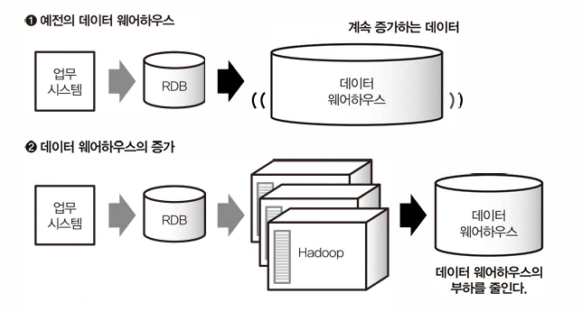

클라우드가 발달하면서 하드웨어에 의존성이 있는 데이터 웨어하우스를 구축하기 쉬워졌다.

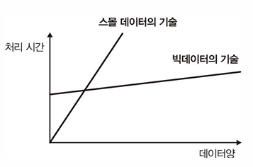

빅데이터 이전에 스몰데이터 기술도 중요하다. 결국 우리가 만나는 빅데이터는 스몰 데이터의 집합이다.

데이터 디스커버리라는 웨어하우스 시각화 기술이 등장하였다.

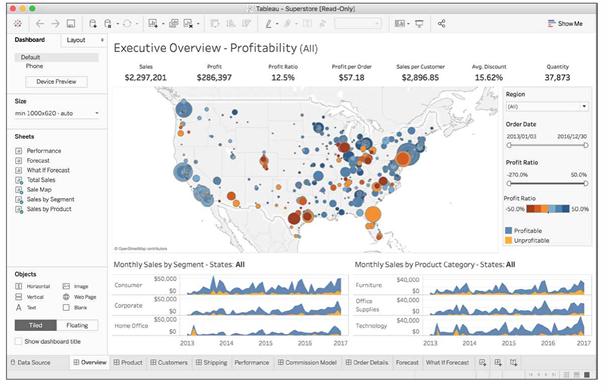

데이터 디스커버리란 ‘대화형으로 데이터를 시각화하여 가치 있는 정보를찾으려고 하는 프로세스”이다 

## 1-2 빅데이터 시대의 데이터 분석 기반

데이터 파이프라인이란 차례대로 전달하는 데이터 시스템이다.

데이터 수집: 벌크형, 스트링 형 데이터를 전송한다.


벌크형은 이미 존재하는 데이터를 정리, 스트리밍형은 계속 생성되는 데이터를 보내는 방법이다.

데이터의 형식 이외에도 데이터의 처리 방식에 따라 분류할 수 있다.

스트림 처리: 과거 30분간 취합한 데이터를 집계하는 경우 시계열 데이터 베이스를 사용한다. 스트림 처리의 결과를 시계열 데이터 베이스에 저장하여 하용한다.

배치처리는 장기적인 데이터 분석에 사용하는 방법

데이터는 분산 스토리지형태로 저장한다.(분산 스토리지의 이점은 설명을 제외한다) 데이터를 저장하는 방법으로는 객체 스토리지, NoSQL  다양한 형태를 사용한다.

분산 스토리지에 데이터를 처리하기 위해서는 분산 데이터 처리 프레임워크를 사용해야한다 MapReduce가 대표적이다. 

SQL은 데이터 집계에 사용되는데 분산 스토리지 대상의 SQL을 사용하기 위한 쿼리엔진이 필요하다.(HIVE가 예시)

외부의 웨어하우스 제품을 사용하는 방법도있다. 이를 위해서 제품에서 요구되는 데이터 형태고 가공하여 적재하는 일련의 과정은 ETL이라고 한다.

데이터 파이프라인을 동작을 관리하기 위해서는 워크플로를 통해 스케줄링한다.

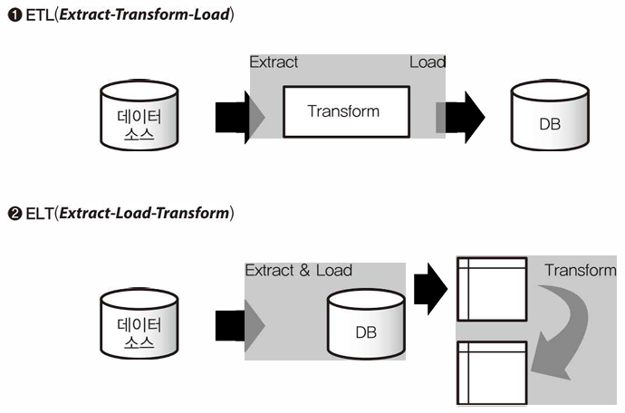

데이터 웨어하우스는 웹서버나 업무 시스템에 이용되는 RDB와 달리 데이터 장기 보존에 목적이 있다.

따라서 빈번한 소량의 읽기 쓰기 연산에 적합하지 않다.

웨어하우스에서 데이터 소스라고 부르는 원시 데이터를 본인에게 저장하기 까지의 과정이 ETL이자 ETL 프로세스라고 한다.

웨어하우스는 데이터에 대한 전역 접근이 일어나기 때문에 부하가 발생하기 때문에 빈번한 접근이 필요한 데이터는 데이터 마트를 구축하여 사용한다.(시각화도 이에 해당한다)

웨어하우스로 구축할 수 없는 경우가 있다.(정확하게 어떤 상황인지는 모르겠다)

이러한 경우 데이터 레이크에 데이터를 저장한다.

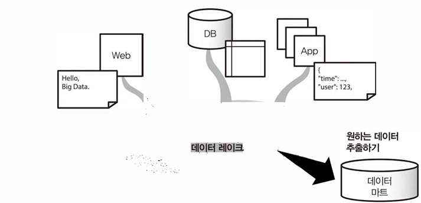

이해한 바로는 데이터 레이크 - 데이터 웨어하우스 - 데이터 마트 순으로 갈수록 데이터의 정제 수준이 올라가고, 크기도 작아지며, 좋은 성능을 가져야한다.

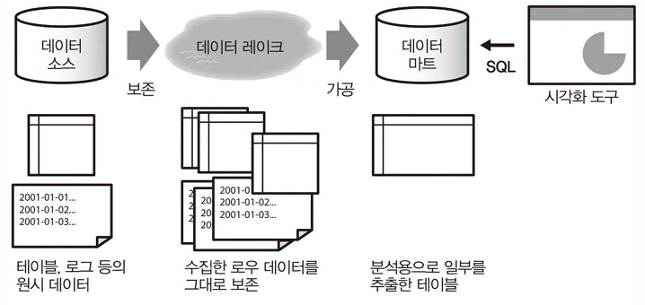

직무 별로 다루는 기술의 경계를 생각해본다면 다음과 같다

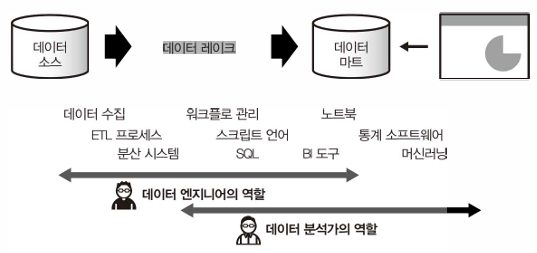

애드 혹 분석: 일회성 데이터 분석,수작업 (우리가 직접 SQL을 날리면서 확인하는 것?)


데이터를 수집하는 목적으로는 데이터 검색(데이터 자체를 모으기 위함), 데이터 가공(데이터를 사용할 수 있도록 가공), 데이터 시각화(유저 차원에서 데이터 모니터링) 인데 책에서는 데이터 시각화을 목적으로 가지고 간다.

공부하고 있는 학부생입장에서는 데이터 검색 → 데이터 가공 → 데이터 시각화 순으로 중요하다고 느껴지는데, 백엔드 개발자로 비즈니스 로직에 사용될 데이터를 구축하는 것이 일단 쉽지 않고, 데이터 가공은 상대적으로 검색보다는 난이도가 낮다.(AI쪽은 모르겠는데 대부분 검색한 데이터를 반환해주는 선에서 끝나기 때문에) 데이터 시각화또한 비슷한 이유로 난이도가 낮음

## 1-3 스크립트 언어에 의한 특별 분석과 데이터 프레임

데이터 프레임 이란 파이썬에서 사용하는 데이터 추상화 객체이다.

데이블을 객체에 바인딩 할 수 있다. 데이터 프레임은 Spark에서도 사용한다.

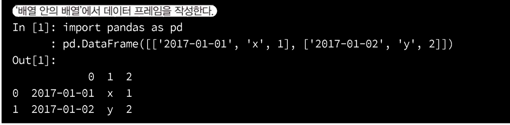

## 1-4 BI 도구와 모니터링

에드혹 분석,모니터링에서는 주로KPI라는 지표를 사용한다.

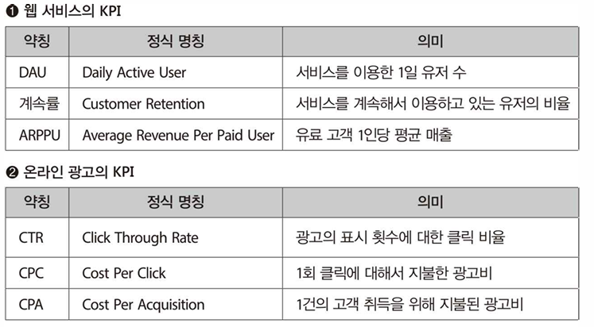

BI 도구로는 다음과 같은 것들이 있다.

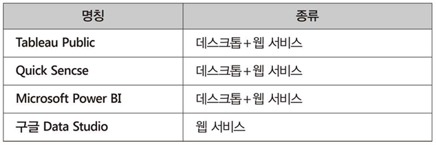

# 2장 빅데이터의 탐색

## 2-1 크로스 집계의 기본

**크로스 테이블**이란 컬럼과 행으로 구성된 양방향 테이블이다.

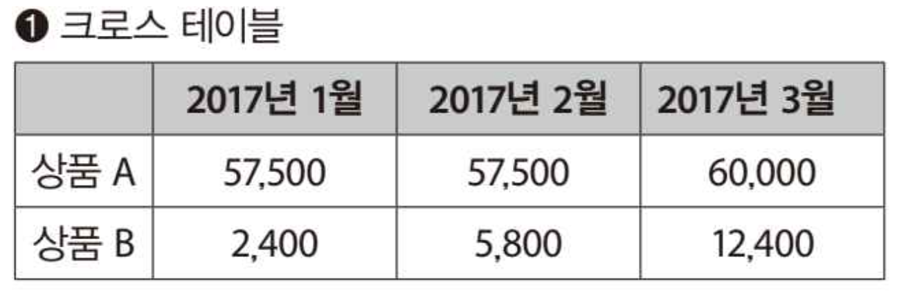

크로스 테이블은 사람들이 보기 편한 보고서이지만, 데이터베이스에서는 다루기 어려운 데이터 형식이다. 열을 늘리는 것은 간단한 작업이 아니기 때문이다. 따라서 보고서 데이터는 행방향으로만 증가하는 **트렌잭션 테이블**을 사용한다.

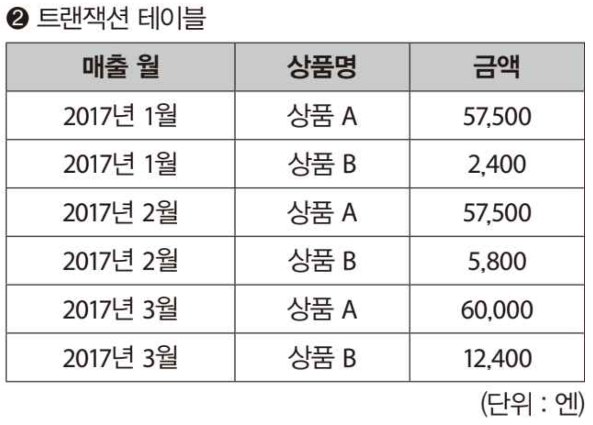

**트랜잭션 테이블**에서 **크로스 테이블**로 변환하는 과정을 **크로스 집계**라고 한다.

피벗 테이블에 의한 크로스 집계는 간편하지만, 데이터 양이 너뭄 많으면 처리할 수 없다. BI 도구와 pandas라면 수백만 레코드는 집계할 수 있지만, 그 이상이 되면 너무 느려져서 쓸 수가 없다. 대량의 데이터를 크로스 집계하려면 SQL을 사용하여 데이터 집계 함수를 고려할 필요가 있다.

```sql
SELECT date_trunc('month',"매출일")::DATE AS "매출일".
                "점포 ID",
                "상품 ID",
                "고객 ID",
                sum("금액") AS "금액"
FROM "판매 이력"
GROUP BY 1,2,3,4
```

SQL 결과로는 트랜잭션 테이블을 받을 수 있다. 이를 크로스 집계함으로써 임의의 크로스 테이블을 얻을 수 있다.

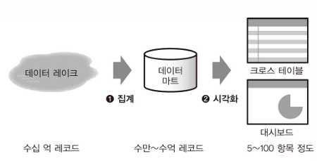

## 2-2 열지향 스토리지에 의한 고속화

메모리가 버틸수 없는 데이터 처리를 하는경우에 대기시간을 고려해야한다

천만 레코드기준 5GB으로(하나가 500B) RDB가 버틸 수 있는 수준이다. 그이상으로는 db IO 성능이 급격하게 저하된다.

이러한 문제를 해결하고자 압축과 분산을 통해 고속화를 지원할 수 있다.

데이터를 가능한 한 작게 압축하여 여러 디스크에 분산을 통해 데이터 로드 지연시간을 확보한다.

분산된 데이터를 읽어 들이려면 멀티 코어를 활용하면서 디스크 I/O를 병렬 처리하는것이 좋은데 이러한 아키텍쳐를 MPP(대규모 병렬처리)라고 한다. Redshift, BigQuery가 지원한다.

데이터는 행 지향 데이터베이스에서 사용된다. 열 지향 데이터베이스는 칼럼 단위의 집계에 최적화 되어 있다. (높은 확률로 전제는 모든 데이터에 대한 접근하는 로직일 경우)

데이터 처리 성능에는 두 종류의 숫자로 표시된다. 하나는 “일정 시간에 처리할 수 있는 데이터의 양(처리량)” 과 다른 하나는 “데이터 처리가 끝날 때까지 대기 시간(지연시간)”이다.

그러면 처리량이 높으면 무조건 좋다고 할 수 있을까? → 그건 아니다. 일부 시스테에서는 높은 처리량을 제공함에 따라 지연 시간도 커지기 때문에 애드 혹 분석에 적합하지 않다.

또는 지연시간이 작음에 따라 처리량의 감소되는 시스템도 있다.

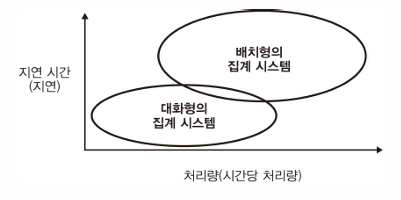
### 행 지향 데이터베이스

해 지향 데이터베이스에는 테이블의 각 행을 하나의 덩어리로 디스크에 저장한다. 새 레코드를 추가할 때 파일의 끝에 데이터를 쓸 뿐이므로 빠르게 추가 할 수 있다. 대량의 트랜잭션을 지연 없이 처리하기 위해 데이터 추가를 지원하는 것이 행 지향 데이터베이스의 특징이다.

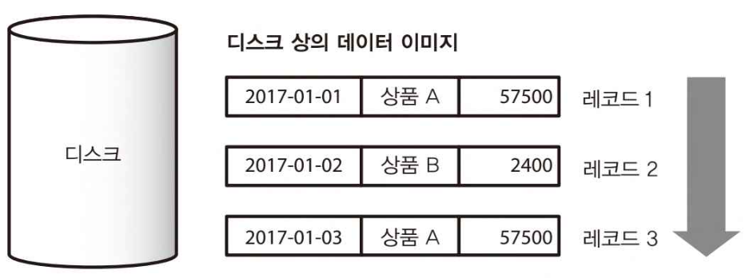
### 열 지향 데이터베이스

데이터 분석에는 종종 일부 칼럼만이 집계 대상이 된다. 행 지향 데이터베이스에서는 레코드 단위로 데이터를 저장되어 있으므로 필요 없는 열까지 디스크로부터 로드된다.

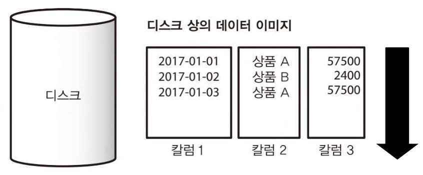

한편, 열 지향 데이터베이스에서 데이터를 미리 칼럼 단위로 정리해 둠으로써 필요한 칼럼만을 로드하여 디스크 I/O를 줄인다.

열 지향 데이터베이스는 데이터의 압축 효율도 우수하다. 같은 칼럼에는 종종 유사한 데이터가 나열된다.

### MPP에서 쿼리 실행 과정

행 지향 데이터베이스에서는 하나의 쿼리를 하나의 스레드에서 실행된다. 많은 쿼리를 동시에 실행함으로써 여러 개의 CPU 코어를 활용할 수 있지만, 그래도 개별 쿼리가 분산 처리되는 것은 아니다. 행 지향 데이터베이스의 경우, 각 쿼리는 충분히 짧은 시간에 끝나는 것으로 생각하므로, 하나의 쿼리를 분산 처리하는 상황은 가정하지 않는다.

반면, 열 지향 데이터베이스에서는 디스크에서 대량의 데이터를 읽기 때문에 아무래도 1번의 쿼리 실행시간이 길어진다. 또한 압축된 데이터의 전개등으로 CPU 리소스를 필요로 하모르로 멀티 코어를 활용하여 고속화 하는 것이 유리하다.

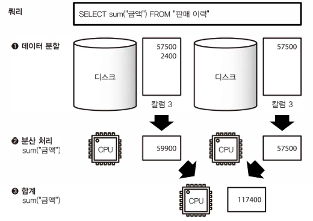

MPP에서는 하나의 쿼리를 다수의 작은 태스크로 분해하고 이를 가능한 병렬로 실행한다. 예를 들어 1억 레코드로 이루어진 테이블의 합계를 계산하기 위해 그것을 10만 레코드로 구분하여 1000개의 태스크로 나누는 것이다. 각 태스크는 각각 독립적으로 10만 레코드의 합계를 집계해 마지막 모든 결과를 모아 총합계를 계산한다.

수억 레코드를 초과하는 데이터 마트의 지연을 작게 유지하기 위해서는 데이터를 열 지향의 스토리지 형식으로 저장해야 한다.


## 2-3 애드 혹 분석과 시각화 도구

일반적으로 데이터 마트에 테이블을 생성하여 해당 테이블에서 여러 대시보드를 생성한다.


## 2-4 데이터 마트의 기본구조

BI 도구에서 대화형으로 데이터를 참고하려고 하면, 시각화에 필요한 정보만을 모은 데이터 마트가 필수적이다.

BI도구에 있어서 핵심적인 개념 중 하나로 OLAP는 데이터 집계를 효율화하는 접근중 하나이다. 일반적으로 업무 시스템에 있어서 RDB는 표형식으로 모델링된 데이터를 SQL로 집계한다. 한편 OLAP에서는 “다차원 모델”의 데이터 구조를 “MDX”동의 쿼리 언어로 집계한다. 그것을 그로스 집계하는 구조가 OLAP이다.

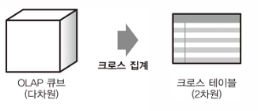

트랜잭션: 시간과 함께 생성되는 데이터를 기록한 것

마스터: 트랜잭션이 참고되는 각종정보

데이터 분석의 경우 아래와 같이 정규환 관계형 모델에서 출발해서 그와는 반대의 작업을 실행한다.

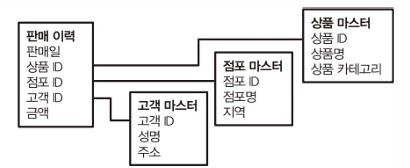
팩트 테이블: 데이터 웨어하우스의 세계에서는 트랜잭션처럼 사실이 기록된 것

디멘전 테이블: 팩트 테이블에 참고되는 마스터 데이터

데이터 마트를 만들때는 팩트 테이블을 중심으로 여러 디멘전 테이블을 결합하는 것이 좋다. 여러 테이블 결합 방식이 있다.

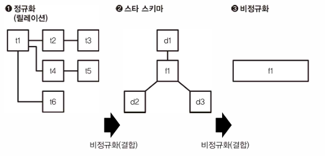