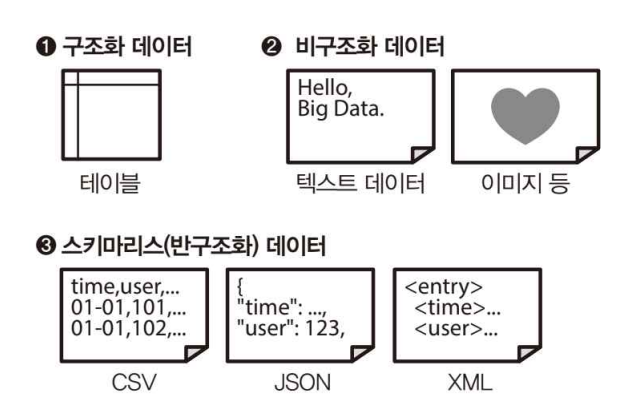
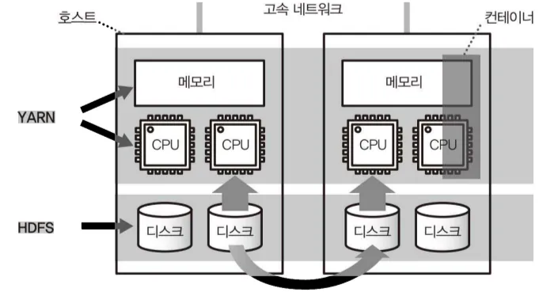

# 3.1. 대규모 분산 처리의 프레임워크

---

## 3.1.2. 구조화 데이터와 비구조화 데이터

- 스키마(schema): 데이터 테이블에서 정의한 칼럼 명, 데이터형, 테이블 간 관계와 같은 데이터의 구조



- 구조화된 데이터 = 정형 데이터(structured data): 스키마가 명확하게 정의된 데이터
    - SQL로 데이터 집계 가능
    - 데이터 웨어하우스에서 데이터를 저장하는 방식
    - 예) 테이블
- 비구조화 데이터 = 비정형 데이터(unstructured data): 스키마가 없는 데이터
    - SQL로 데이터 집계 불가능
    - 예) 이미지, 영상, 텍스트 등
- 스키마리스 데이터(schemaless data): 서식은 정해져 있지만, 칼럼 수, 데이터형이 명확하지 않은 데이터
    - 예) CSV, JSON, XML
    - 일부 NoSQL 데이터베이스, 데이터 레이크에서 처리 가능
    - 반구조화 데이터 = 반정형 데이터(semi-structured data): 명시적으로 스키마를 정하는 것이 가능하지만, 테이블보다는 유연한 데이터
        - 명시적으로 스키마를 정하기가 가능하기 때문에 모든 JSON, XML이 스키마리스라는 것은 XX, 반정형 데이터라는 표현이 더욱 정확함

### 데이터 구조화의 파이프라인


- 각 데이터 소스에서 수집된 데이터는 분산 스토리지에 보존
    - 예) 웹 서버 로그 파일, 업무용 데이터베이스에서 추출한 마스터 데이터 등…
- 이때, 주로 비구조화 데이터 혹은 스키마리스 데이터가 보존되어 SQL로 집계할 수 없음

→ 구조화된 데이터(테이블)로 변환해 열 지향 스토리지에 저장 (데이터 마트 X)

### 열 지향 스토리지의 작성

- Hadoop은 사용자가 직접 열 지향 스토리지의 형식, 쿼리 엔진 등을 선택하며 시스템을 구성
- Hadoop에서 사용할 수 있는 열 지향 스토리지
    - Apache ORC: 구조화 데이터를 위한 열 지향 스토리지
        - 처음에 스키마를 정한 후 데이터를 저장
    - Apache Parquet: 스키마리스에 가까운 데이터 구조
        - JSON과 같은 스키마리스 데이터도 그대로 저장 가능

## 3.1.2. Hadoop

### Hadoop의 역사

- 2003: Nutch 프로젝트 발족
    - 원래 Hadoop은 오픈 소스의 웹 크롤러인 Nutch를 위한 분산 파일 시스템으로 개발 시작
- 2004: Google MapReduce 논문
- 2006: Apache Hadoop 프로젝트 발족
    - 단일 프로젝트로 독립
- 2011: Apache Hadoop 1.0.0 배포
- 2013: Apache Hadoop 2.2.0 배포 (YARN 대응)
- 2014: Apache Spark 1.0.0 배포
- 2016: Apache Flink 1.0.0 배포
- 2016: Apache Mesos 1.0.0 배포

### 분산 시스템의 구성 요소


- Hadoop의 기본 구성 요소
    - 분산 파일 시스템(distributed file system): HDFS(Hadoop Distributed File System)
    - 리소스 관리자(resource manager): YARN(Yet Another Resource)
    - 분산 데이터 처리(distributed data processing): MapReduce
    - 그 외 프로젝트는 독립적으로 개발되어 Hadoop을 이용한 분산 애플리케이션으로 동작
- 다양한 소프트웨어 중 자신에게 맞는 것을 선택하고 조합해 시스템을 구성하는 것

### 분산 파일 시스템과 리소스 관리자 (HDFS, YARN)



- HDFS: Hadoop에서 처리되는 데이터 대부분을 저장
    - 다수의 컴퓨터에 파일을 복사하여 중복성을 높임
- YARN: 애플리케이션이 사용하는 CPU 코어, 메모리 등 계산 리소스를 컨테이너 단위로 관리
    - Hadoop에서 분산 애플리케이션 실행 → YARN이 클러스터 전체의 부하를 보고 비어 있는 호스트부터 컨테이너를 할당
        - YARN의 컨테이너는 애플리케이션 수준의 기술 (어떤 호스트에서 어떤 프로세스를 실행시킬 것인지), Docker의 컨테이너는 OS 수준의 가상화 기술
    - 사용 가능한 리소스의 상한이 존재하기 때문에 리소스 쟁탈이 발생 가능 → 리소스 관리자가 우선순위를 부여해 리소스 낭비 없이 데이터 처리가 가능하도록 함

### 분산 데이터 처리 및 쿼리 엔진

- MapReduce: 데이터 처리를 위해 YARN 상에서 동작하는 분산 애플리케이션의 일종
    - 자바 프로그램 실행이 가능해 비구조화 데이터를 가공하는 것에 적합
    - 대량의 데이터를 배치 처리하기 위한 시스템
- Apache Hive: 쿼리를 MapReduce 프로그램으로 자동 변환하는 소프트웨어로, SQL 등의 쿼리 언어에 의한 데이터 집계를 위한 쿼리 엔진
    - 초기에는 MapReduce에 의존
- MapReduce는 데이터 처리의 스테이지가 바뀔 때, HDFS 디스크에 중간 데이터를 저장하고 YARN 상에 다시 꺼내오는 대기 시간이 있어 애드 혹 쿼리와 같이 소량의 데이터를 처리하기에는 부적합


### Hive on Tez


- Apache Tez는 기존의 MapReduce의 몇 가지 단점을 해소하며 Hive 가속화를 목적으로 개발
- MapReduce는 스테이지가 끝날 때까지 다음 처리를 진행할 수 없는 완료 대기가 존재
    
    → Tez는 종료를 기다리지 않고 처리가 끝난 후 데이터를 후속 처리에 바로 전달하며 실행 시간을 단축
    
- Hive on Tez → 현재의 Hive
- Hive on MR → 예전 Hive

### 대화형 쿼리 엔진


- 대화형 쿼리 실행만 전문으로 하는 쿼리 엔진: Apache Impala, Presto
    - 대화형 쿼리 엔진: 순간 최대 속도를 높이기 위해 모든 오버헤드를 제거, 사용할 수 있는 리소스를 최대한 활용함
    - SQL 실행 특화
    - 범용적인 리소스 관리자 사용 X
    - MPP DB처럼 멀티 코어를 활용해 가능한 한 많은 데이터 처리를 병렬화 → 고속화 실현
- MapReduce, Tex: 장시간의 배치 처리를 가정해 한정된 리소스를 유효하게 활용하도록 설계
- 목적에 따른 쿼리 엔진 선택
    - 대량의 비구조화 데이터를 가공하는 무거운 배치 처리 → Hive (높은 처리랑으로 리소스 활용 가능)
    - 배치 처리 후 완성된 구조화 데이터를 대화식으로 집계 → Impala, Presto (지연이 적음)
- SQL-on-Hadoop: Hadoop의 다수의 쿼리 엔진의 총칭

## 3.1.3. Spark


- Apache Spark: 대량의 메모리를 활용하여 고속 데이터 처리를 실현
    - 디스크만 사용하는 MapReduce가 개발된 시점과 달리 최근에는 메모리 양이 증가함에 따라, “가능한 한 많은 데이터를 메모리상에 올린 상태로 두고 디스크에는 아무것도 기록하지 않는다”
    - 컴퓨터 비정상 종료 후 중간 데이터가 사라지더라도 처리를 다시 시도해서 잃어버린 데이터를 다시 만들면 됨
- Hadoop이 아닌 MapReduce를 대체
    - HDFS, YARN 등은 그대로 사용 가능
    - Hadoop을 이용하지 않아도 됨
    - 또 다른 분산 스토리지와 분산 데이터베이스를 도입하는 것도 가능
- 실행은 자바 런타임이 필요하지만, Spark 상에서 실행되는 데이터 처리는 스크립트 언어 사용 가능
    - 자바, 스칼라, 파이썬, R 언어
- Spark SQL: Spark에서 SQL로 쿼리 실행 가능
- Spark Streaming Spark에서 스트림 처리 수행 가능

→ 대규모 배치 처리 뿐만 아니라 SQL에 의한 대화형 쿼리 실행과 스트림 처리까지 널리 이용 가능

# 3.2. 쿼리 엔진

---

## 3.2.1 데이터 마트 구축의 파이프라인


1. Hive를 사용해 분산 스토리지에 저장된 데이터를 구조화해 열 지향 스토리지 형식으로 저장
2. Presto를 사용해 구조화 데이터를 결합, 집계하고 비정규화 테이블로 데이터 마트에 내보냄
- Hive 메타 스토어(Hive Metastore): Hive에서 만든 각 테이블의 정보가 저장됨
    - Hive 뿐만 아니라 SQL-on-Hadoop의 쿼리 엔진에서도 공통의 테이블 정보로 참고

## 3.2.2. Hive에 의한 구조화 데이터 작성

### CSV 파일을 외부 테이블로 정의해 집계


- `CREATE EXTERNAL TABLE` 로 CSV 파일에 대한 외부 테이블을 정의
    - Hive를 비롯한 SQL-on-Hadoop의 쿼리 엔진은 데이터를 내부로 가져오지 않아도 텍스트 파일을 그대로 집계 가능


- 쿼리 실행 시, 외부 테이블로 지정한 경로제 포함된 모든 CSV 파일이 로드되어 집계됨
- 위 쿼리 실행 시 8.664초 소요
    - 쿼리를 실행 시킬 때마다 텍스트를 읽어 들이는 방식이기 때문에, CSV 파일을 그대로 집계하는 것은 비효율적 → 열 지향 스토리지로 변환 필요

### 열 지향 스토리지로의 변환

- hive는 테이블 별로 스토리지 형식 지정 가능 → `CREATED TABLE table_name STORED AS ORC`
- ORC 형식으로 변환에는 오랜 시간이 걸리지만 (`15.993초`), 변환 후 집계 시간은 `1.567초` 로 단축됨
    
    → 초기 변환에만 시간이 걸릴 뿐, 이후 집계는 빠른 속도로 가능하기 때문에 배치형 쿼리 엔진에 적합함
    


- `cast()` 처럼 타입을 변환하고, 텍스트 데이터에 정규 표현식을 사용하거나, 날짜 서식을 변환하는 정도의 간단한 쿼리는 실행 가능
- hive는 원래 데이터가 어떤 형태든 읽을 수 있는 형식이라면 쿼리를 조금 고쳐 쓰는 것만으로도 어떤 테이블이든 생성 가능

### Hive로 비정규화 테이블을 작성하기

- 데이터 구조화 후 데이터 마트 구축을 위해 비정규화 테이블을 생성
    - 이때, 데이터가 클 경우 데이터 마트로 보내는 과정에도 많은 시간이 소요되기 때문에 쿼리 엔진 자체 성능은 최종 실행 시간에 큰 영향을 미치지 않게 됨.
        
        → 배치형 시스템을 사용해 효율을 높일 수 있음. 
        
        → hive > presto
        
- hive는 데이터베이스가 아닌 배치형 쿼리 엔진이기 때문에 더더욱 쿼리 작성 시 효율을 고려해 최적화야 함
- hive의 쿼리 개선 예시
    1. 서브 쿼리 안에서 레코드 수 줄이기
    2. 데이터의 편향 피하기

### 서브 쿼리 안에서 레코드 수 줄이기

1. 비효율적인 쿼리 예시
    - 테이블을 결합한 후에 WHERE 로 검색
    
    ```sql
    SELECT ...
    FROM access_log a
    JOIN users b ON b.id = a.user_id
    WHERE b.created_at = '2017-01-01'
    ```
    
    - 모든 데이터를 읽어 들인 후 결합하고 검색을 하는 방식은 대량의 중간 데이터의 대부분을  버리게 되므로 낭비가 큰 처리
        
        
        
2. 보다 효율적인 쿼리 예시
    - 서브 쿼리 안에서 시간으로 팩트 테이블을 검사
    - 초기에 팩트 테이블을 작게 하는 것이 중요
    
    ```sql
    SELECT ...
    FROM (
        SELECT * access_log
        WHERE time >= TIMESTAMP '2017-01-01 00:00:00'
    ) a
    JOIN users b ON b.id = a.user_id
    WHERE b.created_at = '2017-01-01'
    ```
    

### 데이터의 편향 피하기

- 데이터 편차(data skew)는 고속화를 방해하는 또 하나의 문제
- 예) 접속 로그 데이터를 활용해 30일 동안의 일별 방문자 수를 집계하려는 경우
    - 일별로 group by 후, user_id를 중복 제거 후 집계(count)해야 함
    - 각각 일별로 분산 처리를 위한 조건: 하루 데이터 양이 거의 균등할 것
    - 중복 제거를 위해서는 모든 데이터를 한 데 모아야하기 때문에 분산 처리 불가
        
        → 데이터가 편향된 경우 결국 전체적인 쿼리 실행 시간이 늘어나게 됨
        
1. 비효율적인 쿼리 예시
    - group by 후 중복 제거
    - distint count는 분산되기 않기 때문에 처리가 느려짐
    
    ```sql
    SELECT date, count(distinct user_id) users
    FROM access_log GROUP BY date
    ```
    
2. 보다 효율적인 쿼리 예시
    - 서브 쿼리 안에서 일별로 user_id의 중복을 제거한 뒤, group_by 및 집계 진행
    - 이처럼 데이터의 편차를 최대한 없애고 모든 노드에 데이터가 균등하게 분산되도록 해야 함
    
    ```sql
    SELECT date, count(*) users
    FROM (
        SELECT DISTINCT date, user_id FROM access_log
    ) t
    GROUP BY date
    ```
    

## 3.2.3. 대화형 쿼리 엔진 Presto의 구조

- 대화형 쿼리 엔진은 쿼리 실행의 지연을 감소시키는 것이 목표로, 작은 쿼리를 여러 번 실행할 때 적합함

### 플러그인 가능한 스토리지

- presto의 구성
    - 하나의 코디네이터(Presto Coordinator)가 여러 워커(Presto Worker)로 구성되는 분산 시스템
    - 쿼리는 클라이언트(Presto CLI 등)에서 코디네이터로 전송
    - 코디네이터는 쿼리 분석 및 실행 계획을 수립해 워커에게 처리 분배
    
    
    
- presto는 전용 스토리지가 없어 hive처럼 다양한 데이터 소스에서 직접 데이터를 읽어 들임
    - hive에서 만든 구조화 데이터를 좀 더 집계하는 목적에 적합 → hive 메타스토어에 등록된 테이블 가져오기 가능
    - CSV와 같은 텍스트 데이터도 가능 (최대 성능을 위해서는 열 지향 데이터 구조여야 함)
    - 그 외: 분산 스토리지 상의 팩트 테이블, MySQL의 마스터 테이블, NoSQL DB(Cassandra) 등
- presto는 ORC 형식의 로드에 최적화
    
    → 확장성 높은 분산 스토리지에 배치해 최대 성능 발휘
    
- presto의 데이터 로딩 속도를 높이기 위한 방법: presto 클러스터를 분산 스토리지와 네트워크의 가까운 곳에 설치 후 그것들을 가능한 한 고속 네트워크에 연결

### CPU 처리에 최적화

- presto는 SQL 실행에 특화된 시스템
    - 쿼리 분석 및 최적의 실행 꼐획 생성 → 자바의 바이트 코드로 변환 → Presto의 워커 노드에 배초 → 런타임 시스템에 의해 컴파일
    - 코드의 실행은 멀티 스레드화 → 단일 머신 ~ 수백 태스크나 병렬로 실행
    - 읽기도 병렬화되어 CPU, 메모리 리소스만 충분하다면 데이터 읽기 속도가 실행 시간을 결정
- presto는 YARN, Mesos, Kuberneties 등의 다양한 리소스 관리자에 의해 실행 가능
- presto는 가장 빠르게 쿼리를 완료하기 위해 사용 가능한 모든 리소스를 사용하므로 쿼리 실행이 시작되면 중간에 끼어들 수 없어 너무 큰 쿼리를 실행하면 안 됨. 다른 쿼리를 실행할 수 없게 될 우려가 있기 때문
    - 대부분 단시간에 종료해 리소스가 해제되어 웬만해서는 문제 인지 X

### 인 메모리 처리에 의한 고속화

- presto는 쿼리 실행 과정에서 디스크에 쓰기를 하지 않고 모든 데이터 처리를 메모리 상에서 실시
    - 메모리가 부족하면 대기하거나 오류 발생 → 이때, 메모리 할당량을 늘리거나 쿼리 재작성
- 대부분의 쿼리에 있어 중간 데이터를 디스크에 쓰는 것은 쓸데없는 오버헤드

→ 메모리 상에서 할 수 있는 것은 메모리 상에서(대화형 쿼리 엔진), 

→ 디스크가 필요한 일부의 대규모 배치 처리와 거대한 테이블 간 결합의 경우 디스크를 활용해야 함 (배치형 쿼리 엔진)

### 분산 결합과 브로드캐스트 결합

- 분산 결합(distribute join): 조인 시, 같은 키를 갖는 데이터는 동일한 노드에 모이게 하는 것
    - presto의 기본적인 결합 방식
    - 2개의 팩트 테이블을 조인할 경우 효율적. 많은 조인 키를 메모리 상에 계속 유지해야 하기 때문
    - 이때, 노드 간 데이터 전송을 위한 네트워크 통신 발생 → 종종 쿼리의 지연 초래
        
        → 한쪽 테이블이 충분히 작은 경우 브로드캐스트 결합 사용 
        
    
    
    
- 브로드캐스트 결합(broadcast join): 두 테이블 중 한 테이블이 충분히 작은 경우, 작은 테이블을 모든 작업 노드에 복제
    - 각 노드에서 로컬 조인하도록 하는 것
    - 예) 팩트 테이블과 디멘전 테이블 결합
    - presto에서 브로드캐스트 결합을 유효로 하려면 분산 결합을 명시적으로 무효화해야 함.
        
        +) 쿼리 안에 SELECT 문으로 먼저 팩트 테이블을 지정하고, 그것에 디멘전 테이블을 결합해야 함
        
    
    
    

### 열 지향 스토리지 집계

- presto에서 열 지향 집계를 빠르게 실행 가능
- 예) ORC 방식의 테이블 로드
    - 1초 미만으로 집계됨 (초당 4.85M개 행 집계 가능)`
    
    
    

## 3.2.4. 데이터 분석의 프레임워크 선택하기

### MPP 데이터베이스

**⇒ 완성된 비정규화 테이블의 고속 집계에 적합, 시각화를 위한 데이터 마트** 

- 구조화 데이터를 SQL로 집계 → 기존 데이터 웨어하우스 제품 및 클라우드 서비스, Hadoop
- MPP 데이터베이스는 스토리지 및 계산 노드의 일체화로 앞 단의 ETL 프로세스로 데이터를 가져오는 절차만 있으면 다른 기술이 없어도 충분함
- 확장성 및 유연성 측면에서 유리한 분산 시스템
    - 대량의 텍스트 처리가 필요한 경우 / 데이터 처리를 프로그래밍하는 경우 / NoSQL 데이터베이스에 저장된 데이터 집계하려는 경우 → 분산 시스템의 프레임워크 결합

### Hive

**⇒ 데이터 양에 좌우되지 않는 배치형 쿼리 엔진**

- 대규모 배치 처리가 가능하므로 무거운 처리(텍스트 데이터 가공, 열 지향 스토리지 구축) 실행에 적합
- 수많은 하드웨어를 이용하는 전제로 일부분에서 장애가 발생해도 전체적으로 계속 처리할 수 있는 시스템
- 대화성보다는 안정성

### Presto

**⇒ 속도 중시 & 대화식으로 특화된 쿼리 엔진**

- 실행 중 장애 발생 시 오류로 처음부터 다시 실행해야 하고, 메모리 부족 시 실행할 수 없는 경우도 존재. 이처럼 속도를 위해 많은 것을 희생하지만, 실행이 아주 빠르기 때문에 오류 발생 시 다시 반복해서 사용하는 것이 특징
- 표준 SQL 준수 및 MySQL, 카산드라, 몽고DB 등 다양한 경우에 대응함
- 대화식 쿼리 실행에 특화 → 텍스트 처리 중심이 되는 ETL 프로세스 및 데이터 구조화에는 부적합
- 속도를 위해 단시간에 대량의 리소스를 소비하므로 무리하게 사용하면 다른 쿼리를 실행할 수 없음

### Spark

- SQL 특화는 X. 하지만 SparkSQL이 대중적으로 많이 사용되고 있어 이를 주력 쿼리 엔진으로 사용하는 사용자도 존재할 것
- 인 메모리 처리 중심(Presto처럼)
- Spark의 장점: ETL 프로세스에서 SQL에 이르기까지의 일련의 흐름을 하나의 데이터 파이프라인으로 기술 가능
- Spark에서는 Hive에 의한 데이터 구조화 및 Presto에 의한 SQL의 실행 모두 단독으로 하나의 스크립트 안에서 실행 가능
- 메모리 관리 방식이 중요 → 캐시, 디스크 스왑으로 메모리 해제 등 메모리 사용을 제어 가능

- 데이터 처리를 일종의 프로그래밍이라고 생각하고, 그것을 위한 실행 환경을 원해! → Spark
- SQL을 사용하고 싶은 것 뿐이야 → SQL 특화 쿼리 엔진, MPP 데이터베이스

# 3.3. 데이터 마트의 구축

---

## 3.3.1. 팩트 테이블

- 팩트 테이블: 트랜잭션처럼 사실이 기록된 것
- 팩트 테이블 작성 방법
    - 추가(append): 새로 도착한 데이터를 증분으로 추가
    - 치환(replace): 과거의 데이터를 포함해 테이블 전체를 다시 만듦
    
    
    

### 테이블 파티셔닝

- 추가할 경우 발생 가능한 문제점
    1. 추가에 실패한 것을 알아채지 못하면 팩트 테이블의 일부에 결손이 발생
    2. 추가를 잘못해서 여러 번 실행하면 팩트 테이블의 일부가 중복됨
    3. 나중에 팩트 테이블을 다시 만들고 싶은 경우 관리가 복잡해짐
    
    → 테이블 파티셔닝으로 문제 발생 가능성을 줄임
    
- 테이블 파티셔닝(table partitioning): 하나의 테이블을 물리적인 파티션으로 나눔
    - 파티션 단위로 데이터 쓰기, 삭제 가능
    - 데이터 웨어하우스 구축 시 유용
    - 주기적으로 새 파티션을 만들고 기존 파티션을 교체
        
        → 시간에 따라 자연스럽게 생성 및 소멸하는 데이터를 효과적으로 관리하고 쿼리 성능과 유지보수 효율을 극대화하기 위해 
        
    - 주로 시간 기준으로 파티션을 나눔 (혹은 범위, 리스트, 해시 등 다양한 기준 존재)
    - 데이터의 중복 가능성을 배제하면서 필요에 따라 여러 번 데이터의 기록을 바로 잡을 수 있음


### 데이터 마트의 치환

- 데이터 마트는 데이터 양이 한정되어 있어 대부분 치환
- 전체를 치환할 경우 장점
    - 데이터 중복 혹은 누락 가능성 최소화
    - 쿼리 한 번으로 테이블 재생성 가능 → 스키마 변경 등에 유연하게 대응 가능
    - 오래된 데이터는 자동으로 삭제하므로 데이터 마트가 계속 확대되지 않음
- 너무 데이터 양이 많아 단순 치환하기 어려울 경우:
    - MPP 데이터베이스로 쓰기를 병렬화
    - 데이터 마트에서 테이블 파티셔닝 실시
    - 기존 테이블에 추가한 후 주의 깊게 모니터링 (치환 X)
- 대개 데이터 치환 시 1시간 이내에 팩트 테이블 생성이 가능하다면 충분함

## 3.3.2. 집계 테이블

- 집계 테이블(summary table): 팩트 테이블을 어느 정도 모아서 집계한 테이블
- 일일 집계(daily summary): 데이터를 1일 단위로 집계한 것. 주로 일일 보고서를 만들 때 사용됨


- 카디널리티(cardinality): 각 칼럼이 취하는 값의 범위
    - 예) 성별은 카디널리티가 작고, IP 주소는 카디널리티가 커진다
- 집계 테이블을 작게 하기 위해서는 모든 컬럼의 카디널리티를 줄여야 함
    - IP 주소처럼 여러 값이 있는 경우, 위치 정보(국가나 지역)로 변환하는 등의 노력 필요
    - 무리하게 낮출 경우 원 정보가 손실되므로 필요 이상으로 줄일 필요까지는 없음
    - 균형을 잘 고려해야 함

## 3.3.3. 스냅샷 테이블

- 스냅샷 테이블(snapshot table): 정기적으로 테이블을 통째로 저장하는 방법
    - 마스터 데이터처럼 업데이트될 가능성이 있는 테이블에 대한 방안 중 하나
    - 보다 취급하기 쉬움
    - 시간이 지남에 따라 점점 커져 일종의 팩트 테이블로 간주
- 스냅샷을 기록하는 시점을 설정할 때, 하루의 시작보다 끝으로 설정해 취득하는 것이 직관적
    
    
    
    - 하루의 시작으로 0시 0분에 취득할 경우, 1월 1일 0시 0분에 생긴 스냅샷 후에 생긴 일은 1월 2일 0시 0분에 생긴 스냅샷에 기록됨
- 스냅샷 테이블 활용 방법
    - 스냅샷 테이블은 다른 팩트 테이블과 결합해 디멘전 테이블로 사용 가능
        - 디멘전 테이블: 데이터 웨어하우스에서 마스터 테이블처럼 트랜잭션에서 참고되는 각종 정보
        
        
        
    - 팩트 테이블과 스냅샷 테이블을 날짜를 포함해 결합 가능
        
        
        
- 스냅샷은 나중에 다시 만들 수 없음

## 3.3.4. 이력 테이블

- 이력 테이블: 변경이 있을 때마다 그 내용을 기록하는 테이블
    - 마스터 데이터처럼 업데이트될 가능성이 있는 테이블에 대한 방안 중 하나
    - 테이블의 양을 줄이는 것에 도움이 되지만, 어느 순간의 완전한 마스터 테이블을 나중에 복원하기 어려워 디멘전 테이블로 사용하기 힘듦
- 이력에서 마스터 테이블을 복원하는 방법
    - 이력을 과거 365일까지 거슬러 올라가 그 중에서도 최신 레코드만 선택하는 경우
    - 처리가 복잡하기 때문에 처음부터 스냅샷을 만들어 두는 것이 쉬움
    
    
    

## 3.3.5. [마지막 단계] 디멘전을 추가하여 비정규화 테이블 완성시키기

- 팩트 테이블과 디멘전 테이블을 결합하여 비정규화 테이블 생성
- 디멘전 테이블은 스냅샷 사용할 뿐만 아니라, 목적에 따라 각종 중간 테이블이 생성됨
- 예) 웹사이트의 액세스 해석: 세션 ID를 사용해 사용자의 동향 분석 진행
    - 처음 액세스 시간과 마지막 액세스 시간을 정리해 액세스 로그와 결합 → 처음 액세스 이후의 경과 일수 등을 파악 가능
    
    
    
    - 이때 세션 ID는 높은 카디날리티를 가져 시각화가 어려움
        
        → 보다 카디널리티가 작은 디멘전을 만들어 결합해 시각화에 불필요한 컬럼은 가급적 제거 (디멘전: 차원, 월별 매출을 볼 경우 날짜가 디멘전인 것)
        
    
    
    

### 데이터 집계의 기본형


1. 팩트 테이블(액세스 로그)에서 필요한 컬럼 추출
    - 서브쿼리를 활용해 집계 기간을 검색하여 데이터의 양과 컬럼 수를 줄임
2. 디멘전 테이블과 결합: 디멘전 테이블(세션 정보)과 세션 아이디로 조인
3. 그룹화: 1일 단위, 방문한 후의 일 수로 그룹화 진행
    - 1일과 방문한 후의 일 수를 디멘전으로 설정하고 그룹화해 카디널리티 최소화