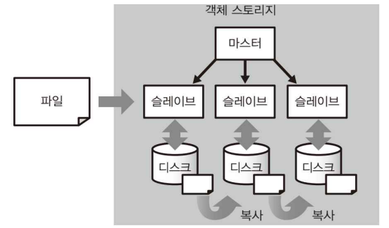

# 4.1. 벌크 형과 스트리밍 형의 데이터 수집

---

## 4.1.1. 객체 스토리지와 데이터 수집

- 빅데이터는 대부분 확장성이 높은 **분산 스토리지(distributed stora**ge)에 저장되며, 이때 기본으로 이용하는 것은 파일을 대량으로 저장하기 위한 **객체 스토리지(object storage)**이다.
    - 예) Hadoop의 HDFS, Amazon S3
    
    
    
- 객체 스토리지는 다수의 컴퓨터를 사용해 파일을 여러 디스크에 복사한다 → **데이터 중복화 및 부하 분산 실현**
    - 객체 스토리지에서의 파일 읽고 쓰기는 네트워크를 거쳐서 실행
    - 데이터 중복화 → 다수의 물리적인 서버와 하드 디스크를 통해 여러 디스크에 데이터를 복사해두어 일부 하드웨어 고장에도 데이터가 손실되지 않도록 한다
    - 부하 분산 → 읽고 쓰기 등 부하를 다수의 하드웨어에 분산하여 성능이 떨어지지 않도록 한다
- 구조 상, 데이터양이 많을 때는 우수하나 소량의 데이터일 때는 비효율적이다
    
    → 데이터양에 비해 통신 오버헤드가 크기 때문
    
- 객체 스토리지에서 효율적으로 처리할 수 있는 파일 크기: 대략 1MB ~ 1GB
    - 파일 크기가 너무 작은 경우 → 예) 시계열 데이터: 시간과 함께 생성되는 데이터
        
        
        
        - 대량의 작은 파일이 생성되며, 시간이 지남에 따라 성능을 저하시키는 요인으로 작동
        - 작은 데이터는 적당히 모아 하나의 큰 파일로 만들면 효율을 높일 수 있다
    - 파일 크기가 너무 큰 경우
        
        
        
        - 네트워크 전송에 시간이 걸려 예상치 못한 오류 발생률이 높아진다
        - 예) 1TB의 파일을 100Mbps 회선으로 전송 시, 약 24시간이 넘는 시간이 소요된다
        - 큰 데이터는 적당히 나눠 여러 개의 파일로 만들면 문제 발생을 줄일 수 있다
- 데이터 수집(data ingestion): 수집한 데이터를 가공하여 집계 효율이 좋은 분산 스토리지를 만드는 일련의 프로세스
    - 데이터 수집, 구조화 데이터 작성, 분산 스토리지에 대한 장기적인 저장 등이 포함됨

## 4.1.2. 벌크 형의 데이터 전송

- **벌크 형 데이터 전송: 대량의 데이터를 한 번에 묶어서 전송하는 방식**
    - 전통적인 데이터 웨어하우스에서 사용
- 축적된 데이터를 데이터베이스, 파일 서버, 웹 서비스 등에서 SQL, API 등으로 정리해 데이터를 추출하고, ETL 프로세스(ETL 서버)를 사용해 분산 스토리지에 저장한다
    
    
    
- ETL 프로세스는 정해진 주기대로 정기적인 실행을 하고(주로 하루 또는 1시간), 한 번에 축적된 모든 데이터를 전송한다
- 데이터의 양이 많은 경우, 디스크가 넘치는 등 오류가 발생할 수 있다. 한 번에 전송하기에 데이터의 양이 너무 많은 경우, 한 달이나 하루 단위로 전송하도록 작은 태스크로 분해해 한 번의 태스크 실행이 커지지 않도록 조정한다.
    
    → 이때 워크플로 관리 도구를 사용한다 (정기적인 스케줄 실행 및 오류 통지 등을 맡긴다)
    
- 벌크 형 데이터 전송의 장점: 문제 발생 시 여러 번 재실행이 가능하다 (스트리밍 형은 어려움)
    
    → 데이터 전송 시 신뢰성이 중요한 경우 벌크 형을 사용해야 하는 이유
    
- 벌크 형 데이터 전송은 워크플로의 일부로써 사용하기 적합 + 정기적으로 데이터를 모아 전송 + 데이터의 양이 커질 경우 태스크 조정 필요 → 워크플로 관리 도구와 조합시켜 사용하기에 용이하다!

## 4.1.3. 스트리밍 형의 데이터 전송

- 스트리밍 형 데이터 전송: 데이터를 조금씩 계속해서 실시간 또는 거의 실시간으로 전송하는 방식
    - 통신 장비 및 소프트웨어에 의해 지금 바로 생성되어 아직 어디에도 저장되지 않은 데이터는 바로 전송해야 한다 → 이때 스트리밍 형 데이터 전송이 필요

- 스트리밍 형 데이터 전송의 공통점은 다수의 클라이언트에서 계속해서 작은 메시지가 전송되는 것
    
    → **메시지 배송(message delivery)**
    
    - 메시지 배송 시스템은 전송되는 데이터양에 비해 통신을 위한 오버헤드가 큰 편
    - 웹 브라우저나 모바일 앱은 HTTP(HTTPS), IoT 같은 머신 데이터는 MQTT(MQ Telemetry Transport) 등 오버헤드가 적은 프로토콜이 사용되기도 한다
- 보내온 메시지를 저장하는 방법
    1. NoSQL 데이터베이스 이용: 작은 데이터 쓰기에 적합
        - Hive와 같은 쿼리 엔진으로 데이터를 읽을 수 있다
    2. 메시지 큐(message queue), 메시지 브로커(message broker) 등의 중계 시스템에 전송
        - 분산 스토리지에 직접 쓰는 것이 아니라, 중계 시스템에 기록된 데이터를 일정한 간격으로 꺼내고 모아 함께 분산 스토리지에 저장한다

### 웹 브라우저에서의 메시지 배송

1. 웹 서버 경유의 메시지 배송: 웹 서버 안에서 메시지를 만들어 배송 
    
    
    
    - 전송 효율을 위해 서버상에서 임시 파일로 데이터를 축적한 뒤, 나중에 모아서 전송하는 경우가 많다
    - 서버상주형 로그 수집 소프트웨어 사용
2. 자바스크립트에 의한 메시지 배송 
    
    
    
    - 웹 이벤트 추적(web event tracking): 자바스크립트를 사용해 웹 브라우저에서 직접 메시지를 전송
    - 사용자 입장에서는 편리하게 HTML 페이지에 태그만 수집하면 되므로 각종 액세스 분석 서비스 및 데이터 분석 서비스 등에서 사용된다
    - 수집된 데이터는 바로 다른 서버에 전송되거나 API 경유로 함께 취득해 분산 스토리지에 저장한다

### 모바일 앱으로부터의 메시지 배송

- HTTP 프로토콜을 사용하는 클라이언트이므로 방식은 웹 브라우저와 동일
- 하지만, 모바일 앱에서는 서버를 직접 마련하는 것이 아니라, MBaaS(Moblie Backend as a Service)라는 백엔드의 각종 서비스를 이용할 수 있다
1. MBaaS(Moblie Backend as a Service) 경유의 메시지 배송
    
    
    
    - 백엔드 저장소(DB)에 저장한 데이터를 벌크 형 도구를 사용해 전송
2. SDK에 의한 메시지 배송
    
    
    
    - 모바일 앱에 특화된 액세스 해석 서비스(SDK 등)를 통해 이벤트 데이터를 수집하고, 메시지를 보낸다
    - 모바일 앱의 경우 오프라인이 되는 경우가 많으므로 일단 이벤트를 SDK 내부에 축적하고 온라인 상태가 되면 모아 보내도록 한다
    - 모바일 회선은 통신이 불안정하고 오류에 따른 메시지 재전송이 다수 발생하는 특성을 갖고 있어 데이터가 중복될 가능성이 높아 특정한 중복 제거 구조가 필요하다

### 디바이스로부터의 메시지 배송 (MQTT의 예)

- MQTT(MQ Telemetry Transport): TCP/IP를 사용하여 데이터를 처리하는 프로토콜의 일종
    - Pub/Sub 형 메시지 배송(Pub/Sub message delivery) 구조
        - publish(전달), subscription(구독)
        - 메시징 앱 또는 푸시 알림 등에서 자주 사용
    - MQTT 브로커: 메시지 교환을 중계하는 서버
    - MQTT 구독자: 메시지를 수신하는 시스템

- 구독자가 특정 토픽을 구독하면 디바이스에서 특정 토픽에 대한 메시지를 보낼 때, MQTT 브로커가 정해진 규칙에 맞게 메시지 교환을 중계하고, MQTT 구독자는 그 메시지를 수신하게 된다.

### 메시지 배송의 공통화

- 클라이언트(client): 메시지가 처음 생성되는 기기
- 프론트엔드(frontend): 생성된 메시지를 먼저 받는 서버

# 4.2. [성능x신뢰성] 메시지 배송의 트레이드 오프

---

> 클라이언트 수가 많아지면 스트리밍 형 메시지 배송의 ‘성능’과 ‘신뢰성’을 둘 다 만족하기는 어렵다
> 

## 4.2.1. 메시지 브로커

- 메시지 브로커(message broker): 빅데이터의 메시지 배송 시스템에서 데이터를 일시적으로 축적하는 중산층. 데이터의 쓰기 속도를 조절하기 위한 완충 부분.
- 다수의 클라이언트에서 보낸 메시지를 분산 스토리지에 바로 저장하려고 하는 경우, 부하 제어가 어려워 성능 한계에 도달하기 쉽고, 이 경우 스토리지의 부하가 낮아지거나 쓰기 성능을 높이기 전에는 더 쓸 수 없게되는 문제가 발생할 수 있다.
    
    
    
    - 쓰기 성능의 한계로 에러 발생 시 대부분 클라이언트는 메시지를 재전송하지만, 성능적인 한계에 도달한 경우 부하가 높아지는 악영향을 끼칠 뿐 문제가 해결되지는 않는다.
- 모든 분산 스토리지가 성능이 매우 높고 필요에 따라 성능을 얼마든지 올릴 수 없기 때문에, 중간에서 데이터를 일시적으로 축적하는 메시지 브로커가 필요하다
- 예) Apache Kafka, Amazon Kinesis
- 메시지 브로커는 어떻게 외부 클라이언트의 대량의 메시지 전송을 처리할 수 있는가?
    
    → 메시지 브로커는 대개 데이터를 쓰는 것에 최적화되어 있고, 여러 대의 노드에 부하를 분산해 성능을 끌어올릴 수 있는 뛰어난 확장성을 구현한다
    

### 푸쉬 형과 풀 형

- 푸시(push) 형: 송신 측의 제어로 데이터를 보내는 방식
- 풀(pull) 형: 수신 측의 주도로 데이터를 가져오는 것
- 생산자(producer): 메시지 브로커에 데이터를 넣는(push) 것
- 소비자(consumer): 메시지 브로커에서 데이터를 꺼내오는(pull) 것
- 생산자가 메시지 브로커에 메시지를 보내면 임시 스토리지에 저장되고, 이때 소비자가 일정한 간격으로 적당히 모아진 데이터를 꺼내오면서 분산 스토리지에 기록한다
    
    → 파일 사이즈 적정화
    

### 메시지 라우팅

- 메시지 라우팅(message routing): 메시지 브로커에 써넣은 데이터는 복수의 다른 소비자에서 읽어 들일 수 있고, 이를 통해 데이터를 여러 경로로 분기 시키는 것
- 예) 어떤 시스템이 100만 대의 디바이스에서 1분마다 100바이트의 메시지를 수신하는 경우
    
    
    
    - 시스템 전체가 받는 메시지는 초당 1.7만 메시지 (= 1.66MB(= 13.28Mbps))
    - 이때 메시지 브로커에 데이터를 푸쉬하고, 소비자에서 1초 당 1.66MB를 가져갈 수 있으므로 거의 실시간으로 처리하는 것이다
        
        → 짧은 간격으로 차례대로 데이터를 꺼내서 처리: 스트림 처리(stream processing)
        

## 4.2.2. 메시지 배송을 확실하게 실시하는 것은 어렵다

- 메시지 배송 시 성능 문제 외에도 중요한 것은 신뢰성(reliability)의 문제
- 모바일 회선처럼 신뢰성이 낮은 네트워크에서는 메시지의 중복이나 누락이 발생하여, 시스템 별로 다음 세 가지 중 하나는 꼭 보장하도록 설계된다
    1. at most once: 메시지는 무조건 한 번만 전송된다. 도중에 전송이 실패해 결손이 발생할 수 있다
    2. exactly once: 메시지는 손실되거나 중복 없이 한 번만 전달된다
    3. at least once: 메시지는 확실히 전달된다. 단, 중복이 발생할 수 있다

### at most once

- 무슨 일이 있어도 절대로 메시지를 다시 보내지 않는다 → 결손 발생 가능
- 대부분은 데이터의 결손을 피하기 위해 재전송(retransmission)이 이루어지지만, 이때 at most once를 보장할 수는 없다
- 예) 두 노드 간의 TCP/IP 통신 시, 데이터 전송이 끝난 뒤 수신 완료 표시를 위한 ack가 반환되기 직전 네트워크 통신이 중단된 경우. 이때 송신 측은 ack가 반환되지 않아 타임아웃을 감지하고 재전송을 시작한다. 하지만 수신 측은 메시지를 다 받았기 때문에 데이터 처리를 그냥 진행할 수 있다. 그 후, 접속이 재개되면 메시지가 재전송되어 중복이 발생한다

### exactly once

- 코디네이터(coordinator): 양쪽 노드의 통신 내용을 보장하기 위해 그 사이를 중계하는 존재
    - 일반적으로 네트워크 상에서 필수적
    - 메시지의 송신 측, 수신 측 모두 서로의 정보를 코디네이터에게 전달함으로써 문제가 발생한 경우 코디네이터의 지시에 따라 그것을 해결한다

⇒ exactly once는 가능하지만, 아래와 같은 문제점으로 배송 시스템에서는 코디네이터를 도입하지 않는다

1. 분산 시스템에서는 코디네이터가 항상 존재한다고 가정할 수 없다. 코디네이터와의 통신 등의 문제로 부재하게 될 경우 항상 시스템을 중지할 수는 없기 때문에 어떻게 할 것인지 합의하는 과정이 필요하다.
2. 코디네이터의 판단에만 따를 경우 성능상 시간이 너무 소요된다는 문제가 생길 수 있다.

### at least once

- 메시지가 확실히 전송되는 것을 우선으로 하며, 이때 발생할 수 있는 중복의 제거는 사용자에게 맡긴다
- 예) TCP의 경우 메시지 수신 확인을 위해 ack 플래그를 도입해 at least once를 실현. 중복이 발생해도 모든 TCP 패킷에 식별 가능한 시퀀스 번호가 포함되어 있어 이를 활용한 중복 제거가 가능
- 대부분의 메시지 배송 시스템이 at least once를 보장한다. (하지만 자동 중복 제거는 제공하지 않음)
- 예) 메시지 배송에 있어 at least once를 보장하는 오픈 소스 소프트웨어 → Apache Flume, Apache Kafka, Logstash, Fluentd

## 4.2.3. 중복 제거는 높은 비용의 오퍼레이션

- 메시지의 중복 제거를 위해서는 같은 메시지를 과거에 받은 것인지 여부를 판정해야 한다
    - 예) TCP의 경우 메시지에 시퀀스 번호를 붙여 구분
- 모든 메시지에 일련의 번호를 넣으려면 한 부분에 처리를 집중시켜야 하지만, 성능 향상이 어려워지는 문제점이 있다.

### 오프셋을 이용한 중복 제거

- 데이터양이 고정된 경우 잘 작동해 벌크 형에서 주로 사용
- 파일 전송 방식과 유사
- 전송해야 할 데이터에 파일명 등의 이름을 부여해 작은 메시지에 실어서 배송한다.
- 각 메시지에 파일 안의 시작 위치(오프셋)를 덧붙인다. 메시지가 중복되어도 같은 파일의 같은 장소를 덮어쓰게 된다.
    - 오프셋: 전체 파일 내에서 데이터가 어디서부터 시작되는지 나타내는 위치 값
- at least once가 보장된 경우 언젠가는 파일이 재구성되어 데이터 전송이 완료된다

### 고유 ID에 의한 중복 제거

- 스트리밍 형의 메시지 배송에서 자주 사용
- 모든 메시지에 UUID 등 고유 ID를 지정한다.
- 문제점: 메시지가 늘어남에 따라 폭발적으로 증가하는 ID를 관리하는 것. 과거의 모든 ID를 기억하는 것은 어렵고, 파기하기엔 중복의 우려가 있다.
    
    → 최근에 받은 ID만 기억하고, 그보다 늦게 온 경우는 중복 허용
    

### 종단간(End to End)의 신뢰성

- 메시지 배송에 있어 성능과 신뢰성은 트레이드 오프 관계에 있다
- 빅데이터의 메시지 배송에서는 종종 신뢰성보다 효율 쪽이 중시된다
    
    → 중간 경로에 at least once를 보장하고, 중복 제거는 하지 않는 것이 표준적인 구현
    
    → 중복 제거는 종단 간에 실행해야 하며, 최종적으로 분산 스토리지에 기록하는 단계에서 중복이 없도록 해야 한다
    
    - 메시지 전송 중 중복 제거가 이루어지더라도 다른 곳에서 중복이 발생할 수 있기 때문
- 신뢰성 높은 메시지 배송 실현을 위한 방법
    - 중간 경로를 모두 at least once로 통일
    - 모든 메시지에 고유 ID를 포함
    - 경로의 말단에서 중복 제거 실행

### 고유 ID를 사용한 중복 제거의 방법

1. 분산 스토리지로 NoSQL 데이터베이스 이용
    - 예) Cassandra, Elasticsearch 등의 경우 데이터를 쓸 때 고유 ID를 지정하고 동일한 ID의 데이터는 덮어 쓴다. 중복이 있더라도 변화 X → 중복 제거가 실현된다
2. SQL로 중복 제거
    - 보내온 데이터를 그대로 객체 스토리지에 저장하고, 나중에 읽어 들일 때 중복을 제거한다
    - 배치형 쿼리 엔진에서 실행해야 한다 (메모리 X)
    
    
    

## 4.2.4. 데이터 수집의 파이프라인

데이터 수집의 파이프라인 (스트리밍 형)

- 마지막으로 데이터 구조화 및 열 지향 스토리지로 변환함으로써 데이터 분석에 적합한 스토리지가 완성된다
- 파이프라인의 요구사항과 필요에 따라 시스템을 조합한다
    - 쓰기 성능에 불안감이 없는 경우: 메시지 브로커 대신 클라이언트나 프론트엔드에서 NoSQL 데이터베이스에 직접 데이터를 쓰는 방식도 가능
    - 중복이 어느정도 허용되는 경우: 중복 제거 생략
    - 데이터 집계에 쿼리 엔진을 사용하는 경우: 구조화된 데이터를 열 지향 스토리지 형식으로 객체 스토리지에 저장

### 중복을 고려한 시스템 설계

- 일반적인 스트리밍 형 메시지 배송 과정에는 중복이 발생할 가능성이 언제든 존재한다. (명시적 중복 제거 방식이 없는 경우)
- 데이터 센터와 같은 안정된 회선의 경우 99% 이상의 신뢰성을 확보할 가능성이 높고, 그 정도의 오차는 허용한 후 평소 멱등한 조작에 유의하여 중복이 있어도 문제가 되지 않는 시스템을 설계할 수 있다.
    - 멱등한 조작: 같은 작업을 여러 번 수행해도 결과가 처음 한 번 수행한 것과 동일한 연산. 즉
        
        → 몇 번 수행하든 시스템의 최종 상태가 변하지 않는 것 
        
        ⇒ 중복 호출해도 안전한 작업
        
- 신뢰성이 중시되는 경우, 스트리밍 형의 메시지 배송을 피하는 것이 가장 좋다
    - 예) 과금 데이터: 오차가 허용되지 않는 경우. 트랜잭션 처리를 지원하는 데이터베이스에 애플리케이션이 직접 기록 후 벌크 형 데이터 전송 진행
- 메시지 중복과 결손은 네트워크와 하드웨어의 일시적인 장애에 따라 발생하는 설계상의 트레이드 오프
    - 확률적으로 발생하는 것이 아닌, 시스템이 안정적인 경우 발생하지 않는다.
    - 재전송의 구조가 있는 경우 결손은 피할 수 있지만, 중복의 가능성이 커진다

# 4.3. 시계열 데이터의 최적화

---

> 스트리밍 형의 메시지 배송에서는 ‘메시지가 도착할 때까지의 시간 지연’이 문제
> 
> 
> 늦게 도달하는 데이터가 집계 속도에 미치는 영향에 관해 설명 
> 

## 4.3.1. 프로세스 시간과 이벤트 시간

- 스마트폰의 경우, 오프라인이 될 수 있기 때문에(전파가 닿지 않는 곳으로 외출하거나 배터리가 완전 방전된 경우) 어느 정도의 지연을 예측해 데이터 분석을 고려해야 한다
- 이벤트 시간(event time): 클라이언트 상에서 메시지가 생성된 시간
    - 데이터 분석의 대상이 되기도 하기 때문에 시간 차이가 문제를 일으킬 수 있다
- 프로세스 시간(process time): 서버가 처리하는 시간

## 4.3.2. 프로세스 시간에 의한 분할과 문제점

- 예) 모바일 앱의 활동 사용자 수 집계
- 늦게 도달하는 데이터의 존재 ⇒ 과거의 집계 결과가 매일 조금씩 달라진다
    
    → 실태에 가까운 집계 결과를 얻기 위해 이벤트 시간보다 며칠 지난 시점에서 소급해 집계해야 한다
    
    
    
- 분산 스토리지에서 데이터를 넣는 단계에서는 이벤트 시간이 아니라 프로세스 시간을 사용
    - 각 프로세스 시간을 사용해 만든 파일 안에 다수의 이벤트 시간이 기록되어 있다
        
        → 과거 특정 일에 발생한 이벤트를 찾기 위해서는 그 과거부터 현재까지의 모든 파일을 열어야 정확한 결과를 얻을 수 있다 
        
        ⇒ 모든 데이터를 로드해야 하는 시간과 자원의 낭비 발생 
        
        = 풀 스캔(full scan): 다수의 파일을 모두 검색하는 쿼리, 시스템 부하를 높이는 원인
        
    
    
    

## 4.3.3. 시계열 인덱스

- 이벤트 시간 취급을 효율화하기 위해 데이터를 정렬하기 위한 방법의 일종
    
    **⇒ 이벤트 시간에 대해 인덱스를 만드는 것**
    
- RDB에서 인덱스를 만드는 것과 같은 방식
- 예) Cassandra와 같은 시계열 인덱스에 대응하는 분산 데이터베이스를 이용해 이벤트 시간으로 인덱스 된 테이블을 만들 수 있다
- 특정 시간에 대한 데이터 집계를 빠르게 실행 가능하며, 정해진 시간에 발생한 이벤트를 조사하거나 실시간 대시보드를 만드는 것에 유용하다
- 하지만, 장기간에 걸쳐 대량의 데이터를 집계하는 경우 분산 데이터베이스는 효율적이지 않다.
    
    → 장기적 데이터 분석 시에는 집계 효율이 높은 열 지향 스토리지를 지속적으로 만들어야 한다 
    

## 4.3.4. 조건절 푸쉬다운

- 이벤트 시간 취급을 효율화하기 위해 데이터를 정렬하기 위한 방법의 일종
    
    ⇒ 매일 한 번씩 새로 도착한 데이터를 배치 처리로 변환하는 것
    
- 열 지향 스토리지에서는 RDB와 동등한 인덱스를 만들 수 없지만, 처음부터 데이터를 정렬 가능
    
    → 이벤트 시간으로 데이터를 정렬한 후 열 지향 스토리지로 변환 
    
    
    
- 열 지향 스토리지는 컬럼 단위의 통계 정보를 이용해 최적화가 이루어진다
    - 예) 시간이면 각 칼럼의 최솟값과 최댓값 등 모든 파일에 메타 정보로 저장된다. 이를 참고해 어떤 파일의 어떤 부분에 원하는 데이터가 포함되어 있는지 알 수 있다

**⇒ 조건절 푸시 다운(predicate pushdown): 컬럼 단위 통계 정보를 이용해 필요한 최소한의 데이터만을 읽도록 하는 최적화**

- 데이터 정렬을 해둠으로써 조건절 푸시 다운에 의한 최적화가 작동해 풀 스캔을 회피할 수 있다

- 조건절 푸시 다운을 최대 활용하기 위한 방법: 집계 시 데이터 로딩이 최소한으로 끝날 수 있도록 다수의 연속된 데이터를 한 곳에 배치한다. (데이터 정렬)
    - 열 지향 스토리지를 짧은 주기로 만들면 다수의 파일로 데이터가 분산되어 최적화 효율이 떨어진다

## 4.3.5. 이벤트 시간에 의한 분할

- 프로세스 시간으로 파일을 나누는 경우, 어쩔 수 없이 동일 이벤트 시간 데이터는 다수의 파일에 분산된다 → 정확한 집계 결과를 얻기 위해 많은 파일을 읽어봐야 한다.
- 이벤트 시간을 사용하여 테이블을 분할하는 경우
    - 시계열 테이블: 시간을 이용하여 분할한 테이블
    - 테이블 파티셔닝: 테이블을 문리적으로 분리하는 개념
    - 이벤트 발생 시간을 파티션의 이름에 포함하도록 설정
        - 예) 1월 1일 → event_0101
    
    
    
    - 시계열 테이블에 데이터 추가를 어떻게 구현하는가?
        - 새로 도착한 데이터를 새로운 파일로 만드는 것에 잠재적인 문제가 존재한다.
            
            → 과거의 데이터가 얼마 동안의 기간에 걸쳐 보내올지 모르기 때문에 시계열을 구성하는 각 파티션에는 매일 조금씩 데이터가 추가된다. (몇 년에 걸쳐서 보내올 수도 있으므로)
            
            ⇒ 분산 스토리지에 대량의 작은 파일이 만들어지게 되고, 결국 쿼리의 성능이 악화된다 
            
    - 이벤트 시간으로부터 시계열 테이블을 만들 경우,
        1. 작은 데이터를 효율적으로 추가할 수 있는 분산 데이터베이스를 사용
        2. 너무 오래된 데이터 버리기
        
        .. 등의 아이디어 필요
        

### 데이터 마트를 이벤트 시간으로 정렬하기

- 데이터 마트만이 이벤트 시간에 의한 정렬을 고려하도록 해두는 것
    - 데이터 수집 단계 → 이벤트 시간을 따지지 않고 프로세스 시간만을 사용하여 데이터를 저장
    - 데이터 마트를 만드는 단계 → 이벤트 시간에 의한 정렬을 함께 진행
- 파일이 조각나지 않고 최적의 데이터 마트 유지 가능

# 4.4. 비구조화 데이터의 분산 스토리지

---

## 4.4.1. [기본 전략] NoSQL 데이터베이스에 의한 데이터 활용

- 빅데이터를 위한 분산 스토리지에는 확장성, 유연성이 요구된다
- 객체 스토리지는 임의의 파일을 저장할 수 있는 장점이 있으나, 여러 단점이 존재한다
    1. 객체 스토리지 상의 파일을 교체하기 어렵다. 통째로 교체하는 방법 뿐이다.
        - 예) 변경할 일 없는 로그 파일 O, 데이터베이스처럼 수시로 변경하는 용도 X
        - 쓰기 빈도가 높은 데이터는 별도의 RDB에 저장해 스냅샷을 하거나, 분산 데이터베이스에 저장
        - 중요한 데이터는 처리 중 문제가 생겨도 돌아갈 수 있도록 트랜잭션 처리에 대해 고려된 데이터베이스에 기록하는 것이 원칙
            - 스트리밍 형의 메시지 배송 등은 트랜잭션 처리 X
            - 대부분의 앱은 일반적인 RDB로도 충분
    2. 객체 스토리지에 저장된 데이터를 집계할 수 있게 되기까지는 시간이 걸린다
        - 열 지향 스토리지로 만들 경우 집계를 고속화하는 것은 가능하지만, 작성 시 시간이 걸리는 문제가 있다.
        - 데이터를 기록하고 바로 활용하고 싶은 경우 실시간 집계와 검색에 필요한 데이터 저장소가 필요하다
            
            → 특정 용도에 최적화된 데이터 저장소 → NoSQL 데이터베이스
            

<aside>
💡

**ACID 특성과 CAP 정리**

- ACID 특성: 트랜잭션 처리에 요구되는 4가지 성질
    - 원시성(atomicity)
    - 일관성(consistency)
    - 독립성(isolation)
    - 내구성(durability)
- CAP 정리: 일반적으로 분산 시스템에서 동시에 모두 충족시킬 수 없는 세 가지
    - 일관성(consistency)
    - 가용성(availability)
    - 분단내성(partition-tolerance)
- 결과 일관성: 써넣은 데이터를 바로 읽을 수 있다고는 말할 수 없다는 개념
    - NoSQL 데이터베이스의 일부는 CAP 정리의 일관성이나 가용성 중 하나를 선택
        - 일관성을 우선하고 가용성을 포기 (단시간의 장애 발생을 수용)
        - 가용성을 우선하고 일관성을 포기 (오래된 데이터를 읽을 수 있는)
    - 결과 일관성은 시간이 지나면 언젠가 최신 데이터를 읽을 수 있음을 보장하지만 언제가 될지 알 수 없다 (지연 발생 가능)
</aside>

## 4.4.2. 분산 KVS

- 분산 KVS(distributed Key-Value Store): 모든 데이터를 키값 쌍으로 저장하도록 설계된 데이터 저장소
    - 객체 스토리지도 이의 일종. 하지만 이때 좀 더 작은 데이터라고 가정 (몇 KB 정도 데이터를 초당 수만 번 읽고 쓰는 경우)
- 모든 데이터에 고유의 키를 지정하고 부하 분산을 위해 이용한다
    - 키가 정해질 경우 그 값을 클러스터 내의 어느 노드에 배치할 것인지 결정한다
        
        → 노드의 부하를 균등히 분산하는 것
        
- 시스템에 따라 하나의 키에 하나의 값만 할당하거나(가장 간단), 하나의 키에 여러 값을 할당하거나, 여러 키 조합에 값을 할당하는 다양한 경우가 존재과정 중 문제가 생겨도 돌아갈 수 있도록
- 분산 KVS 아키텍처 예시
    
    
    
    1. 마스터/슬레이브 형: 1대의 마스터가 전체를 관리하며, 마스터가 중지되면 아무도 데이터를 읽고 쓸 수 없다
    2. P2P 형: 모든 노드가 대등한 관계로 클라이언트는 어떤 노드에 연결해도 데이터를 읽고 쓸 수 있다

### Amazon DynamoDB

- 항상 안정된 읽기 쓰기 성능을 제공하도록 디자인된 분산형 NoSQL 데이터베이스
- 특징
    - 하나 또는 두 개의 키에 연결하는 형태로 임의의 스키마리스 데이터를 저장 가능
        - JSON 구조도 취급 가능해 도큐먼트 스토어로도 사용 가능
    - P2P 형의 분산 아키텍처
    - 미리 설정한 기준에 따라 노드가 증감됨 → 데이터의 읽기 쓰기에 지연이 발생하면 곤란한 경우
- 데이터 분석을 위해서는 Amazon EMR 및 Amazon Redshift 등과 결합해 Hive에 의한 배치 처리를 실행하거나 데이터 웨어하우스에 데이터를 전송
- DynamoDB Streams를 사용해 데이터 변경을 이벤트로 외부에 전송해 실시간 스트림 처리가 가능
    
    
    
- (DynamoDB 뿐만 아니라) 일반적으로 NoSQL 데이터베이스는 애플리케이션에서 처음으로 데이터를 기록하는 장소로 이용된다

## 4.4.3. 와이드 칼럼 스토어

- 와이드 칼럼 스토어: 2개 이상의 임의의 키에 데이터를 저장할 수 있도록 한 것
    - 예) Google Cloud Bigtable, Apache HBase, Apache Cassandra
- 성능 향상이 목적
- 특징
    - 내부적으로 행 키와 컬럼 명의 조합에 대해 값을 저장
    - 테이블에 새로운 행을 추가하는 것처럼 컬럼도 얼마든지 추가 가능한 구조. 컬럼의 개수에 제약이 없다
        
        → 하나의 테이블에 가로와 세로의 2차원에 데이터를 쓸 수 있도록 한 것 
        
    
    
    

### Apache Cassandra

- 오픈 소스의 와이드 컬럼 스토어
- CQL: Cassandra의 높은 수준의 쿼리 언어로 SQL처럼 테이블 조작 가능
    
    
    
- 특징
    - 구조화 데이터만 취급 가능해 RDB와 비슷하지만, 쿼리의 의미 등 SQL과 다른 점이 많다
        - 예) INSERT INTO: 추가 또는 갱신(upsert)으로 동작해 동일한 키를 가진 레코드가 존재하면 덮어 쓴다
    - P2P 형의 분산 아키텍처
    - 지정한 키에 의해 결정한 노드에 해당 키와 관련된 모든 값 저장
        - 예) 전 세계 1억 명의 활성 사용자가 있는 메시지 서비스. 각 사용자가 매일 수십 메시지를 기록 → 테이블에 매일 수십억 레코드가 추가
            
            사용자 ID를 키로 데이터를 분산하고 메시지의 타임스탬프로 레코드를 분리 → 사용자별 타임 라인 구축
            
            CQL에서는 복합 키를 이용하여 실현 
            
- 집계를 위해서는 분산된 모든 노드에서 데이터를 모아야하기 때문에 데이터를 집계하는 데에 적합하지 않다
    
    → Hive, Presto, Spark 등 쿼리 엔진을 활용해 빠른 데이터 추출 가능 
    
    
    

## 4.4.4. 도큐먼트 스토어

- 도큐먼트 스토어: 복잡한 스키마리스 데이터를 그대로의 형태로 저장하고 쿼리 실행 가능
- 성능 향상보다 데이터 처리의 유연성
- 배열과 연상 배열(Map)과 같은 중첩 데이터 구조에 대해 인덱스를 만들거나 도큐먼트 일부만을 치환하는 방식으로 쿼리를 쉽게 실행
- 스키마를 정하지 않고 데이터 처리가 가능
- 예) 참고 시스템의 데이터 및 로그 저장 등에 적합

### MongoDB

- 오픈 소스의 분산형 도큐먼트 스토어
- 자바스크립트나 각종 프로그래밍 언어를 사용해 데이터를 읽고 쓸 수 있다
    
    
    
- 여러 노드에 데이터 분산이 가능하지만, 대량의 데이터 집계 시에는 부적합 → 데이터 분석 시 쿼리 엔진 활용

## 4.4.5. 검색 엔진

- 검색 엔진(search engine): 저장된 데이터를 쿼리로 찾아내며, 텍스트 데이터 및 스키마리스 데이터를 집계하는 데 자주 사용
- 역 색인(inverted index): 텍스트에 포함된 단어를 분해하고 어떤 단어가 어떤 레코드에 포함되어 있는지 인덱스를 만들어 둔 것
    - 이전에는 모든 텍스트를 전체 스캔해야 원하는 레코드를 찾을 수 있었던 것
    - 기록 시스템 부하 및 디스크 소비량은 커지지만, 키워드 검색이 훨씬 고속화된다
- 검색 엔진은 적극적으로 색인을 만들어 데이터 검색에 특화되어 있다 → 특히 민접성이 요구되는 데이터 집계에 적합
    - 대부분의 NoSQL → 성능 향상을 위해 색인 작성을 제한한다
- 실시간 집계 시스템의 일부로 이용된다
    - 예) 메시지가 배송된 데이터를 분산 스토리지에 저장하는 한편, 검색 엔진에도 전송하여(라우팅) 실시간성이 높은 데이터 처리를 위해 활용한다

### Elasticsearch

- 인기 있는 오픈 소스의 검색 엔진
- 임의의 JSON 데이터를 저장 가능해 도큐먼트 스토어와 유사
- 아무것도 지정하지 않으면 모든 필드에 색인이 만들어지고, 텍스트 데이터에는 역 색인이 구축된다
- 간단한 도큐먼트 스토어보다 쓰기의 부하가 크고, 필요에 따라 명시적으로 스키마를 결정해 색인을 무효화 하는 식의 튜닝이 필요하다
- 자체 쿼리 언어에 의한 고급 집계 기능 제공
- 열 지향 스토리지에도 대응
- 주요 사용법: 프론트 엔드(Kibana)를 이용하거나 프로그램 안에서 호출한다

### Splunk

- 텍스트 데이터 집계를 위한 상용 검색 엔진 (오픈 소스 X)
- 예) 로그 파일에서 키워드 기반으로 로그 검색하기
- 검색할 때마다 데이터가 구조화된다 → 쿼리를 작성하며서 어떤 테이블도 유연하게 만들 수 있다
- 파이프라인을 사용해 데이터를 순차적으로 가공하고, 대화형 쿼리를 사용해 추출, 필터링하면서 교차 분석 및 시각화까지 하나의 화면에서 실행 가능 ⇒ 신속하게 텍스트 데이터를 애드 혹 분석할 때 유용