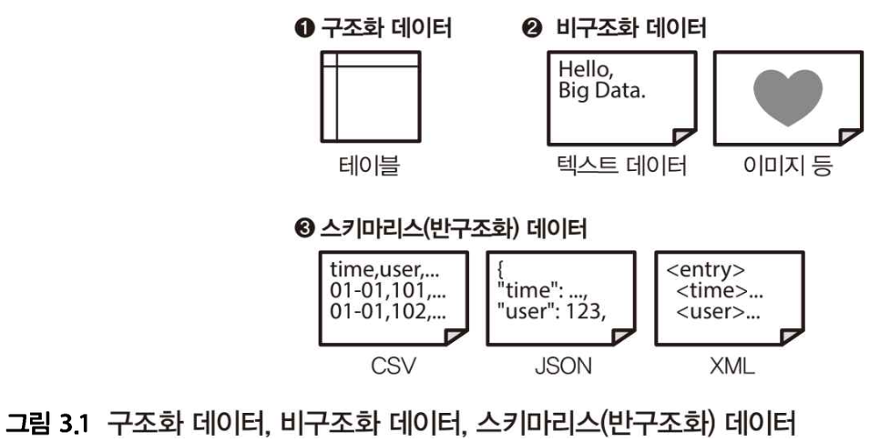

# 3장 빅데이터 분산 처리

## 3-1 대규모 분산 처리의 프레임워크

스키마: 테이블의 칼럼명, 데이터형, 테이블 간의 관계

빅데이터의 경우 구조화 된 데이터만 있는 것이 아니라, 자연 언어로 작성된 택스트 데이터와 이미지, 동영상 등의 미디어 데이터도 포함된다. 이러한 스키마가 없는 데이터를 “비구조화 데이터”라고 하고, 이 상태로는 SQL로 제대로 집계할 수 없다.



비구조화 데이터를 분산 스토리지에 저장하여 분산 시스템에서 처리하는 것이 데이터 레이크이다.

### 데이터 구조화의 파이프라인

각 데이터 소스에서 수집된 비구조화 데이터, 또는 스키마리스 데이터는 처음에는 분산 스토리지에 보관된다. 분산 스토리지에 수집된 데이터는 면확한 스키마를 갖지 않는 것도 많으므로 그냥 그대로는 SQL로 집계할 수 없다. 따라서 스키마를 명확하게 한 테이블 형식의 구조화 데이터로 변환하는 과정을 먼저 필요로 한다.


구조화 데이터는 데이터의 압축률을 높이기 위해 열 지향 스토리지로 저장한다. MPP 데이터베이스로 전송하거나 Hadoop 상에서 열 지향 스토리지 형식으로 변환한다. 

구조화 데이터 중 시간에 따라 증가하는 데이터를 팩트 테이블, 디멘전 테이블로 취급한다. 이 단계에서는 테이블을 조인하지 않는다. 데이터 마트에 대해 생각하는 것은 좀 더 나중의 이야기다. 여기에는 먼저 데이터를 구조화하여 SQL로 집계 가능한 테이블을 만든는 것부터 생각한다

### 열 지향 스토리지의 작성

MPP 데이터베이스의 경우, 제품에 따라 스토리지의 형식이 고정되어 있어 사용자가 그상세를 몰라도 괜찮지만, Haoop에서는 사용자가 직접 열 지향 스토리지의 형식을 선택하고, 자신의 좋아하는 쿼리 엔진에서 그것을 집계할 수 있다.

Hadoop에서 사용할 수 잇는 열 지향 스토리지에는 몇 가지 종류가 있으며, 각각 특징이 다르다. Apache ORC는 구조화 데이터를 위한 열 지향 스토리지로 처음에 스키마를 정한 후 데이터를 저장한다. 한편 Apache Parquet은 스키마리스에 가까운 데이터 구조로 되어 있어 JSON 같은 뒤얽힌 데이터도 그래도 저장할 수 있다.

비구조화 데이터를 읽어 들여 열 지향 스토리지로 변환하는 과정에서 데이터의 가공 및 압축을 위해 많은 컴퓨터 리소스가 소비된다. 이러한 과정을 위해 Hadoop, Spark와 같은 분산 처리 프레임워크를 사용한다.

### Hadoop

Hadoop은 단일 소프트웨어가 아니라 분산 시스템을 구성하는 다수의 소프트웨어로 이루어진 집합체다. 2013년에 배포된 Hadoop2부터 YARN이라고 불리는 새로운 리소스 관리자 상에 복수의 분산 애플리케이션이 동작하는 구성으로 되어, 대규모 분산시스템을 구축하기 위한 공통 플랫폼의 역활을 담당하고 있다.


Hadoop의 기본 구성 요소는 분산 파일 시스템(HDFS), 리소스 관리자(Resource Manager), 분산 데이터 처리(MapReduce) 3가지 이다. 그 외의 프로젝트는 Hadoop 본체와는 독립적으로 개발되어 Hadoop을 이용한 분산 애플리케이션으로 동작한다.

모든 분산 시스템이 Hadoop에 의존하는 것이 아니라, Hadoop을 일부만 사용하거나 혹은 전혀 이용하지 않는 구성도 있다. 예를 들어, 분산 파일 시스템으로는 HDFS를 사용하면서 리소스 관리자는 Mesos 분산 데이터 처리는 Spark를 사용하도록 구성할 수 있다. 이와 같이 다양한 소스트웨어 중에서 자신에게 맞는 것을 선택하고 그것을 조합함으로써 시스템을 구성하는 것이 Hadoop을 중심으로 하는 데이터 처리의 특징이다.

### 분산 파일 시스템과 리소스 관리자

Hadoop에서 처리되는 데이터 대부분은 분산 파일 시스템인 HDFS에 저장한다. HDFS는 다수의 컴퓨터에 파일을 복사하여 중복성을 높인다는 특징이 있다.

CPU나 메모리 등의 계산 리소스는 리소스 매니저인 YARN에 의해 관리된다. YARN은 애플리케이션이 사용하는 CPU 코어와 메모리를 컨테이너라 불리는 단위로 관리한다. Hadoop에서는 분산 애플리케이션을 실행하면 YARN이 클러스터 전체의 부하를 보고 비어 있는 호스트로부터 컨테이너를 할당한다.


분산 시스템은 많은 계산 리소스를 소비하지만, 호스트의 수에 따라 사용할 수 있는 리소스의 상한이 결정된다. 한정된 리소스로 다수의 분산 애플리케이션이 동시에 실행되므로 애플리케이션 간에 리소스 쟁탈이 발생하고, 이때 리소스 관리자가 이를 관리하여 예방한다.

### 분산 데이터 처리 및 쿼리 엔진

MapReduce도 YARN 상에서 동작하는 분산 애플리케이션 중 하나이며 분산 시스템에서 데이터 처리를 실행하는 데사용된다. MapReduce는 임의의 자바 프로그램을 실행시킬 수 있기 때문에 비구조화 데이터를 가공하는데 적합하다.

SQL등의 쿼리 언어에 의한 데이터 집계가 목적이라면 그것을 위해 설계된 쿼리 엔진을 사용한다. Apache Hive는 그런 쿼리 엔진 중 하나이며, 쿼리를 자동으로 MapReduce 프로그램으로 변환하는 소프트웨어로 개발되었다. 초기 Hive 실행 특성은 MapReduce에 의존하였기도 했다.

MapReduce는 원래 대량의 데이터를 배치 처리하기 위한 시스템이다. 한 번 실행하면 분산 파일 시스템에서 대량의 데이터를 읽을 수 있지만, 작은 프로그램을 실행하려면 오버헤드가 크기 때문에 짧은 쿼리 실행에는 적합하지 않다. Hive도 동일하게 애드 혹 쿼리에는 부적합한 반면 시간이 걸리는 배치 처리에는 적합하다.


### 대화형 쿼리 엔진

Hive를 고속화하는 것이 아니라 처음부터 대화형의 쿼리 실행만 전문으로 하는 Apache Impala, Presto와 같은 쿼리 엔진도 개발되고 있다.

MapReduce와 Tez는 장시간의 배치 처리를 가정해 한정된 리소스를 유효하게 활용하도록 설계되어 있다. 한편 대화형 쿼리 엔진으로는 순간 최대 속도를 높이기 위해 모든 오버헤드가 제거되어 사용할 수 있는 리소스를 최대한 활용하여 쿼리를 실행한다.


Hadoop에서는 이와 같이 성질이 다른 쿼리 엔진을 목적에 따라 구분한다. 대량의 비구조화 데이터를 가공하는 무거운 배치 처리에 높은 처리량으로 리소스를 활용할 수 있는 Hive를 이용한다. 그렇게 해서 완성한 구조화 데이터를 대화식으로 집계하고자 할 때는 지연이 적은 Impala와 Presto등이 적합하다.

### Spark

Apache Spark 또한 MapReduce보다 더 효율적인 데이터 처리를 실현하는 프로젝트로 개발이 진행되고 있다. Hadoop의 연장선 상에 있는 Tez와 달리, Spark Hadoop과는 다른 독립된 프로젝트이다.

Spark는 Hadoop을 대체하는 것이 아니라 MapReduce를 대체하는 존재다. 예를 들어, 분산 파일 시스템인 HDFS나 리소스 관리자인 YARN등은 Spark에서도 그래도 사용할 수 있다. Hadoop을 이용하지 않는 구성도 가능하며, 분산 스토리지로 Amazon S3를 이용하거나 분산 데이터베이스인 카산드라에서 데이터를 읽어 들이는 것도 가능하다.

Spark의 실행은 자바 런타임이 필요하지만, Spark 상에서 실행되는 데이터 처리는 스크립트 언어를 사용할 수 있다. 표준으로 자바, 스칼라, 파이썬 그리고 R언어에 대응하고 있으며, 문서도 충실하기 때문에 도입하기 쉽다.


## 3-2 쿼리 엔진

### 데이터 마트 구축의 파이프라인

Hadoop에 의한 구조환 데이터의 작성과 이를 이용한 쿼리의 실행이 어떤 것인지를 알기 위해, 여기서는 실제로 ㅝ리 엔진을 사용하며 데이터 마트를 만들기까지의 흐름을 살퍼보자


분산 스토리지에 저장된 데이터를 구조화하고 열 지향 스토리지 형식으로 데이터를 저장한다. 이 작업은 여러개의 텍스트 파일을 읽어 들어 가공하는 부하가 큰 처리가 되기 때문에 Hive를 사용한다.

완성된 구조화 데이터를 결합, 집계하고 비정규화 테이블로 데이터 마트에 써서 내보낸다. 열 지향 스토리지를 이용한 쿼리의 실행에는 Presto를 사용함으로써 실행 시간을 단축할 수 있다.

### Hive로 비정규화 테이블을 작성하기

데이터의 구조화가 완료되면 다음은 데이터 마트의 구축이다. 테이블을 결합하여 비정규화 테이블을 만든다. 이때 Presto같은 대화형 쿼리 엔진을 사용할 것인지, Hive 같은 배치형 쿼리 엔진을 사용할 것인지에 따라 생각이 달라진다.

Hive와 Presto의 차이에 대해서는 나중에 언급하겠지만, 시간이 걸리는 배치 처리는 원칙적으로 Hive를 사용해야 한다. 예를 들어, 비정규화 테이블이 수억 레코드나 되면, 그것을 데이터 마트로 내보내는 것만으로도 상당한 시간이 소용된다. 따라서 쿼리 엔진의 성능은 최종 실행 시간에 그다지 많은 영향을 끼치지 않는다.

비정규화 테이블을 만드는 데 오랜 시간이 걸리는 것은 흔한 일이며, 그렇기에 가능한 효율적인 쿼리를 작성해야 한다.

### 서브 쿼리 안에서 레코드 수 줄이기

Hive 쿼리는 SQL과 매우 유사하지만, 그특성은 일반적인 RDB와는 전혜 다르다. Hive는 데이터베이스가 아닌 데이터 처리를 위한 배치 처리 구조이다. 읽을 데이터 양을 의식하면서 쿼리를 작성하지 않을 경우, 성능이 나오지 않을 수 있다.

```sql
SELECT ...
FROM access_log a
JOIN users b On b.id = a.user_d
WHERE b.created_at = '2017-01-01'

SELECT ...
FROM (
    SELECT * access_log
    WHERE time >= TIMESTAMP '2017-01-01 00:00:00'
) a
JOIN users b ON b.id = a.user_id
WHERE b.created-at = '2017-01-01'
```

전자와 달리 후자는 서브 쿼리 안에 팩트 테이블을 필터링하여 작게한다.


Hive가 쿼리를 최적화해주는 경우도 있으므로, 서브 쿼리화가 꼭 필요하지는 않지만 가능한 ‘초기에 팩트 테이블을 작게 하는 것’이 빅데이터의 집계에 중요하다.

예를 들어 최종적을 GROUP BY로 데이터를 집계하고 싶다면, 테이블을 결합하기 전에 서브 쿼리 안에서 집계할 수 있다. 데이터의 양을 감소시킨 후에 테이블을 결합하는 것이 쿼리 실행 시간을 단축할 수 있다.

### 데이터 편향 피하기

고속화를 방해하는 다른 문제는 ‘데이터의 편차’이다. 예를 들어 분산 시스템에서 SELECT를 실행하는 것은 다른 처리보다 시간이 오래 걸린다. 중복이 없는 깂을 세라면 데이터를 한곳에 모아야하기 때문이다.

---
