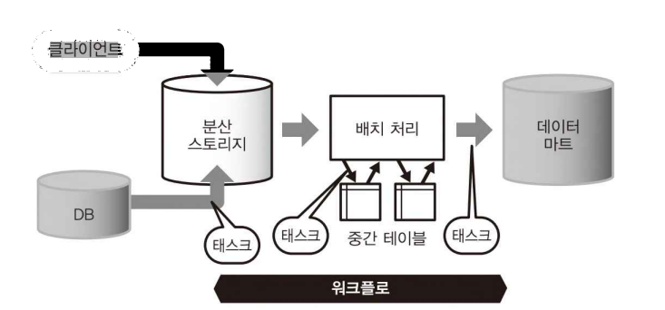

# 5-1. 워크플로 관리

 

## 5-1-1. [기초 지식] 워크플로 관리

- 워크플로 관리(workflow management): 기업 내의 정형적인 업무 프로세스(신청, 승인, 보고 등)와 같이 정해진 업무를 원활하게 진행하기 위한 구조
- 워크플로의 버전 관리는 주로 Git을 사용한다
- 워크플로 관리 도구의 주요 역할
    1. 정기적으로 태스크를 실행하는 것
    2. 비정상적인 상태를 감지하여 그것에 대한 해결을 돕는 것 → 관리 도구 사용 이유 (태스크 실패 가능성)
- 오픈 소스 워크플로 도구 예시
    - 선언 형: Azkaban, Digdag, Oozie
    - 스크립트 형: Airflow, Luigi

### 워크플로 관리 도구와 태스크

- 태스크(task): 데이터 파이프라인에서 실행되는 개별 처리
    - 데이터가 잇달아 이동하면서 정해진 처리를 반복하는 것. 이때 개별 처리를 태스크라고 한다
    - 문제가 발생해도 빠르게 재실행할 수 있도록 태스크를 되도록 작게 유지하는 것이 좋다
    
    
    

### 기본 기능과 빅데이터에서 요구되는 기능

- 워크플로 관리 도구 사용 이유: 태스크 실행에 실패할 수 있기 때문
- 워크플로 관리 도구의 주요 기능:
    1. 태스크를 정기적인 스케줄로 실행하고 그 결과 통지하기
    2. 태스크 간의 의존 관계를 정하고, 정해진 순서대로 빠짐없이 실행하기
    3. 태스크의 실행 결과를 보관하고, 오류 발생 시에는 재실행할 수 있도록 하기 

### 선언 형과 스크립트 형

1. 선언 형(declarative): XML이나 YAML 등의 서식으로 워크플로를 기술하는 타입
    - 미리 제공된 기능 범위 안에서 작성해야 하기 때문에 유지 보수성이 높아진다
    - 예) 동일 쿼리를 파라미터만 바꾸어 여러 번 실행하는 경우, 워크플로룰 단순 반복적으로 자동 생성하는 경우
    - 예) SQL의 실행에 활용
2. 스크립트 형(scripting): 스크립트 언어로 워크플로를 정의하는 타입
    - 태스크의 정의를 프로그래밍할 수 있음에서 오는 유연성
    - 스크립트 언어에 의해 데이터 처리를 태스크 안에서 실행하는 것 또한 가능
    - 예) 데이터 수집 과정, 파일의 문자 코드를 변환해 서버에 업로드하는 경우
    - 예) ETL 프로세스에 활용

## 5-1-2. 오류로부터의 복구 방법 먼저 생각하기

- 데이터 파이프라인 동작 중, 다양한 오류가 발생할 수 있다. 이때 대응에 시간을 많이 쏟아 일이 커지지 않도록 오류 발생 가능성을 고려하여 대처 방법을 결정해 두어야 한다.
    - 예) 일시적인 장애, 구현상의 버그, 네트워크의 일시적인 장애, 하드웨어의 장애, 스토리지 용량 부족, 쿼리 증가에 따른 성능 부족 외 등등
- 플로우(flow): 워크플로 관리 도구에 의해 실행되는 일련의 태스크
    - 각 실행 시 고정 파라미터가 부여된다. 일별 배치 처리인 경우 특정 날짜가 파라미터가 되는 것!
    - 1월 1일에 실행된 플로우가 실패한 경우, 동일한 파라미터로 재실행이 가능

### 복구

- 오류 중에서는 몇 차례 반복하면 해결되는 것(통신 오류)과 몇 차례 반복해도 실패하는 것(인증 오류)이 있다. 여러 가능성을 고려해 자동 회복이 아닌, **수작업에 의한 복구(recovery)**를 전제로 한 태스크 설계가 필요하다.
- 이때 실패한 태스크는 모두 기록하여 재실행할 수 있도록 한다. → 플로우에 실패한 것과 동일한 파라미터를 부여해 재실행하는 것
- 워크플로 관리 도구는 과거에 실행한 플로우와 파라미터를 자동으로 데이터베이스에 기록한다. 일부는 모든 태스크 상태를 관리하는 경우도 있으며, 그럴 경우 재실행할 때 이미 성공한 태스크는 넘어가고, 미완료된 태스크만 실행하는 것이 가능하다
    
    
    

### 재시도

- 여러 번 발생하는 오류에 대해 자동화하여 복구하고 싶은 경우, **태스크 단위의 자동적인 재시도(retry)**로 간단히 해결할 수 있다. 대부분의 오류는 시간을 두고(5~10분 정도) 재실행하는 것만으로도 해결되는 경우가 많기 때문이다.
- 재시도 횟수에 따른 문제
    - 너무 적은 경우: 장애로부터 복구하기도 전에 재시도가 종료해 태스크 실행에 실패
    - 너무 많은 경우: 태스크가 실패하지 않은 것처럼 보여 중대한 문제 발생 시 빠르게 눈치채기 어려움
- 재시도 횟수는 태스크 성격에 따라 다르므로 재시도 없이 모든 오류를 통지하는 것이 이상적
    
    → 원인을 그때마다 좌해 오류가 일어나지 않도록 대책을 마련하는 것! (가장 좋은 해결책)
    
- 무분별한 재시도 보다는 수작업으로 복구하거나, 로그를 모니터링하는 과정이 필요하다. 오류가 발생해도 데이터 전송에 성공할 수 있고, 재시도 시 태스크에 따라 데이터가 중복될 수 있기 때문이다.
- 태스크 내부에서 재시도를 제어할 수 있다
    - 예기되는 오류에 대해서는 워크플로 관리 도구에 의존하지 않고 태스크 내부에서 명시적으로 대처할 수 있다
    1. 지수 백오프(exponential backoff)
        - 태스크 내부에서 재시도 횟수를 세세하게 제어하면서 오류 발생을 회피할 수 있다
        - 재시도 횟수를 정하고, 재시도 간격을 배수로 증가시키며 반복한다. 정해진 만큼을 반복하고도 실패할 경우 태스크를 오류로 간주한다
        - 결과적으로 워크플로 관리 도구에 예상 외의 문제만을 통지되도록 한다
    2. 타임 아웃
        - 태스크가 아무리 기다려도 끝나지 않아 문제가 되는 경우
        - 예) 시스템의 자원 부족
        - 오류가 발생한 것은 아니지만 실행이 멈춰 있는 경우로 문제를 감지하기 위해 워크플로 관리 도구 측에서 타임아웃을 지정할 수 있다
            
            → 태스크마다 예상되는 실행 시간과 종료 예정 시간을 설정해 이를 초과하면 통지하는 방식 
            
        - SLA(Service Level Agreement): 그 태스크가 만족해야 하는 기준

### 백필

- 백필(backfill): 파라미터에 포함된 일시를 순서대로 바꿔가면서 일정 기간의 플로우를 연속해서 실행하는 구조
- 예) 태스크의 실패가 며칠 동안 계속된 후 이를 모아서 한 번에 재실행하고 싶을 경우
- 예) 새로 만든 워크플로를 과거에 대해 실행하고 싶은 경우

- 대규모 백필을 실시할 경우, 성능상의 주의가 필요하다
    - 케이스에 따라 커다란 부하가 걸릴 수 있어 예상치 못한 오류가 발생할 수 있다
    - 자동적인 재시도는 무효로 하고, 오류는 모두 통지하는 것이 이상적
    - 테스트 삼아 조금씩 백필을 실행해 잘 작동하는지 확인하고, 오류가 자주 발생할 경우 실행 속도를 조정하는 등 부하를 떨어트리는 과정이 필요하다

## 5-1-3. 멱등한 조작으로 태스크를 기술하기

- 각각의 태스크는 원칙적으로 **(1) 마지막까지 성공**하거나, **(2) 실패하면 아무것도 남지 않아야** 한다. **도중까지 성공 XXX**

### 원자성 조작

- 원자성 조작(atomic operation): 각 태스크가 시스템에 변경을 가하는 것을 한 번만 할 수 있도록 하는 것
- 트랜잭션 처리에 대응한 데이터베이스가 아닌 경우, 여러 번의 쓰기를 그 만큼의 태스크로 나눠 원자성 조작을 실현할 수 있다
- 예) 하나의 태스크 안에 두 번의 INSERT 문이 있을 경우, 첫 번째 쓰기 후 오류가 발생해 태스크를 재실행할 경우 데이터가 중복될 수 있다
    
    이때 트랜잭션을 시작해 한 번에 COMMIT해야 하지만, 분산 스토리지의 경우 트랜잭션에 대응하지 않는 경우가 많다 → 원자성을 지킬 수 없는 것
    
    
    
- 원자성 조작 직후 문제가 발생할 경우, 원자성 조작 자체는 성공하고 있지만 워크플로 관리 도구는 그것을 오류로 여길 수 있다.
    - 예) 데이터베이스에 데이터를 로드하는 태스크를 실행할 때, 로드 명령 발행 직후 통신이 끊어져 오류가 발생하였다고 가정하자. 이때 로드 명령이 취소될지 실행이 계속될지는 데이터베이스를 조작해봐야 알 수 있다. 즉, 워크플로 관리 도구는 오류가 발생했으니 재시도를 고려할 수 있지만, 데이터베이스에서는 로드 명령이 중단되지 않고 실행될 수 있기 때문에 결과적으로 중복이 발생할 수 있는 것이다.
    
    → 원자성 조작에 의존한 플로우를 만들기보다, 워크플로 관리 도구의 적어도 자동적인 재시도는 피하고, 오류의 내용을 확인한 후 수동으로 복구해야 한다 
    

### 멱등한 조작

- 멱등한 조작(indempotent): 동일한 태스크를 여러 번 실행해도 동일한 결과가 되도록 하는 것
    - https://ko.wikipedia.org/wiki/%EB%A9%B1%EB%93%B1%EB%B2%95%EC%B9%99 : 연산을 여러 번 적용하더라도 결과가 달라지지 않는 성질
    - 예) SQL에서 테이블을 삭제한 후 다시 만들기 `DROP TABLE ..; CREATE TABLE ..;`
        
        → 오류 발생 후 재실행 시 다시 한 번 테이블을 만드는 부분부터 시작해 중복이 발생하지 않는다
        
    - 멱등한 조작을 위해서는 원칙적으로 항상 데이터를 덮어써야 한다
- 워크플로의 각 태스크는 추가(append), 치환(replace) 중 하나를 실시
    - 예) 분산 스토리지에 파일 업로드할 경우,
        - 매번 새로운 파일명을 만들 경우 → 추가
        - 동일 파일명으로 덮어쓰기 → 치환
- 멱등한 태스크를 만들기 위한 방법: 여러 번 실행해도 항상 치환이 실행되도록 설계하는 것

### 멱등한 추가

- 항상 멱등한 태스크를 구현할 수 없으며, 과거의 모든 데이터를 치환하면 멱등성은 충족하지만, 부하가 커지는 문제가 생긴다
- 단순히 SQL로 그날의 데이터만 기존 테이블에 추가하고 싶을 경우, **테이블 파티셔닝 사고방식으로 멱등성을 충족할 수 있다**
- 테이블을 1일, 혹은 1시간 단위 파티션으로 분할하고 파티션 단위로 데이터를 치환한다
    - `TRUNCATE` or `INSERT OVERWRITE` 문 등으로 파티션의 모든 데이터를 삭제하고 덮어쓰기

- 테이블 파티셔닝의 경우 시스템 별로 지원 여부가 다르기 때문에 시스템에 맞춰 플로우를 조립해야 한다
    - 예) Hive와 다르게 Redshift처럼 파티셔닝 개념이 없는 경우 UNION ALL을 사용한 뷰를 작성하는 등 비슷하지만 다른 방식을 고려해야 한다
- 태스크를 멱등으로 구성하기 어려울 경우, 원자성을 지닌 추가만으로 운용해야할 수도 있다.
    
    → 데이터 중복 가능성을 고려해 재시도는 무효로, 오류 발생 시 수작업으로 복구
    

### 원자성을 지닌 추가

- 테이블에 데이터를 쓸 일이 많은 복잡한 플로우일 경우, **중간 테이블을 만들어 처리한 후 마지막에 목적 테이블에 한 번에 데이터를 추가하는 방식**이 안전하다

## 5-1-4. 워크플로 전체를 멱등으로 하기

- 데이터 파이프라인을 안정적으로 운용하기 위해서는 포함된 태스크나 플로우를 가능한 한 멱등으로 해야 한다. 각 태스크를 멱등으로 하는 것이 이상적이지만, 필수 과정은 아니다.
    - 하지만 추가가 포함된 경우, 재시도 시에 발생할 수 있는 중복의 가능성을 고려해야 한다
    - 재실행의 안정성을 높이기 위해서는 각 플로우가 전체적으로 멱등하게 되도록 구현해야 한다
    
    ⇒ 처음에 중간 테이블을 초기화하는 방식처럼 플로우 전체를 재실행하더라도 문제가 없도록 해야 한다 
    
- 예) 데이터 수집 시 테이블 파티셔닝을 도입함으로써 파티션 단위의 치환 진행
- 예) 데이터 마트 구축 시 추가는 삼가고 테이블마다 치환하도록 함
    - 중간 테이블도 치환하는 것이 바람직하지만, 성능 상의 이유 등으로 추가해야할 수 있다

## 5-1-4. 태스크 큐

- 워크플로 관리 도구에서 요구되는 역할 중 하나: 태스크의 크기나 동시 실행 수를 변화시킴으로써 자원의 소비량을 조정해 모든 태스크가 원활하게 실행되도록 하는 것 (외부 시스템의 부하 컨트롤)
- 예) 파일 서버로부터 분산 스토리지로의 파일 전송
    
    > 2MB로 압축된 텍스트 파일이 1만 개인 경우 → 합계: 20GB
    > 
    > 
    > 하나의 파일을 압축해 전송하는 경우 → 5초 소요 → 1만 번 반복 시 약 14시간 소요
    > 
    
    ⇒ 병렬화를 고려하는 경우
    
    - 단순히 하나의 파일을 하나의 태스크로 고려하여 병렬화 진행
    - 파일의 수만큼 태스크를 실행하게 되므로 대량의 테스크를 동시 실행해 서버에 과부하가 걸릴 가능성이 있다 → 잡 큐(job queue), 태스크 큐(task queue)를 통해 부하를 조절한다
    - 8개의 워커를 가동할 경우, 8개 태스크가 병렬로 실행 가능
    
    
    

### 병목 현상의 해소

- 각 태스크는 CPU와 디스크 I/O, 네트워크 I/O까지 소비하므로 워커의 수를 늘림으로써 실행 속도를 높일수 있다
- 워커를 너무 증가시킬 경우, 병목 현상이 발생할 수 있다
    
    → 성능의 향상이 한계점에 도달하거나, 오류가 발생할 수 있다
    
- 서버의 내부적인 요인:
    - CPU 사용률 100% → CPU 코어 수를 늘린다 / 서버를 증설한다
    - 메모리 부족 → 메모리를 증설한다 / 스왑 디스크를 추가한다 / 태스크를 작게 분할한다
    - 디스크 넘침 → 각 태스크가 임시 파일을 삭제하고 있는지 확인한다 / 디스크를 증설한다
    - 디스크 I/O의 한계 → SSD 등의 고속 디스크를 사용한다 / 여러 디스크로 분산한다
    - 네트워크 대역의 한계 → 고속 네트워크를 사용한다 / 데이터의 압축률을 높인다
    - 통신 오류나 타임 아웃 → 시스템 상의 한계일 가능성이 있다 / 서버를 분리한다
- 서버의 외부적인 요인의 경우 문제를 제거하기 어려워 다양한 경우를 고려해보고 조정해야 한다
    - 예) 파일 복사에서 오류 발생 시, 파일 서버 측의 성능 한계일 경우 고려 → 문제가 발생하지 않는 정도로 워커를 줄인다
    - 예) 분산 스토리지로의 쓰기 빈도가 너무 높아 오류 발생 시 → 쓰기 빈도를 줄인다

### 태스크 수의 적정화

- 앞서 하나의 파일 전송을 하나의 태스크로 고려하였는데, 이것은 틀렸다
- 작은 태스크를 다수 실행 시 오버헤드만 커져 실행 시간이 증가하고 오류 발생률을 높이는 요인이 된다
    
    → 여러 파일을 모아 하나의 태스크로 실행해야 한다
    
- 각 태스크는 날짜와 시간을 파라미터로 건네 받으므로 지정된 시간의 데이터를 모아서 처리하도록 구현해야 한다
    - 예) 파일이 1년 걸려 만들어진 것이라면, 하나의 태스크가 1일의 데이터를 처리하도록 해서 과거 365일에 대한 백필을 실행한다. 하나의 태스크가 30개 정도의 파일을 읽어들이므로 모아서 전송함으로써 효율을 높일 수 있다.
    
    
    
- 태스크를 작은 파일을 모아서 하나의 파일로 처리하거나, 여러 파일을 한 번에 업로드하는 명령어를 사용함으로써 효율적으로 실행할 수 있는 조합을 발견하는 최적화 작업을 진행할 수 있다
    - Hadoop과 같은 분산 시스템에서도 유사하게 최적화 프로세스를 진행
- 만약 부하 상승 등으로 지연 및 오류 발생 시 태스크의 크기를 바꾸거나 자원을 증설해 문제를 해결하는데, 워크플로 관리 도구가 이를 수행한다

# 5-2. 배치 형의 데이터 플로우

 

## 5-2-1. MapReduce의 시대는 끝났다

- 이전에는 워크플로의 태스크로 MapReduce 프로그램을 등록해 데이터 처리를 진행했지만, 그 후에는 다단계의 데이터 처리를 분산 시스템 내부에서 실행할 수 있게 되었다 (데이터 플로우)
- 배치 처리와 스트림 처리가 하나로 통합되어 통일된 프레임워크로부터 양쪽이 모두 실행되는 기술이 발전하면서, 복잡한 파이프라인이어도 단일 프로그램으로 실행하는 경우가 증가할 수 있다
- 데이터 플로우를 위한 프레임워크:
    - Google Cloud Dataflow
    - Apache Spark
    - Apache Flink

### MapReduce의 구조

- 예) 텍스트 파일에 포함된 단어를 세는 처리
    
    
    
    1. 파일을 일정 크기로 나누어 작은 단위인 스플릿(split)을 만든다
    2. 나눈 데이터를 읽어들여 그 중에 포함된 단어를 카운트한다 → Map(분할된 데이터 처리)
    3. 단어별로 그 수의 합계를 구한다 (집계) → Reduce(결과를 모아서 집계)
- MapReduce는 구조상 사이클이 끝나지 않으면 다음 처리로 이동하지 않고, 사이클을 이동할 때 적지 않은 대기 시간이 발생한다
- 애드 혹 데이터 분석이 요구하는 지연이 적은 집계를 MapReduce로 실현하기 어렵고, 더 이상 시대에 맞지 않는 설계로 취급된다.
    
    → Hadoop의 Tez, Spark 등 더욱 개선된 설계 방식으로 대체되고 있다
    

## 5-2-2. MapReduce를 대신할 수 있는 새로운 프레임워크

- DAG(directed acyclic graph): 방향성 비순환 그래프
    - 수학과 컴퓨터 알고리즘에서 사용되는 데이터 모델의 일종 ⇒ 데이터 구조
- DAG의 성질:
    - 방향성: 노드와 노드가 화살표로 연결된다
    - 비순환: 화살표를 아무리 따라가도 동일 노드로는 되돌아오지 않는다
- 데이터 플로우에서는 실행해야 할 일련의 태스크를 DAG에 의한 데이터 구조로 표현
    
    
    
    
    실행해야 할 태스크를 DAG로 정의하면 태스크 간의 의존 관계를 유지하면서 실행 순서를 정렬하는 것이 가능하기 때문!
    
- MapReuce도 간단한 DAG라고 볼 수 있지만, 하나의 노드에서 처리가 끝나지 않으면 다음 처리를 진행할 수 없어 비효율적
- 데이터 플로우에서 DAG는 각 노드가 모두 동시 병행으로 실행되며, 처리가 끝난 데이터는 네트워크를 거쳐 차례대로 전달되어 MapReduce에 존재했던 (디스크 I/O) 대기 시간이 없다

### Spark에 있어서의 DAG

- Spark와 같은 데이터 플로우의 프레임워크에서는 프로그래밍 언어를 사용해 직접 DAG의 데이터 구조를 조립할 수 있다
- 예) 파이썬으로 단어를 세는 Spark 프로그램을 구현하였을 때, 내부적으로 생성되는 DAG
    
    
    
    
    
    
- 지연평가(lazy evaluation): 프로그램의 각 행은 DAG의 데이터 구조를 조립할 뿐이다. 먼저 DAG를 구축하고 그 후에 명시적 혹은 암묵적으로 실행 결과를 요구함에 따라 데이터 처리가 시작된다.
- 먼저 데이터 파이프라인 전체를 DAG로 조립한 뒤, 실행에 옮기면서 내부 스케줄러가 분산 시스템에 효과적인 실행 계획을 세워주는 것이 데이터 플로우의 장점이다

## 5-2-3. 데이터 플로우와 워크플로를 조합하기

- 데이터 플로우와 워크플로 관리 도구는 상호 보완 관계로 잘 조합해서 사용해야 한다

### 데이터를 읽어들이는 플로우

- 데이터 플로우로부터 읽어 들일 때 무슨 오류가 발생할지 예측할 수 없으므로 데이터는 성능적으로 안정된 분산 스토리지에 배치하도록 한다
    
    
    
- 데이터를 읽어들이는 플로우
    
    
    
    - 외부의 데이터 소스에서 데이터를 읽어 들일 경우, 벌크 형의 전송 도구로 태스크를 구현한다
        
        → 워크플로 관리 도구 사용
        
    - 분산 스토리지에 저장된 데이터를 구조화하는 과정을 태스크로 구현한다
        
        → 데이터 플로우 사용 
        

### 데이터를 써서 내보내는 플로우

- 데이터 플로우 안에서 대량의 데이터를 외부로 전송할 경우, 실행이 완료되지 않아 자원을 계속 소비하거나 쓰기 작업에 실패하면 데이터 처리부터 처음부터 재실행해야할 수 있다
- 데이터를 써서 내보내는 플로우
    
    
    
    - 구조화된 데이터를 CSV 파일처럼 취급하기 쉬운 형식으로 변환하여 분산 스토리지에 써넣는다
        
        → 데이터 플로우 사용
        
    - 분산 스토리지에 저장된 파일을 외부 시스템에 전송하거나 외부에서 읽어 들이도록 지시한다
        
        → 워크플로 관리 도구 사용
        

## 5-2-4. 데이터 플로우와 SQL을 나누어 사용하기

- 데이터 웨어하우스의 파이프라인: SQL을 MPP 데이터베이스에서 실행하는 경우
    - 비구조화 데이터를 가공해 로드되는 데이터(CSV)를 만드는 부분까지가 데이터 플로우의 역할. 그 이후는 워크플로가 맡는다
    
    
    
- 데이터마트의 파이프라인: SQL을 분산 시스템상의 쿼리 엔진에서 실행하는 경우
    - 구조화 데이터를 만드는 부분까지가 데이터 플로우의 역할. 이후 쿼리 엔진을 사용한 SQL 실행이나 그 결과를 데이터 마트에 써서 내보내는 것은 워크플로에가 맡는다
    
    
    

### 대화식 플로우: 애드 혹 분석의 파이프라인

- 구조화되지 않은 데이터를 애드 혹 분석 시 데이터 플로우가 유용해진다
    - 로우 데이터에 직접 접속하여 스크립트 언어를 사용해 그 자리에서 가공, 집계하고 데이터를 구조화하는 부분까지 데이터 플로우가 맡는다
- 분석하고 싶은 데이터가 이미 구조화되어 있는 경우 쿼리 엔진을 사용해 참조한다

# 5-3. 스트리밍 형의 데이터 플로우

 

## 5-3-1. 배치 처리와 스트림 처리로 경로 나누기

- **데이터 처리에서 실시간이란, 이벤트 발생에서 몇 초 후에는 결과를 알 수 있는 것**
- 실시간성이 높은 데이터 처리 시스템은 이미 예전부터 존재했지만, 모든 경우에 적용할 수는 없다
    - 시스템 모니터링, 로그 관리 시스템, 복합 이벤트 처리(Complex Event Processing, CEP) 등…
    - 예) 수백만 대 이상의 스마트폰에서 보내오는 메시지 처리에는 스트림 처리 기반 시스템이 필요

- **배치 처리: 도달한 데이터를 분산 스토리지에 보관 후 정기적으로 추출하며 데이터 처리**
    - 재실행 가능
    - 1년 이상의 장기적인 데이터 분석을 예상해 열 지향 스토리지 구축
- **스트림 처리: 데이터가 도달하는 것과 동시에 처리 시작**
    - 재실행 고려 X
    - 처리한 결과는 시계열 데이터에 적합한 데이터 스토어에 보관하거나, 기존 실시간 시스템에 전송

## 5-3-2. 배치 처리와 스트림 처리 통합하기

- 배치 처리는 먼저 존재하는 데이터를 작게 나눠 DAG에 넣는다
    
    → 유한 데이터(bounded data): 실행 시 데이터양이 정해지는 것
    
- 스트림 처리는 끊임없이 데이터가 생성되어 DAG에 넣는다
    
    → 무한 데이터(unbounded data): 제한없이 데이터가 보내지는 것 
    

- 이 두가지 경우는 차이가 있지만, 데이터를 작게 분할하여 DAG에 실행한다는 공통점이 존재한다
- 즉, DAG를 사용한 데이터 플로우는 배치 처리와 스트림 처리를 동일하게 프로그래밍하는 것이 가능하다

### Spark 스트리밍의 DAG

- 배치 처리와 스트림 처리의 스크립트를 비교할 때, 데이터를 읽고 쓰는 초기화 부분에서 차이가 있고, 데이터 처리의 중심부는 동일하다

- 하나의 프레임워크에서 통합적인 데이터 처리를 기술할 수 있다는 점이 데이터 플로우의 장점이다

 

<aside>
💡

**스트림 처리에 의한 1차 집계**

- 배치 처리에서 분산 스토리지에 데이터를 저장하기 전에 데이터양을 줄여야할 경우 스트림 처리를 통해 데이터양을 줄일 수 있다

</aside>

## 5-3-3. 스트림 처리의 결과를 배치 처리로 치환하기

- 스트림 처리의 두 가지 문제
    1. 틀린 결과를 어떻게 수정할 것인가?
        - 버그, 일시적인 장애 등으로 과거의 결과를 수정하고 싶을 경우 수정 방법이 없다
        - 원칙적으로 새롭게 도달하는 데이터를 처리할 뿐, 시간을 되돌린다는 개념은 없다
    2. 늦게 전송된 데이터 취급
        - 메시지 배송 시 지연이 발생하기 때문에 이벤트 시간으로 집계할 경우 문제가 발생한다
        - 집계가 종료한 후에 도착한 데이터도 있으므로 스트림 처리 결과는 부정확해진다
    
    **⇒ 전통적인 해결 방법: 스트림 처리와 별개로 배치 처리를 실행해 후자의 결과가 옳다고 하는 것**
    

### **람다 아키텍처**

- 람다 아키텍처(lambda architecture): 스트림 처리는 잠정 값으로 하고, 별개로 배치 처리를 진행해 정확한 결과값을 도출하는 방식. 이때 데이터 파이프라인을 3개의 레이어로 구분한다
    - 스트림 처리를 다시 실행할 필요가 없다
    - 장점: 실시간 뷰의 결과는 나중에 배치 뷰로 치환된다. 즉, 스트림 결과가 정확하지 않아도 장기적으로 배치 처리를 통해 정확한 결과를 도출할 수 있다는 것

- 배치 레이어(batch layer): 과거의 데이터를 장기적인 스토리지에 축적하고, 대규모 배치 처리를 진행하는 레이어
- 서빙 레이어(serving layer): 배치 처리한 결과(배치 뷰(batch view))를 접근할 수 있는 레이어. 정기적으로 업데이트 된다
- 스피드 레이어(speed layer): 스트림 처리를 진행하며, 이때 얻은 결과(실시간 뷰(realtime view))에 접근할 수 있는 레이어. 실시간 뷰는 배치 뷰가 업데이트될 까지 유지된다
- 마지막 쿼리 실행: 배치 뷰와 실시간 뷰 모두를 조합시키는 형태
    - 예) 최근 24시간의 집계 결과 → 실시간 뷰, 그 이전의 데이터 → 배치 뷰
- 하지만, 이때 스피드 레이어와 배치 레이어의 처리가 중복되어 개발 효율이 나쁘다는 문제가 있다

### 카파 아키텍처

- 카파 아키텍처(kappa architecture): 람다 아키텍처의 문제점을 보완하기 위해 단순화한 아키텍처
- 람다 아키텍처에서 배치 레이어, 서빙 레이어를 완전히 제거하고, 메시지 브로커의 데이터 보관 기간을 길게 설정
- 문제 발생 시 메시지 배송 시간을 과거로 설명하면서 실질적으로 재실행이 이루어지도록 한다
- 스트림 처리에서 멱등성이 보장되어 있다면 출력 데이터가 덮어씌워지면서 새로운 결과로 다시 쓰인다.

⇒ 배치 처리와 같은 과거 데이터의 일괄 처리를 스트림 처리만으로 실행 가능하다

- 문제점: 데이터 플로우에 대량의 과거 데이터를 보낼 경우, 부하가 높아진다
    
    → 클라우드 서비스의 보급으로 자원 확보에 문제가 없으므로 배치 처리를 추가적으로 하기보다 스트림 처리를 다시 하는 것이 간단하다는 것
    

## 5-3-4. 아웃 오브 오더의 데이터 처리

- 아웃 오브 오더(out of order) 문제: 이벤트가 발생한 순서와 다른 순서로 메시지가 도착하는 현상 (메시지가 늦게 도달하며 프로세스 시간과 이벤트 시간의 차이가 발생하는 것)
- 스트림 처리는 프로세스 시간에 의한 실시간 데이터 처리이므로 데이터가 도달한 순간 집계를 시작하지만, 이 성질은 혼란을 일으킬 수 있다
    - 예) 유지 보수 등의 이유로 스트림 처리를 일시적으로 멈춘 경우, 그동안 쌓여 있던 데이터 처리를 재개한 결과, 프로세스 시간 때문에 데이터양이 변화가 있는 것처럼 보일 것이다
    - 프로세스 시간으로 집계하는 것에서 오는 문제는 메시지 배송 중 어느 곳에서도 발생할 수 있다
    
    ⇒ 즉, 이벤트 시간(데이터가 처음 생성된 시간)으로 집계해야 올바른 결과를 얻을 수 있다
    

### 이벤트 시간 윈도잉

- 이벤트 시간 윈도잉(event-time windowing): 이벤트 시간에 의해 윈도우를 나누는 것
    - 예) 1시간의 이벤트 수 추이를 그래프로 시각화하는 경우, 데이터를 1분 간격인 60개의 윈도우로 나누어 각각의 윈도우로 이벤트 수를 세는 것

- 아웃 오브 오더 상태로 온 메시지를 이벤트 시간으로 바꾸어 나열해 윈도우를 나눈다
- 이때, 데이터가 도달할 때마다 해당하는 윈도우는 재집계가 필요하며, 일정 이상 늦게 온 데이터는 무시할 필요가 있다
- 예) Google Cloud Dataflow의 코드
    - 2분 단위 고정 윈도우 설정
    - 워터마크를 기준으로 결과를 출력
    - 이른 트리거: 워터마크 전, 1분마다 중간 결과 출력
    - 늦은 트리거: 워터마크 후, 늦은 데이터가 1개라도 오면 다시 처리 → 지연에 대한 처리
    
    