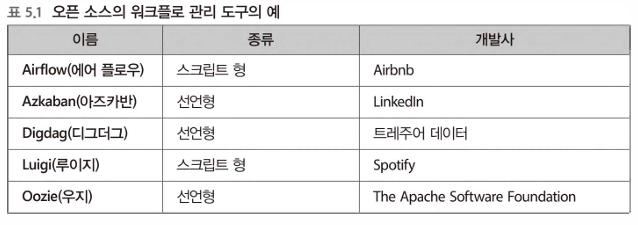
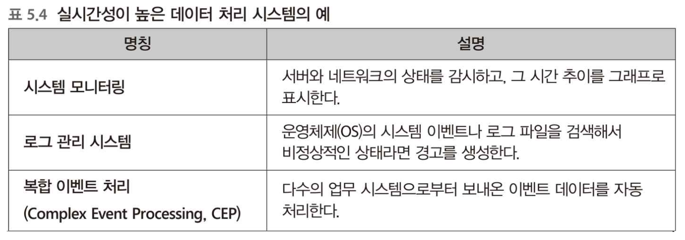

# 5장 빅데이터 파이프라인

## 5-1 워크플로 관리

### 위크폴로 관리 도구

워크폴로 관리 도구의 역활은 정기적으로 태스크를 실행하고 비정상적인 상태를 감지하여 그것에 대한 해결을 돕는 것이다

기존에는 업무용으로 개발된 워크플로 관리 도구가 그대로 데이터 처리에도 사용되었다. 그러나 요즘에는 데이터 파이프라인의 실행에 특화한 오픈소스의 워크플로 관리 도구가 여럿 개발되어서 점차 이용자가 늘어나고 있다.



### 워크폴로 관리 도구와 태스크

데이터 파이프라인의 실행과정에서는 데이터를 잇달아 이동하면서 정해진 처리를 반복한다. 이때 실행되는 개별 처리를 태스크라고 한다.


### 기본 기능과 빅데이터에서 요구되는 기능

워크플로 관리를 위해 전용 도구를 사용하는 이유는 태스트 실행에 실패할 수 있기 때문이다. 태스크의 수가 증가하면 실패한 태스크를 다시 실행하는 일 또한 어려워진다. 워크플로 관리 도구는 다음과 같은 기능을 제공한다.

- 태스크를 정기적인 스케줄로 실행하고 그 결과 통지하기
- 태스크 간의 의존관계를 정하고, 정해진 순서대로 빠짐없이 실행하기
- 태스크의 실행 결과를 보관하고, 오류 발생 시에는 재실행할 수 있도록 하기

### 오류로부터 복구 방법 먼저 생각하기

데이터 파이프라인 도중에 오류가 발생하는 경우 신속하게 해결하여 태스크를 재실행해야한다. 데이터 파이프라인은 처리시간이 긴경우도 있기 때문에 장애가 발생하는 경우 피해가 커진다.

빅데이터를 취급하고 있으면 다양한 오류가 발생한다. 네트워크의 일시적인 장애나 하드웨어 장애, 스토리지의 용량 부족, 쿼리 증가에 따른 성능 부족 등등

워크플로 관리에서는 태스크의 실행순서를 정하는 것과 동시에 오류로부터 어떻게 회복할 것인가라는 계획을 정한다. 문제가 발생해도 신속하게 회복할 수 있도록 오류에 강한 워크플로를 구축하여 데이터 처리를 안정적으로 지원해야한다.

### 복구와 플로우의 재실행

오류 중에서는 통신 오류와 같은 반복시 성공하는 것, 인증 오류와 같은 반복해도 실패하는 것이 있다.

오류에는 여러 가능성이 있으므로 기본적으로 워크플로 관리에서는 오류로부터 자동 회복할 수 없다는 점은 고려하지 않는다. 대신에 실패한 태스크에 대해 기록하여 나중에 재실행할 수 있도록 한다.


워크플로우 관리 도구에 의해 실행되는 일련의 태스크를 플로우라고 한다. 플로우에서는 실행 시 고정 파라미터가 부여되어 있다. 일별 배치 처리라면 날짜이다. 동일 플로우에 동일 파라미터를 부여하면 동일한 태스크가 실행되어야 한다. 플로우가 도중에 실패해도 나중에 동일 파라미터로 재실행이 가능해야 하기 때문이다.

대부분의 워크플로 관리도구는 과거에 실행한 플로우와 그 파라미터를 자동으로 데이터베이스에 기록하게 되어 있다. 오류 중 일부가 재실행으로 해결되는 경우가 있기 때문이다.


### 재시도

여러 번 발생하는 오류에 대해서는 되도록 자동화하여 수작업 없이 복구해야한다. 태스크를 재시도하는 방법은 간단하지만, 재시도 횟수에는 주의가 필요하다. 재시도가 적으면 장애로부터 복구하기 전에 재시도가 종료해 태스크 실행이 실패한다. 반대로 재시도가 너무 많으면 태스크가 실패하지 않은 것처럼 되기 때문에 중대한 문제가 발생해도 눈치채지 못한다.

재시도를 반복해도 문제가 없는 태스크라면 1,2회의 재시도를 실행해도 좋을 것이다. 그러나 그 이상은 태스크의 재시도로 대처하는 것이 아니라 올바른 문제 해결 방법을 찾아야한다.

### 백필

실패한 플로우를 복구하는 다른 방법은 플로우 전체를 처음부터 다시 실행하는 것이다.

백필이란 파라미터에 포함된 일시를 순서대로 바꿔가면서 일정 기간의 플로우를 연속해서 실행하는 구조다. 태스크의 실패가 며칠 동안이나 계속된 후에 이를 모두 모아서 재실행하고 싶을 때나 새롭게 만든 워크플로를 과거로 거슬러 올라가 실행하고 싶은 경우에 사용할 수 있다.


백필에 의해 대량의 태스크를 실행할 때에는 성능상의 주의가 필요하다. 예를들어 새롭게 일별 플로우를 작성했다고 하면, 그것을 백필함으로써 과거 30일간의 데이터처리를 의도한 읨가 될 수 있다.

대규모 백필을 실시할 때는 자동적인 재시도는 모두 무효로 하고, 오류는 모두 통지하는 것이 좋다. 테스트 삼아 조금씩 백필을 실행하여 어떠한 오류가 발생하는지, 오류가 발생하지 않는지를 확인한다. 오류가 자주 발생하면, 실행 속도를 낮춰서 부하를 떨어뜨려야 한다. 마지막에 오류가 난 태스크만을 재실행하면 모든 백필이 완료된다.

### 멱등한 조작으로 태스크를 기술하기

복구의 전제는 재실행의 안정성이다. 태스크를 도중까지 실행하다가 실패했을때 태스크 일부 처리로 데이터가 혼재할 수 있다.

### 원자성 조작

예를들어 SQL을 실행하는 태스크가 있고, 그안에서 INSERT문을 2회 호출하고 있고, 첫번째 INSERT가 종료된 상황에서 오류가 발생하면 태스크가 재실행된 때에 동일한 데이터가 다시 쓰일 수 있다.


이 문제를 회피할 수 있는 방법은 각 태스크가 시스템에 변경을 한번만 하도록 하는 것이다. 데이터베이스라면 여러번의 쓰기를 한번의 트랜잭션으로 실행할 수 있지만, 그렇지 않다면 쓰기가 필요한 수만큼 태스크를 원자성 있는 조작으로 구현하여 재시도의 안정성을 높여야한다.

원자성 조작에도 문제를 일으킬 가능성이 있는데, 태스크 구현상의 버그으로 원자성 조작 직후에 문제가 발생하면 원자성 조작 자체는 성공하고 있음에도 워크플로는 실패로 간주될 수 있다.

### 멱등한 조작

더  확실한 방법은 동일한 태스크를 여러번 실행해도 동일한 결과가 되도록 멱등한 조작을 구성하는 것이다. ex) SQL처리는 테이블 삭제 후 다시 만든다.

도중에 오류가 발생하여 재실행 해도 중복이 발생하지 않는다. 각 태스크를 어떻게 멱등하게 할지 생각하는 것은 이용자의 책임이다. 원칙적으로 항상 데이터를 덮어써야한다. 추가를 반복하면 데이터가 중복되지만, 치환을 반복해도 결과가 변하지 않으므로 멱등하다고 할 수 있다. 멱등한 태스크를 만들기 위해서는 태스크에 부여된 파라미터를 잘 이용해 고유의 이름을 생성하고, 여러번 실행해도 항상 치환이 시행되도록 설계하면 된다.

### 멱등한 추가

그러나 실제로는 항상 멱등한 태스크를 구성할 수 없다. 예를 들어 SQL에 의한 테이블 쓰기에는 그 날의 데이터만을 INSERT 문으로 기준 테이블에 추가하고 싶을때도 있다. 이 경우 태스크는 원자성을 갖고 실행할 수 있지만, 그냥 그대로는 멱등하지 않다.

과거의 모든 데이터를 치환하는 것은 멱등성을 보장하지만 부하가 크다. 그래서 테이블 파티셔닝을 사용해볼 수 잇는 테이블을 1일마다 1시간마다 파티션을 분할하여 파티션 단위로 치환하는 것이다.


태스크를 멱등으로 구성하는 것이 어렵다면, 그것을 포기하고 원자성을 지닌 추가만으로 운용한다. 태스크를 재실행하면 데이터가 중복될 가능성이 있으므로 자동적인 재시도는 무효로 처리하고 오류 발생시에는 수작업으로 복구해야한다.

### 원자성을 지닌 추가

복잡한 플로우에서는 하나의 테이블에 몇 번이고 데이터를 써넣을 때가 있다. 그 경우에는 추가를 반복하는 것이 아니라 중간 테이블을 만들어 처리한 후, 마지막에 목적 테이블에 한 번에 추가하는 것이 안정하다.


### 워크플로 전체를 멱등으로 하기

데이터 파이프라인을 안저정적으로 운용하기 위해서는 거기에 포함된 태스크나 플로우를 가능한 한 멱등으로 해야한다. 데이터 수집의 파이프라인에서는 테이블 파티셔닝을 도입함으로써 파티션 단위의 치환이 가능하다. 벌크 형데이터 전송에 대해서도 워크플로 관리 도구에서 날짜와 시간을 파라미터로 전달함으로써 치환 형의 태스크를 구현할 수 있다.


### 태스크 큐

워크플로 관리 도구에서 요구되는 다른 하나는 외부 시스템의 부하 컨트롤이다. 태스크의 크기가 크거나 동시 실행 수를 변화시킴으로써 자원의 소비량을 조정하여 모든 태스크가 원할하게 실행되도록 한다.

예를 들어 파일 서버로부터 분산 스토리지의 파일 전송의 경우 2MB의 압축이 안 된 텍스트 파일이 전부 1만개라면, 합계는 20GB가 된다. 이것 중에 하나의 파일을 압축해서 전송하는 데 5초가 걸린다면 총 14시간이 소요된다. 해당 태스크를 워크플로 관리 도구에서 실행해보자

첫번째는 병렬화다. 데이터 전송에 8코어 서버를 이용할 수 있다고 하자. 우선 단순하게 하나의 파일을 하나의 태스크로 고려할 수 있다. 각 태스크는 파일 서버로부터 파일을 추출하여 압축하고 분산 스토리지로 전송한다. 이런 일련의 절차를 워크플로 도구 안에서 호출할 수 있다.

이렇게 대량의 태스크를 동시에 실행하면 서버에 과부하가 걸리므로 어느정도 제한을 해야한다. 이때 사용할 수 있는 것이 태스크 큐라고 불리는 구조다. 워커 프로세스가 큐에 저장된 태스크를 하나씩 꺼내어 실행한다.


### 병목 현상의 해소

그러나 실제로는 8코어 서버에 8개의 워커로는 부족하다. 각 태스크는 CPU를 사용할 뿐만 아니라 디스크 I/O나 네트워크 I/O도 소비한다. 워커의 수를 늘리면 실행 속도를 높일 수 있다. 그렇다고 워커를 너무 증가시키면 병혹 션상이 발생할 수 있다.


## 5-2 배치형의 데이터 플로우

### MapReduce의 시대는 끝났다.

분산 스토리지로의 데이터 전송이 완료되면, 거기서부터는 분산 시스템의 프레임워크를 사용할 수 있다. 이전부터 MapReduce를 사용한 데이터 처리에서는 MapReduce 프로그램을 워크플로의 태스크로 등록함으로써 다단계의 복잡한 데이터 처리를 할 수 있었다.

### MapReduce의 구조

한때 빅데이터의 대표적인 기술이었던 MapReduce가 이젠 과거의 기술로 간주되어 새롭게 사용되는 일이 적어젔다. Hadoop에서는 Tez, Spark도 MapReduce를 대체할 프레임워크로 인기를 끌고 있다.


MapReduce는 구조상 Map과 Reduce의 하나의 사이클이 끝나지 않으면 다음 처리로 이동하지 않는다. 복잡한 데이터 처리에서는 Map과 Reduce를 여러번 반복하지 않으면 원하는 결과를 얻을 수 없으므로, 하나의 사이클에서 다음 사이클로 이동할 때가지 대기시간이 적지 않게 발생한다.

### MapReduce를 대신 새로운 프레임워크

새로운 프레임워크에 공통으로 들어가는 것이 DAG라고 불리는 데이터 구조다. DAG는 다음과 같은 성질을 갖고 있다.

- 노드와 노드가 화살표로 연결된다.
- 화살표를 아무리 따라가도 동일 노드로는 되돌아오지 않는다.

데이터 플로우에는 실행해야 할 일련의 태스크를 DAG에 의한 데이터 구조로 표현한다. 그림 안의 화살표는 태스크의 실행 순서를 나타내고 있으며, 그 의존 관계를 유지하면서 실행 순서를 알맞게 정하면 모드 태스크를 빠짐없이 완료 할 수 있다. 이후에는 이것을 얼마만큼 높은 효율로 실행할 수 있는지 문제가 남는다.


MapReduce와 달리 DAG를 구성하는 노드는 모두 동시 병행으로 실행된다.

### Spark 에서 DAG

DAG는 시스템의 내부적인 표현이며, 이용자가 그 존재를 의식할 일은 거이 없다. 데이터 플로우에 국한되지 않고, Hive on Tez, Presto와 같은 쿼리 엔진에도 DAG는 채택되어 있다. SQL로부터 DAG데이터 구조가 내부적으로 자동 생성된다. 한편 Spark와 같은 데이터 플로우의 프레임워크에서는 프로그래밍 연어를 사용하여 더욱 직접 DAG의 데이터 구조를 조립한다.

다음 코드는 MapReduce를 지원하는 Spark 스크립트이다.

```sql
lines = sc.testFile("sample.txt")
words=lines.flatMap(lambda line: line.split())
words.map(lambda word: (word, 1)
	.reduceByKey(lambda a, b: a + b)
	.saveAsTextFile("word_counts")
```


DAG에 의한 프로그래밍의 특징이 지연 평가이다. 프로그램의 각 행은 실제로는 DAG의 데이터 구조를 조립하고 있을 뿐, 거기서 특별히 뭔가를 처리하지는 않는다. 이후 내부 스케줄러가 분산 시스템에 효과적인 실행 계획을 세워주는 것이 데이터 플로우의 장점이다.

### 데이터 플로우와 워크플로를 조립하기

- 데이터를 읽어들이는 플로우


- 데이터를 써서 내보내는 플로우


### 데이터 플로우와 SQL을 나누어 사용하기

- 대화식 플로우


## 5-3 스트리밍 형의 데이터 플로우

데이터의 실시간 처리를 높이려면, 배치 처리와는 전혀 다른 데이터 파이프라인이 필요하다.

### 배치 처리와 스트림 처리로 경로 나누기

배치 처리를 중심으로 하는 데이터 파이프라인의 결점은 데이터가 분석할 수 있게 될때가지 시간이 걸린다는 것이다. 집계 효율을 높이기 위해 열 지향 스토리지를 만들려고 하면 데이터를 모아서 변환하는데 아무래도 일정 시간이 필요하다.

실시간이라는 이벤트 발생에서 몇 초 후에는 결과를 알 수 있는 것을 가리킨다. 좀 더 시간이 걸리는 예를 들어 1시간 후에 알아도 된다면 스트림 처리로 처리할 필욕 ㅏ없다.

실시간성이 높은 데이터 처리 시스템은 예쩐부터 여러 가지가 있으며 예를 들어 표 5.4와 같은 것이 사용되고 있다. 이 시스템들은 빅데이터라는 말이 사용되기 전보다도 이전에 대량의 데이터를 처리하고 있었으며, 각각의 분야에서 사용되고 있다.



배치 처리와 스티림 처리는 서로 결점을 보완하는 관계다. 배치 처리는 대체로 1년이상의 장기적인 데이터 분석을 예상한 스토리지를 구축하는 부분부터 시작한다. 그래서 모다운 데이터를 한 번에 처리하지 않으면 효율이 떨어지므로, 1시간마다 비교적 큰 단위로 데이터를 처리한다. 그러므로 배치 처리의 사이클이 올때가지는 데이터를 볼 수 없어 실시간 집계에는 적합하지 않다.

스트림 처리는 실시간성이 우수하지만, 과거의 데이터를 취급하는 데에는 부적합하다. 처리 내용을 변경하면 새롭게 도달한 데이터에는 적용되지만, 이미 처리가 끝난 과거 데이터까지는 변경되지 않는다. 앞으로 도달할 데이터에만 흥미가 있으면 스트림 처리가 적합하지만, 과거 데이터를 집계하고 싶다면 배치 처리쪽이 우수하다.


### 배치 처리와 스트림 처리 통합하기

스트림 처리를 위한 프레임워크는 여러가지가 있는데, 여기서는 DAG에 의한 데이터 플로우를 기술하는 것에 관해 설명한다. 배치처리에서는 먼저 데이터가 있고, 그것을 작게 나눠서 DAG에 흘려 넣는다. 한편 스트림 처리에는 끊임없이 데이터가 생성되면, 그것이 DAG 안에 흘러들어옴에 따라 처리가 진행된다.


배치 처리와 같이 실행 시에 데이터양이 정해지는 것을 유한 데이터라고 하고, 스트림 처리와 같이 제한이 없어 데이터가 보내지는 것을 무한 데이터라고 한다. 이 둘은 서로 성질의 차이는 있지만, 데이터를 작게 분할해서 DAG에서 실행한다는 점에서는 같다.

따라서 DAG를 사용한 데이터 플로우에서는 배치 처리와 스트림 처리를 동일하게 프로그래밍하는 것이 가능하다. 예를 들어 스트림 처리를 위한 DAG를 약간 손봐서 분산 스토리지 상의 과거 데이터, 즉 유한 데이터를 읽어 들이도록 하면 배치처리도 할 수 있다.

### 스트림 처리의 결과를 배치 처리로 치환하기

스트림 처리에는 잠재거인 두가지 문제가 있다. 하나는 틀린 결과를 어떻게 수정할 것인가이다. 스트림처리는 원칙적으로 시간을 되돌일 수 없기 때문이다.

두번쨰는 늦게 전송된 데이터 취급이다. 앞 장에서도 언급한 것처럼 메세지 배송의 지연이 발생하는 경우 이벤트 시간으로 집계하면 문제가 발생한다.

이런 문제들에 대해 대처 방법으로는 스트림 처리와는 별개로 배치 처리를 실행하여 후자의 결과가 옳다고 하는 것이다.

### 람다 아키텍처


람다 아키첵처는 데이터 파이프라인을 두가지 레이어로 분류한다. 모든 데이터는 반드시 배치 레이어에서 처리한다. 배치 처리 결과는 서빙 레이어를 통해서 접근한다. 여기에는 응답이 빠른 데이터베이스를 설치하여 집계 결과를 바로 추출하도록 한다. 서빙 레이어에서 얻어진 결과를 배치 뷰라고 한다. 배치 뷰는 실시간 정보를 제공하지 않는다.

스트림 처리를 위해 스피드 레이어에서는 실시간 뷰를 제공하여 배치 뷰와 실시간 뷰를 조합하여 쿼리를 실행한다. 이 조합을 통해 배치 처리와 스트림 처리의 단점을 서로 보완한다.

람다 아키텍처의 장점은 실시간 뷰의 결과가 나중에 배치 뷰로 치환된다는 것이다. 스트림 처리의 결과는 일시적으로만 사용되고 잠시 기다리면 배치 처리에 의해 올바른 결과를 얻을 수 있다. 스트림 처리가 정확하지 않아도 길게 보면 문제가 없다. 배치 처리만 안정되게 동작하고 있다면 스트림 처리를 다시 실행할 필요가 없다는 것이 람다 아키첵처의 개념이다.

### 카파 아키텍처

람다 아키텍처의 단점은 개발 효율이다. 구현이 번거롭다는 뜻이다. 카파 아키텍처는 람다 아키텍처를 단순화한 버전이다.

카파 아키텍처에서는 람다 아키텍처로 부터 배치 레이어나 서빙 레이어를 완전히 제거하고 스피드 레이어만 남긴다. 대신에 메시지 브로커의 보관기간을 길게하여 문제 발생시 메세지 배송 시간을 과거로 롤백한다.

카파 아키텍처의 문제점은 부하가 높아질 수 있다.

### 아웃 오브 오더의 데이터 처리

배치 처리에만 의존하는 것이 아니라 스트림 처리로 올바른 집계 결과를 얻기 위한 노력도 계속되고 있다. 문제가 되는 것은 늦게 도달하는 메세지, 프로세스 시간과 이벤트 시간의 차이이다. 아웃 오브 오더의 데이터 문제라고 한다.

### 원래 데이터의 모습은 이벤트 시간으로 얻을 수 있다.

스트림 처리란 기본적으로 프로세스 시간에 의한 실시간 데이터 처리다. 데이터가 도달한 순간에 집계를 시간하므로 시간에 대한 조작을 하지 않는다면 프로세스 시간에 의존한다.

이와 같은 현상은 메세지 배송의 경로상에서 어디에서도 일어날 수 있다. 어디선가 지연이 발생할 때마다 스트림 처리의 결과가 요동치게 된다면 어떤 것을 믿어야 할지 모른다. 결국 프로세스 시간으로 집계하는 한 원래 데이터의 모습은 알 수 없다. 결국 이벤트 시간을 집계해야 올바른 결과를 얻을 수 있다.

### 이벤트 시간 윈도윙

스트림 처리에서는 시간을 일정 간격을 나누어 원도우를 만들고 그안에서 데이터 집계를 한다. 예를 들어 과거 1시간의 이벤트 수 추이를 그래프로 만들고 싶으면 데이터를 1분 간격인 60개의 윈도우로 나누어 각각 윈도우로 이벤트 수를 센다.

이러한 방법은 이벤트 시간 윈도잉이라고 말한다. 이벤트 시간으로 보면, 메세지가 배송된 데이터는 무작위 순으로 나열된 아웃 오브 오더 상태이므로, 적절하게 순서를 바꿔야한다.


그 때문에 과거 이벤트의 상태를 보존하여 데이터가 도달할 때 마다 해당하는 윈우를 재집계할 필요가 있다.