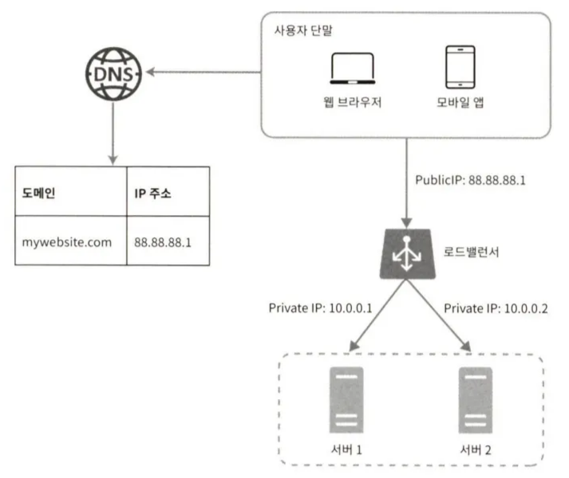

## 1.1. 단일 서버

- 모든 컴포넌트가 단 한 대의 서버에서 실행되는 간단한 시스템

1. 사용자는 도메인 이름을 이용해 웹사이트에 접속한다. 이때 DNS에 질의하여 도메인 이름을 IP 주소로 변환하는 과정이 필요하다.
    
    DNS는 보통 제3 사업자(third party)가 제공하는 유료 서비스를 이용하게 된다 → 우리 서비스의 일부 X
    
2. DNS 조회 결과로 IP 주소가 반환된다
3. 해당 IP 주소로 HTTP 요청이 전달된다
    - 이때 요청은 두 종류의 단말로부터 온다
    1. 웹 애플리케이션: 비즈니스 로직, 데이터 저장 등을 처리하기 위해 서버 구현용 언어(자바, 파이썬 등)를 사용하고, 프레젠테이션용으로는 클라이언트 구현용 언어(HTML, 자바스크립트 등)를 사용한다
    2. 모바일 앱: 모바일 앱과 웹 서버 통신을 위해 HTTP 프로토콜을 이용한다
4. 요청을 받은 웹 서버는 HTML 페이지나 JSON 형태의 응답을 반환한다
    - HTTP 프로토콜을 통해 반환되는 응답 데이터는 보통 JSON이 사용되며, 간결하다는 장점으로 자주 사용된다

## 1.2. 데이터베이스

- 사용자가 늘어날 경우 여러 서버를 두어야 한다
    1. 웹/모바일 트래픽 처리 용도
    2. 데이터베이스 용
    
    
    

### 어떤 데이터베이스를 사용할 것인가?

- 관계형 데이터베이스(relational database)
    - 관계형 데이터베이스 관리 시스템(Relational Data-base Management System, RDBMS)
    - 예) MySQL, Oracle Database, PostgreSQL 등
    - 자료를 테이블과 열, 칼럼으로 표현
    - SQL을 사용하여 조작, 조인 가능
- 비관계형 데이터베이스
    - NoSQL
    - 예) CouchDB, Neo4j, Cassandra, HBase, Amazon DynamoDB 등
    - 네 가지 종류가 존재
        - 키-값 저장소(key-value store)
        - 그래프 저장소(graph store)
        - 칼럼 저장소(column store)
        - 문서 저장소(document store)
    - 조인 불가능
- 관계형 데이터베이스를 일반적으로 선택하지만, 아래와 같은 경우 비관계형 데이터베이스를 선택할 수 있다
    - 아주 낮은 응답 지연시간(letency)이 요구됨
    - 다루는 데이터가 비정형(unstructured)이라 관계형 데이터가 평아님
    - 데이터(JSON, YAML, XML 등)를 직렬화(serialize)하거나 역직렬화(deserialize)할 수 있기만 하면 됨
    - 아주 많은 양의 데이터를 저장할 필요가 있음

## 1.3. 수직적 규모 확장 vs 수평적 규모 확장

- 스케일 업(scale up): 수직적 규모 확장(vertical scaling) 프로세서
    - 서버에 고사양 지원(더 좋은 CPU, 더 많은 RAM 등)을 추가하는 행위
    - 단순함
    - 서버로 유입되는 트래픽의 양이 적을 경우 적합
    - 단점:
        - 한 대의 서버에 CPU나 메모리를 무한대로 증설할 방법은 없다
        - 장애에 대한 자동복구(failover) 방안이나 다중화(re-dundancy) 방안을 제시하지 않고, 서버에 장애가 발생하면 웹사이트/앱은 완전히 중단된다
        
        → 대규모 애플리케이션을 지원하는 것에는 수평적 규모 확장법이 보다 적절함
        
- 스케일 아웃(scale out): 수평적 규모 확장 프로세스
    - 더 많은 서버를 추가하여 성능을 개선하는 행위

### 로드밸런서

- 앞서 본 설계에서는 웹 서버가 다운되어 사용자가 접속할 수 없고, 너무 많은 사용자가 접속해 웹 서버가 한계 상황에 도달하면 응답 속도가 느려지거나 서버 접속이 불가능해질 수 있다
    
    → 부하 분산기 / 로드밸런서(load balancer)를 도입하는 이유 
    
- 로드밸런서는 부하 분산 집합(load balancing set)에 속한 웹 서버들에게 트래픽 부하를 고르게 분산하는 역할을 한다

- 사용자가 DNS로부터 받은 IP 주소로 접속하는데, 이때 웹 서버가 클라이언트의 접속을 직접 처리하는 것이 아니라, 로드밸런서가 처리한다
- 로드밸런서와 웹 서버처럼, 서버 간 통신에 private IP 주소가 이용된다
    - private IP 주소: 같은 네트워크에 속한 서버 사이의 통신에만 쓰일 수 있는 IP 주소. 인터넷을 통해 접속할 수 없다
- 부하 분산 집합에 또 하나의 웹 서버를 추가하면 장애를 자동복구하지 못하는 문제(no failover)가 해소되고, 웹 계층의 가용성(availability)은 향상된다
    - 서버 1이 다운되면 모든 트래픽은 서버 2로 전송되어 웹 사이트 전체가 다운되는 일을 방지한다
    - 웹 사이트로 유입되는 트래픽이 갑작스레 증가해 두 대의 서버로도 감당하기 힘든 지점이 올 때, 로드밸런서를 통해 대처할 수 있다

### 데이터베이스 다중화

> 많은 데이터베이스 관리 시스템이 다중화를 지원한다. 보통은 서버 사이에 주(master) - 부(slave) 관계를 설정하고 데이터 원본은 주 서버에, 사본은 부 서버에 저장하는 방식이다
> 
- 쓰기 연산(write operation)은 마스터에서만 지원
    - insert, delete, update 등
- 부 데이터베이스는 주 데이터베이스로부터 그 사본을 전달 받으며 읽기 연산 만 지원
- 대부분 읽기 연산의 비중이 쓰기 연산보다 훨씬 높기 때문에 부 데이터베이스의 수가 주 데이터베이스의 수보다 많다 ⇒ 데이터베이스 다중화

- 데이터베이스 다중화의 장점
    - 더 나은 성능: 데이터 변경 연산은 주 서버, 읽기 연산은 부 서버로 분산되어 병렬로 처리될 수 있는 쿼리의 수가 늘어나므로 성능이 향상된다
    - 안정성(reliability): 데이터를 지역적으로 여러 장소에 다중화시켜 놓을 수 있기 때문에, 여러 이유로 데이터베이스 서버 일부가 파괴되어도 데이터는 보존된다
        - 데이터가 유실 및 손상 없이 보존되는 능력 (데이터 자체의 생존, 장기적, 살아남는가?)
    - 가용성(availability): 데이터를 여러 지역에 복제해 둠으로써, 하나의 서버에 장애가 발생해도 다른 서버에 있는 데이터를 가져와 계속 서비스할 수 있다
        - 데이터 및 서비스에 언제든 접근할 수 있는 능력 (서비스 지속성, 단기적, 지금 당장 쓸 수 있는가?)
- 데이터베이스 서버 가운데 하나가 다운되면 무슨 일이 벌어지는가?
    - 부 서버가 한 대 뿐인데 다운된 경우: 읽기 연산은 한시적으로 모두 주 서버에 전달되고, 즉시 새로운 부 서버가 장애 서버를 대처한다.
    - 부 서버가 여러 대인데 하나가 다운된 경우: 읽기 연산은 나머지 부 서버들로 분산되고, 새로운 부 서버가 장애 서버를 대처한다.
    - 주 서버가 다운되고, 부 서버가 한 대인 경우: 해당 부 서버가 새로운 주 서버가 되고, 모든 데이터베이스 연산은 새로운 주 서버에서 수행된다. 그리고 새로운 부 서버가 추가된다.
        - 프로덕션 환경의 경우: 부 서버에 보관된 데이터가 최신 상태가 아닐 수 있기 때문에, 복구 스크립트를 통해 추가해야 한다

### 로드밸런서와 데이터베이스 다중화를 고려한 설계안

- 사용자는 DNS로부터 로드밸런서의 public IP 주소를 받는다
- 사용자는 해당 IP 주소를 사용해 로드밸런서에 접속한다
- HTTP 요청은 서버 1, 2 중 하나로 전달된다
- 웹 서버는 사용자의 데이터를 부 데이터베이스 서버에서 읽는다
- 웹 서버는 데이터 변경 연산은 주 데이터베이스로 전달한다

## 1.4. 캐시

- 캐시: 값비싼 연산 결과 또는 자주 참조되는 데이터를 메모리 안에 두고, 뒤이는 요청이 보다 빨리 처리될 수 있도록 하는 저장소
- 웹 페이지를 새로고침할 때마다 데이터를 가져오기 위해 한 번 이상의 데이터베이스 호출이 발생한다. 애플리케이션의 성능은 데이터베이스를 얼마나 자주 호출하느냐에 크게 좌우되는데, 캐시는 그런 문제를 완화할 수 있다

### 캐시 계층

- 캐시 계층(cache tier): 데이터가 잠시 보관되는 곳. 데이터베이스보다 훨씬 빠르다
- 주도형 캐시 전략(read-through caching strategy)
    
    
    
    1. 데이터가 캐시에 있으면 캐시에서 데이터를 읽어온다
    2. 데이터가 캐시에 없으면 데이터베이스에서 해당 데이터를 읽어 캐시에 쓰고, 데이터를 반환한다
- 캐시 전략은 캐시할 데이터 종류, 크기, 액세스 패턴에 맞는 전략으로 선택한다

### 캐시 사용 시 유의할 점

- 캐시는 어떤 상황에 바람직한가?
    - 데이터 갱신은 자주 일어나지 않지만 참조는 빈번하기 일어나는 경우
- 어떤 데이터를 캐시에 두어야 하는가?
    - 휘발성 메모리에 두므로, 영속적으로 보관할 데이터는 바람직하지 않다
- 캐시에 보관된 데이터는 어떻게 만료(expire)되는가?
    - 이에 관해 상황에 맞는 정책을 마련해 두어야 한다
    - 만료 기한은 너무 짧으면 데이터베이스를 너무 자주 읽게될 것이고, 너무 길면 원본과 차이가 날 가능성이 높아진다
- 일관성(consistency)은 어떻게 유지되는가?
    - 일관성: 데이터 저장소의 원본과 캐시 내의 사본이 같은지 여부
    - 저장소의 원본을 갱신하는 연산과 캐시를 갱신하는 연산이 단일 트랜잭션으로 처리되지 않은 경우 일관성에 문제가 생길 수 있다
- 장애에는 어떻게 대처할 것인가?
    - 캐시 서버를 한 대만 두는 경우 해당 서버는 단일 장애 지점(Single Point of Failure, SPOF)이 되어버릴 가능성이 있다
        - 단일 장애 지점(Single Point of Failure, SPOF): 어떤 특정 지점에서의 장애가 전체 시스템의 동작을 중단시켜버릴 수 있는 경우의 그 특정 지점
            
            
            
    - SPOF를 피하기 위해 여러 지역에 캐시 서버를 분산시켜야 한다
- 캐시 메모리는 얼마나 크게 잡을 것인가?
    - 캐시 메모리가 너무 작은 경우, 데이터가 너무 자주 캐시에서 밀려나(eviction) 캐시의 성능 저하가 발생한다
    - 차라리 캐시 메모리를 과할당(overprivision)하여 캐시에 보관할 데이터가 갑자기 늘어났을 때 생길 문제도 방지할 수 있다
- 데이터 방출(eviction) 정책은 무엇인가?
    - 캐시가 꽉 차버리면 추가로 캐시에 데이터를 넣어야할 경우 기존 데이터를 내보내야 한다
    - LRU(Least Recently Used): 마지막으로 사용된 시점이 가장 오래된 데이터를 내보내는 정책
    - LFU(Least Frequently Used): 사용된 빈도가 가장 낮은 데이터를 내보내는 정책
    - FIFO(First In First Out): 선입선출, 가장 먼저 캐시에 들어온 데이터를 가장 먼저 내보내는 정책

## 1.5. 콘텐츠 전송 네트워크(CDN)

- 콘텐츠 전송 네트워크(CDN): 정적 콘텐츠를 전송하는 데 쓰이는, 지리적으로 분산된 서버의 네트워크
    - 이미지, 비디오, CSS, JavaScript 파일 등을 캐시할 수 있다
- 동적 컨텐츠 캐싱: 요청 경로, 질의 문자열, 쿠키, 요청 헤더 등의 정보에 기반해 HTML 페이지를 캐시하는 것
- 사용자가 웹사이트에 방문하면, 가장 가까운 CDN 서버가 정적 콘텐츠를 전달하여 사이트 로딩 시간을 개선할 수 있다
    
    
    

### CDN의 동작 방식

1. 사용자 A가 이미지 url을 이용해 image.png에 접근한다. 이때 url의 도메인은 CDN 서비스 사업자가 제공한다.
2. CDN 서버의 캐시에 해당 이미지가 업는 경우, 서버는 원본(origin) 서버에 요청하여 파일을 가져온다.
    - 이때 원본 서버는 웹 서버이거나 S3와 같은 온라인 저장소
3. 원본 서버가 파일과 캐시 TTL 값을 CDN 서버에 반환한다
4. CDN 서버는 파일을 캐시하고(TTL에 명시된 시간이 끝날 때까지) 사용자 A에게 반환한다
5. 사용자 B가 같은 이미지에 대한 요청을 CDN 서버에 전송한다
6. 만료되지 않은 이미지에 대한 요청은 캐시를 통해 처리된다

### CDN 사용 시 고려해야 할 사항

- 비용: CDN은 보통 제3사업자(third-party providers)에 의해 운영되며, 우리는 CDN으로 들어가고 나가는 데이터 전송 양에 따라 요금을 지불하게 된다. 자주 사용되지 않은 콘텐츠를 캐싱하지 않는 등 비용을 고려해야 한다
- 적절한 만료 시한 설정: 시의성이 중요한 콘텐츠의 경우 만료 시점을 잘 정해야 한다.
    - 너무 긴 경우 콘텐츠의 신선도는  떨어지고, 너무 짧으면 원본 서버에 빈번히 접속하게 된다
- CDN 장애에 대한 대처 방안: CDN이 응답하지 않을 경우, 해당 문제를 감지해 원본 서버로부터 직접 콘텐츠를 가져오도록 클라이언트를 구성할 필요가 있을 수 있다
- 콘텐츠 무효화(invalidation) 방법: 아직 만료되지 않은 콘텐츠라 하더라도 아래 방법을 통해 CDN에서 제거 가능
    - CDN 서비스 사업자가 제공하는 API 이용
    - 콘텐츠의 다른 버전을 서비스하도록 오브젝트 버저닝(object versioning) 이용

### CDN과 캐시가 추가된 설계

1. 정적 콘텐츠는 CDN을 통해 더 나은 성능을 보장
2. 캐시를 통해 데이터베이스 부하를 줄인다

## 1.6. 무상태(stateless) 웹 계층

- 웹 계층을 수평적으로 확장하는 방법
- 무상태(stateless) 웹 계층: 상태 정보(사용자 세션 데이터 등)를 관계형 데이터베이스나 NoSQL 같은 지속성 저장소에 보관하고 필요할 때 갖고 오도록 구성된 웹 계층

### 상태 정보 의존적인 아키텍처

- 상태 정보를 보관하는 서버는 클라이언트 정보를 유지해 요청들 사이에 공유되도록 한다
    
    → 상태를 유지하는 것
    

- 위 경우, 사용자 A는 서버 1에만 요청을 보내야 하고, 다른 서버로 보낼 경우 인증에 실패하는 등의 문제가 발생할 수 있다
    
    ⇒ 클라이언트로부터의 요청은 항상 같은 서버로 전송되어야 한다는 문제가 발생한다
    
- 대부분 로드밸런스에는 이를 위한 고정 세션(sticky session)이라는 기능이 있지만, 부담이 되고 서버의 장애를 처리하기에도 복잡해진다

### 무상태 아키텍처

- 상태 정보는 웹 서버로부터 물리적으로 분리된 공유 저장소에 저장되어, 사용자로부터의 HTTP 요청은 어떤 웹 서버로도 전달될 수 있다
- 이러한 구조는 단순하고, 안정적이고, 규모 확장이 쉽다

### 무상태 웹 계층을 갖도록 변경한 설계안

- 공유 저장소는 관계형 데이터베이스, NoSQL, Redis 같은 캐시 시스템일 수 있다
    
    → 위 경우, 간편한 규모 확장을 위해 NoSQL 사용
    
1. 자동 규모 확장(autoscaling)은 트래픽 양에 따라 웹 서버를 자동으로 추가하거나 삭제하는 기능

## 1.7. 데이터 센터

- 전 세계 어디에서도 웹 사이트를 쾌적하게 사용할 수 있도록 하기 위해서 여러 데이터 센터를 지원하는 것은 필수적이다

### 두 개의 데이터 센터를 이용하는 사례

- 지리적 라우팅(geoDNS-routing or geo-routing): 장애가 없는 상황에서 가장 가까운 데이터 센터로 안내되는 절차
    - geoDNS: 사용자의 위치에 따라 도메인 이름을 어떤 IP 주소로 변환할지 결정할 수 있도록 해주는 DNS 서비스
- 이때 데이터 센터 중 하나에 심각한 장애가 발생하면 모든 트래픽은 장애가 없는 데이터 센터로 전송된다

- 다중 데이터 센터 아키텍처를 만들기 위해 몇 가지 기술적 난제를 해결해야 한다
    - 트래픽 우회: 올바른 데이터 센터로 트래픽을 보내는 효과적인 방법을 찾아야 한다
    - 데이터 동기화(synchronization): 데이터 센터마다 별도의 데이터베이스를 사용하고 있는 상황이라면, 장애가 자동으로 복구되어 트래픽이 다른 데이터베이스로 우회된다 해도 찾는 데이터가 없을 수 있다.
        
        → 데이터를 여러 데이터 센터에 걸쳐 다중화하는 것
        
    - 테스트와 배포(deployment): 웹 사이트 또는 애플리케이션을 여러 위치에서 테스트해보는 것이 중요하다

## 1.8. 메시지 큐

- 메시지 큐는 메시지의 무손실을 보장하는, 비동기 통신(asynchronous communication)을 지원하는 컴포넌트
    - 메시지의 무손실(durability): 메시지 큐에 일단 보관된 메시지는 소비자가 꺼낼 때까지 안전히 보관된다

- 생산자(발행자, producer/publisher)라고 불리는 입력 서비스가 메시지를 만들어 메시지 큐에 발행(publish)한다. 큐에는 보통 소비자(구독자, consumer/subscriber)라 불리는 서비스 혹은 서버가 연결되어 있는데, 메시지를 받아 그에 맞는 동작을 수행한다
- 메시지 큐 이용 시, 서버 간 결합이 느슨해져 규모 확장성이 보장되어야 하는 안정적 애플리케이션을 구성하기 좋다
- 생산자는 소비자 프로세스가 다운되어 있어도 메시지를 발생할 수 있고, 소비자는 생산자 서비스가 가용한 상태가 아니더라도 메시지를 수신할 수 있다
- 예) 사진 보정 애플리케이션
    
    
    
    - 웹 서버가 보정 작업을 메시지 큐에 넣고, 사진 보정 작업 프로세스들은 이 작업을 메시지 큐에서 꺼내 비동기적으로 완료한다
    - 이 경우 생산자와 소비자 서비스의 규모는 각기 독립적으로 확장 가능하다

## 1.9. 로그, 메트릭 그리고 자동화

- 규모가 커지면 로그, 메트릭(metric), 자동화(automation)과 같은 도구가 필수적이게 된다
- 로그
    - 시스템의 오류와 문제들을 보다 쉽게 찾아내기 위해 에러 로그를 모니터링하는 것은 중요하다. 로그를 단일 서비스로 모아주는 도구를 활용할 수 있다
- 메트릭: 어떤 상태, 성능, 품질 등을 수치로 측정 및 평가할 수 있는 지표
    - 메트릭을 잘 수집하면 사업 현황에 관한 유용한 정보를 얻을 수도, 시스템의 현재 상태를 손쉽게 파악할 수도 있다
    - 호스트 단위 메트릭: CPU, 메모리, 디스크 I/O에 관한 메트릭
    - 종합 메트릭(aggregated) 메트릭: 데이터베이스 계층의 성능, 캐시 계층의 성능 같은 것
    - 핵심 비즈니스 메트릭: 일별 능동 사용자(daily active user), 수익(revenue), 재방문(retention) 같은 것
- 자동화
    - 시스템이 크고 복잡해질 경우 생산성을 높이기 위해 자동화 도구를 활용해야 한다

### 메시지 큐, 로그, 메트릭, 자동화 등을 반영하여 수정한 설계안

1. 메시지 큐는 각 컴포넌트보다 느슨히 결합될 수 있도록 하고, 결함에 대한 내성을 높인다
2. 로그, 모니터링, 메트릭, 자동화 등을 지원하기 위한 장치를 추가

## 1.10. 데이터베이스의 규모 확장

### 수직적 규모 확장법

- 스케일 업
- 기존 서버에 더 많은, 더 고성능의 자원(CPU, RAM, 디스크 등)을 증설하는 방법
- 문제점
    - CPU, RAM을 무한 증설할 수 없고 사용자가 계속 늘어나면 결국 한 대의 서버로는 감당하기 어려워질 것이다
    - SPOF 위험성이 크다
    - 비용이 많이 든다

### 수평적 규모 확장법

- 더 많은 서버를 추가함으로써 성능을 향상시키는 방법
- 데이터베이스의 수평적 확장 → 샤딩(sharding)
- 샤딩: 데이터베이스를 샤드(shard)라고 부르는 작은 단위로 분할하는 기술
    - 모든 샤드는 같은 스키마를 쓰지만 샤드에 보관되는 데이터 사이에는 중복이 없다
    - 예) 샤드로 분할된 데이터베이스, id에 따라 보관되는 샤드를 결정하는 경우
        
        
        
        
        
        
- 샤딩 전략에서 가장 중요한 것 ⇒ 샤딩 키(sharding key = 파티션 키(partition key)) 선정
    - 데이터가 어떻게 분산될지 정하는 하나 이상의 컬럼
- 샤딩 도입 시, 시스템이 복잡해지고 풀어야 할 새로운 문제들이 발생한다
    - 데이터의 재 샤당(resharding): 데이터가 너무 많아진 경우, 샤드 간 데이터 분포가 불균형해 샤드 소진이 발생하는 경우
    - 유명인사(celebrity) 문제(= 핫스팟 키(hotspot key) 문제): 특정 샤드에 질의가 집중되어 서버에 과부하가 걸리는 문제
    - 조인과 비정규화(join and de-nomalization): 하나의 데이터베이스를 여러 샤드 서버로 쪼개면 이 데이터를 조인하기 힘들어진다 → 데이터베이스를 비정규화해 하나의 테이블에서 질의가 수행될 수 있도록 해야 한다

### 데이터베이스 샤딩을 적용한 아키텍처

- 데이터베이스에 대한 부하를 줄이기 위해 관계형 데이터베이스가 요구되지 않는 기능들은 NoSQL로 이전

