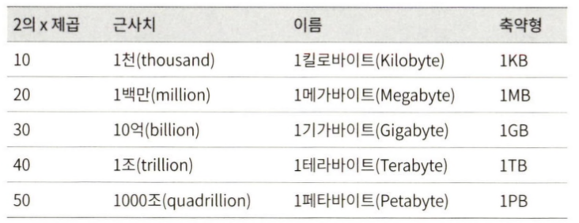

> 개략적인 규모 추정(back-of-the-envelope estimation)은 보편적으로 통용되는 성능 수치상에서 사고 실험(thought experiments)을 행하여 추정치를 계싼하는 행위로서, 어떤 설계가 요구사항에 부합할 것인지 보기 위한 것이다
> 

## 2.1. 2의 제곱수

- 데이터 볼륨(크기)은 2의 제곱수 단위로 표현하는 적이 정확하다
- 최소 단위: Byte
    - 1Byte = 8Bit
        - Bit는 0, 1 을 표현하는 단위
    - ASCII 문자 하나가 차지하는 메모리 크기: 1Byte

## 2.2. 모든 프로그래머가 알아야 하는 응답지연 값

- 구글의 제프 딘이 2010년에 공개한 통상적인 컴퓨터에서 구현된 연산들의 응답지연 값
    
    
    
- 딘 박사가 나열한 수를 2020년 기준으로 알기 쉽게 시각화한 결과
    
    
    
    → 메모리는 빠르지만 디스크는 아직도 느리다
    
    → 디스크 탐색(seek)은 가능한 한 피하라
    
    → 단순한 압축 알고리즘은 빠르다
    
    → 데이터를 인터넷으로 전송하기 전에 가능하면 압축하라
    
    → 데이터 센터는 보통 여러 지역(region)에 분산되어 있고, 센터들 간에 데이터를 주고받는 데는 시간이 걸린다
    

## 2.3. 가용성에 관계된 수치들

- 고가용성(high availability): 시스템이 오랜 시간 동안 지속적으로 중단 없이 운영될 수 있는 능력을 지칭하는 용어
    - 퍼센트로 표현
    - 100% → 시스템이 단 한 번도 중단된 적이 없다
    - 대부분의 서비스는 99~100% 의 값을 갖는다
- SLA(Service Level Agreement): 서비스 사업자가 보편적으로 사용하는 용어로, 서비스 사업자와 고객 사이에 맺어진 합의를 의미
- SLA에 서비스 사업자가 제공하는 서비스의 가용시간이 공식적으로 기술된다
    - 아마존, 구글, 마이크로소프트와 같은 사업자는 99% 이상의 SLA를 제공
    
    
    

## 2.4. 예제) 트위터 GPS와 저장소 요구랑 추정

- 가정
    - 월간 능동 사용자(monthly active user)는 3억(300million) 명 이다
    - 50%의 사용자가 트위터를 매일 사용한다
    - 평균적으로 각 사용자는 매일 2건의 트윗을 올린다
    - 미디어를포함하는트윗은 10% 정도다
    - 데이터는 5년간 보관된다
- 추정
    - QPS(Query Per Second) 추정 치
        - 일간 능동 사용자(Daily Active User, DAU) =3억 x 50%= 1.5억 (150million)
        - QPS = 1.5억 X 2 트윗/24시간/3600초 = 약 3500
        - 최대 QPS(Peek QPS) = 2 x QPS = 약 7000
    - 미디어 저장을 위한 저장소 요구량
        - 평균 트윗 크기
            - tweet_id: 64Byte
            - 텍스트: 140Byte
            - 미디어: 1MB
        - 미디어 저장소 요구량: 1.5억 x 2 x 10% x 1MB = 30TB / 일
        - 5년간 미디어를 보관하기 위한 저장소 요구량: 30TB X 365 x 5 = 약 55PB

## 2.5. 팁

- 근사치를 활용한 계산(rounding and approximation): 면접장에서 복잡한 계산을 하는 것은 어려운 일이다. 적절한 근사치를 활용하여 시간을 절약하자
    - 예) 99987 / 9.1 ⇒ 100000 / 10
- 가정(assumption)들은 나중에 살펴볼 수 있도록 적어두라
- 단위(unit)를 붙여라
- 많이 출제되는 개략적 규모 추정 문제는 QPS, 최대 QPS, 저장소 요구량, 캐시 요구량, 서버 수 등을 추정하는 것이다