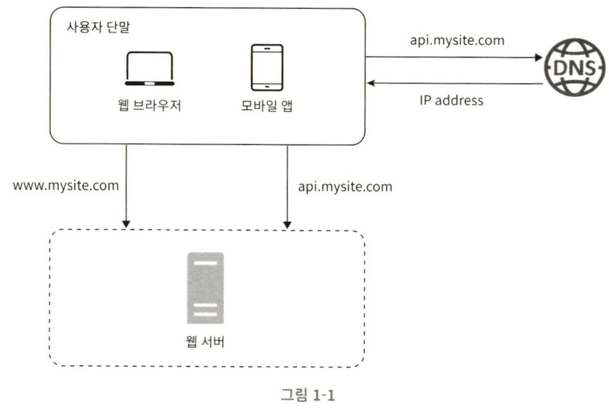

# 가상 면접 사례로 배우는 대규모 시스템 설계 기초 1장 사용자 수에 따른 규모 확장성

## 단일 서버

웹, 앱, 데이터베이스, 캐시를 모두 서버 한 대에서 실행한다.

위 시스템에서 사용자의 요청이 처리되는 과정은 다음과 같다.

1. 사용자는 도메인 이름을 이용하여 웹사이트(api.mysite.com)에 접속한다. 접속을 위해서 도메인 이름을 도메인 이름 서비스(DNS)에 질의하여 IP주소로 변환하는 과정이 필요하다. 도메인 이름 서비스는 보통 제3 사업자가 제공하는 유로 서비스를 이용하기 때문에 시스템 외부이다.
2. DNS 조회 결과로 IP 주소(15.125.23.214)를 반환한다.
3. 해당 IP주소로 HTTP 요청이 전달된다.
4. 요청을 받은 웹서버는 HTML, JSON 형태의 응답를 반환한다.

## 데이터 베이스

사용자가 늘면 서버 하나로는 충분하지 않아 여러 서버를 필요로 한다. 하나는 웹/모바일 트래픽 처리 용도, 다른 하나는 데이터베이스 용도이다. 이렇게 웹 계층과 데이터 계층을 분리하면 각각을 독립적으로 확장해 나갈 수 있게 된다.

<aside>
💡

어떤 데이터베이스를 사용할 것인가?

관계형 데이터베이스는 관계형 데이터베이스 관리 시스템(RDBMS)이라고 부른다. 관계형 데이터 베이스는 자료를 테이블과 열, 칼럼으로 표현한다. SQL을 사용하면 여러 테이블에 있는 데이터를 그 관계에 따라 조인(join)하며 합칠 수 있다.

비 관계형 데이터베이스는 NoSQL이라고 부른다. NoSQL은 다시 네 부류로 나눌 수 있는데, 키 값 저장소, 그래프 저장소, 칼럼 저장소, 문서 저장소가 있다. NoSQL에서는  조인 연산을 일반적으로 지원하지 않는다.

대부분의 개발자에게는 관계형 데이터베이스가 최선일 것인데, 40년 이상 시장에서 살아남아 잘 사용되어 온 시스템이기 때문이다. 단 아래와 같은 경우에는 비 관계형 데이트베이스가 바람직할 수 있다.

- 아주 낮은 응답 지연시간(latency)가 요구됨
- 다루는 데이터가 비정형(unstructured)이라 관계형 데이터가 아님
- 데이터(JSON, YAML, XML)를 직렬화하거나, 역직렬화 할 수 있기만 하면 됨
- 아주 많은 양의 데이터를 저장할 필요가 있음
</aside>

### 수직적 규모 확장 VS 수평적 규모 확장

소위 스케일 업(scale up)이라고 하는 수직적 규모(vertical scaling) 확장 프로세스는 서버에 고사향 자원을 추가하는 행위를 말한다. 반면 스케일 아웃(scale out)이라고 하는 수평적 규모 확장 프로세스는 더 많은 서버를 추가하여 성능을 개선하는 행위를 말한다.

서버로 유입되는 트래픽의 양이 적을 때는 수직적 확장이 좋은 선택이며, 이 방법의 가장 큰 장점은 단순함이다. 그러나 불행하거도 이 방법에는 몇가지 심각한 단점이 있다.

- 수직적 규모 확장에는 한계가 있다. 한 대의 서버에 CPU나 메모리를 무한대로 증설할 방법이 없다.
- 수직적 규모 확장법은 장애에 대한 자동복구 방안이나 다중화 방안을 제시하지 않는다. 서버에 장애가 발생하면 웹사이트,웹은 완전히 중단된다.

이러한 이유로 대규모 애플리케이션은 수평적 규모 확장법이 적절하다.

이전 설계에서는 사용자가 웹서버에 바로 연결된다. 웹 서버가 다운되면 사용자는 웹 사이트에 접속할 수 없다. 또한, 너무 많은 사용자가 접속하여 웹서버가 한계 상황에 도달하게 되면 응답 속도가 느려지거나 서버 접속이 불가능해질 수도 있다. 이런 문제를 해결하는데는 부하 분산기 또는 로드밸런서(load balancer)를 도입하는 것이 최선이다.

## 로드밸런서

로드 밸런서는 부하 분산 집합에 속한 웹서버들에게 트래픽 부하를 고르게 분산하는 역활을 한다.

사용자는 로드밸런서의 공개 IP주소로 접속한다. 로드 밸런서는 클라이언트의 접속을 직접 처리하지 않는다. 더 나은 보안을 위해 서버 간 통신에는 사설 IP주소가 이용된다. 사설 IP주소는 같은 네트워크에 속한 서버 사이의 통신에만 쓰일 수 있는 IP주소로, 인터넷을 통해서는 접속할 수 없다. 로드밸런서는 웹 서버와 통신하기 위해 바로 이 사설 주소를 이용한다.

웹 서버를 추가함에 따라 장애를 자동복구하지 못하는 문제는 해소되면, 웹 계층의 가용성은 향상된다.

- 서버 1이 다운되면 모든 트래픽은 서버 2에 전송된다. 부하를 나누기 위해 새로운 서버를 추가할 수도 있다.
- 웹사이트로 유입되는 트래픽이 가파르게 증가면 두 대의 서버로 트래픽을 감당한 수 없는 시점이 오는데, 로드밸런서가 있으므로 대처할 수 있다. 웹서버 계층에 더 많은 서버를 추가하기만 하면 된다.

웹 계층은 대처했다. 데이터 계층은 어떤가? 현재 설계안에는 하나의 데이터베이스 서버뿐이고, 역시 장애의 자동복구나 다중화를 지원하는 구성이 아니다. 데이터베이스 다중화에 대해 살펴보자

## 데이터베이스 다중화

많은 데이터베이스 관리 시스템이 다중화를 지원한다. 보통은 서버 사이에 주(master)-부(slave)관계를 설정하고 데이터 원본은 주 서버에 사본은 부 서버에 저장하는 방식이다.

쓰기 연산은 마스터에서만 지원한다. 부 데이터베이스는 주 데이터베이스로부터 사본을 전달받고, 읽기 연산만을 지원한다. 데이터베이스를 변경하는 명령어는 주 데이터베이스로만 전달되어야 한다. 대부분의 애플리케이션은 읽기 연산의 비중이 쓰기 연산 보다 훨씬 높다. 따라서 통상 부 데이터베이스의 수가 주 데이터베이스의 수보다 많다.

데이터베이스를 다중화하면 다음과 같은 이득이 있다.

- 더 나은 성능
- 안정성
- 가용성

로드밸런서의 시스템 가용성 상황과 같이 데이터베이스 서버 가운데 하나가 다운되며 무슨 일이 벌어지는가?

- 부서버가 한 대 뿐인데 다운된 경우라면, 읽기 연산은 한시적으로 모두 주 데이터베이스로 전달될 것이다. 또한 즉시 새로운 부 데이터베이스 서버가 장애 서버를 대체할 것이다. 부 서버가 여러 대인 경우에 읽기 연산은 나머지 부 데이터베이스 서버들로 분산될 것이며, 새로운 부 데이터베이스 서버가 장애 서버를 대체할 것이다.
- 주 데이터베이스 서버가 다운되면, 한대의 부 데이터베이스만 있는 경우 해당 부 데이터베이스 서버가 새로운 주 서버가 될 것이며, 모든 데이터베이스 연산은 일시적으로 새로운 주 서버상에서 수행될 것이다. 프로덕션 환경에서 벌어지는 일은 이것보다는 사실 더 복잡한데, 부 서버에 보관된 데이터가 최신 상태가 아닐 수 있기 때문이다. 없는 데이터는 복구 스크립트를 돌려서 추가해야한다. 다중 마스터나 원형 다중화 방식을 도입하면 이런 상황에 대처하는데 도움이 될 수도 있지만 해당 구성은 휠씬 복잡하며 그에 대한 논의는 이 책에서 다룰 수 있는 내용의 범위를 넘어선다

아래 사진은 데이터베이스 다중화를 고려한 설계이다.

- 사용자는 DNS으로부터 로드밸런서의 공개 IP주소를 받는다.
- 사용자는 해당 IP주소를 사용해 로드밸런서에 접속한다.
- HTTP 요청은 서버 1이나 서버 2로 전달된다.
- 웹 서버는 사용자의 데이터를 부 데이터베이스 서버에서 읽는다.
- 웹 서버는 데이터 변경 연산은 주 데이터베이스로 전달한다. 데이터 추가 삭제, 갱신 연산 등이 이에 해당한다.

이제 응답 시간을 개선해볼 순서다. 응답 시간은 캐시(cache)를 붙이고 정적 콘텐츠를 콘텐츠 전송 네트워크(CDN)로 옮기면 개선할 수 있다.

## 캐시

캐시는 값비싼 연산 결과 또는 자주 참조되는 데이터를 메모리 안에 두고, 이후 요청이 빨리 처리될 수 있도록 하는 저장소이다. 웹 페이지를 새로고침 할 때마다 표시할 데이터를 가져오기 위해 한번 이상의 데이터베이스 호출이 발생한다. 캐시를 통해 애플리케이션 성능인 데이터베이스의 호출 횟수를 줄이는 것이다.

아래는 캐시 서버를 두는 방법중 하나이다.

요청을 받은 웹 서버는 캐시에 응답이 저장되어 있는지를 본다. 만일 저장되어 있다면 해당 데이터를 클라이언트에 반환한다. 없는 경우에는 데이터베이스 질의를 통해 데이터를 찾아 캐시에 저장한 뒤 클라이언트에 반환한다. 이러한 캐시 전략을 읽기 주도형 캐시 전략이라고 부른다. 이것 이외에도 다양한 캐시 전략이 있는데 데이터 종류, 크기, 액세스 패턴에 맞는 캐시 전략을 선택하면 된다. 

캐시 사용시에 아래 사항을 고려해야 한다.

- 캐시는 어떤 상황에 바람직한가?
- 어떤 데이터를 캐시에 두어야 하는가?
- 캐시에 보관된 데이터는 어떻게 만료가 되느가?
- 일관성은 어떻게 유지되는가?
- 장애에는 어떻게 대처할 것인가?
- 캐시 메모리는 얼마나 크게 잡을 것인가?
- 데이터 방출 정책은 무엇인가?

## 콘텐츠 전송 네트워크(CDN)

CDN은 정적 콘텐츠를 전송하는데 쓰이는 지리적으로 분산된 서버의 네트워크이다. 이미지, 비디오, CSS, JavaScript등을 캐싱할 수 있다.

CDN이 어떻게 동작하는지를 개략적으로만 살펴보면 다음과 같다. 사용자가 웹사이트를 방문하면, 그 사용자에게 가장 가까운 CDN 서버가 정적 콘텐츠를 전달하게 된다. 직관적으로도 당연하겠지만, 사용자가 CDN 서버로부터 멀면 멀수록 웹사이트는 천천히 로드된다. 예를 들어, CDN 서버가 샌프란시스코에 있다면 LA에 있는 사용자는 유럽 사용자보다 빠른 웹사이트를 보게 될 것이다. 

CDN의 동작과정은 다음과 같다.

1. 사용자 A가 이미지 URL을 이용해 image.png에 접근한다. URL의 도메인은 CDN 서비스 사업자가 제공한 것이다. 아래의 두 URL은 CloudFront와 Akama CDN URL 예시이다.
    1. http://mysite.cloudfront.net/logo.jpg
    2. https://mysite.akamai.com/image-manager/img/logo.jpg
2. CDN 서버의 캐시에 해당 이미지가 없는 경우, 서버는 원본 서버에 요청하여 파일을 가져온다. 원본 서버는 웹서버일 수도 있고, 아마존 S3와 같은 온라인 저장소일 수도 있다.
3. 원본 서버가 파일을 CDN 서버에 반환한다. 응답 HTTP 헤더에는 해당 파일이 얼마나 오래 캐시될 수 있는지를 설명하는 TTL값이 있다.
4. CDN 서버는 파일을 캐시하고 사용자 A에게 반환한다. 이미지는 TTL에 명시된 시간이 끝날 때까지 캐시된다.
5. 사용자 B와 같은 이미지에 대한 요청을 CDN 서버에서 전송한다.
6. 만료되지 않은 이미지에 대한 요청은 캐시를 통해 처리된다.

## 무상태(stateless) 웹 계층

웹 계층을 수평적으로 확장하는 방법을 고민해 볼 순서다. 이를 위해서는 상태 정보를 웹 계층에서 제거해야 한다. 바람직한 전략은 상태 정보를 관계형 데이터베이스나 NoSQL 같은 지속성 저장소에 보관하여, 필요할 때 가져오도록 하는 것이다. 이를 무상태 웹계층이라 한다

상태 정보를 보관하는 서버와 그렇지 않은 서버사이에는 몇 가지 중요한 차이가 있다. 상태 정보를 보관하는 서버는 클라이언트 정보, 즉 상태를 유지하여 요청 사이에 공유한다. 무상태 서버에는 이런 장치가 없다.

사용자의 세션 정보나 프로파일 이미지 같은 상태 정보를 저장한다. 사용자A를 인증하기 위해서는 HTTP 요청이 반드시 서버 1로 전송되어야 한다. 같은 클라이언트로부터 요청은 항상 같은 서버로 전송되어야 한다. 이를 위해 로드밸런서는 고정 세션 기능을 제공하는데, 이는 로드밸런서에 부담을 준다.

이제 무상태 아키텍처를 보자

이제 사용자로부터의 HTTP 요청은 어떤 웹 서버로 전달될 수 있다. 상태 정보가 필요한 경우 공유 저장소로부터 데이터를 가져온다. 따라서 상태 정보는 웹서버로 부터 물리적으로 분리되어 있고, 이 구조는 단순하고, 안정적이며, 규모 확장이 쉽다.

공유 저장소는 관계형 데이터베이스일 수도 있고, Memcached/Redis와 같은 캐시 시스템일 수도 있으며, NoSQL일 수도 있다. 그림에서 NoSQL을 사용한 이유는 규모 확장이 간편해서다.

## 데이터 센터

두 개의 데이터 센터를 이용하고 있다. 장애가 없는 상황에서 사용자는 가장 가까운 데이터 센터로 안내되는데, 통상 이 절차를 지리적 라우팅이라고 부른다. 지리적 라우팅에서의 geoDNS는 사용자의 위치에 따라 도메인 이름을 어떤 IP주소로 변환할지 결정할 수 있도록 해주는 DNS 서비스다.

예를 들어, x% 사용자는 US-East 센터로 그리고 (100-x)%의 사용자는 US-West 센터로 안내된다고 가정 하자 이들 데이터 센터 중 하나에 심각한 장애가 발생하면 모든 트래픽은 장애가 없는 데이터 센터로 전송된다. 아래 그림과 같다.

이와 같은 다중 데이터센터 아키텍처를 만들기 위해 몇 가지 기술적 난제를 해결해야 한다.

- 트래픽 우회: 올바른 데이터 센터로 트래픽을 보내는 효과적인 방법을 찾아야 한다.
- 데이터 동기화: 데이터 센터마다 별도의 데이터 베이스를 사용하고 있는 상황이라면, 장애가 자동으로 복구되어 트래픽을 우회해도 데이터를 찾을 수 없을 수 있다.
- 테스트와 배포: 여러 데이터 센터를 사용하도록 시스템이 구성된 상황이라면 웹 사이트 또는 애플리케이션을 여러 위치에서 테스트해보는 것이 중요하다.

시스템을 더 큰 규모로 확장하기 위해서는 시스템의 컴포넌트를 분리해서 각각 독립적으로 확장될 수 있도록 해야 한다. 메세지 큐는 많은 분산 시스템에서 이 문제를 풀기 위해 채용하고 있는 핵심적 전략 가운데 하나다.

## 메세지 큐

메세지 큐는 메세지의 무손실을 보장하는 비동기 통신을 지원하는 컴포넌트로 메세지 큐에 보관된 메세지는 소비자가 꺼낼 때까지 안전하게 보관된다. 메세지의 버퍼 역활을 하며, 비동기적으로 전송된다. 생산자 또는 발생자라고 불리는 입력 서비스가 메세지를 만들어 메세지 큐에 발행한다. 큐에는 보통 소비자 혹은 구독자라 불리는 서비스 혹은 서버가 연결되어 있는데, 메세지를 받아 그에 맞는 동작을 수행하는 역활을 한다.

메세지 큐를 이용하면 서비스 또는 서버 간 결합이 느슨해져서, 규모 확장성이 보장되어야 하는 안정적 애플리케이션을 구성하기 좋다. 생산자는 소비자 프로세스가 다운되어 있더라도 메세지를 발행할 수 있고, 소비자는 생산자 서비스가 가용한 상태가 아니더라도 메세지를 수신할 수 있다.

예를 들어 이미지의 크로핑, 샤프닝, 블러링을 지원하는 사진 보정 애플리케이션을 만든다고 해보자. 이러한 보정은 시간이 오래 걸릴 수 있는 프로세스 이므로 비동기적으로 처리하면 편리하다. 웹 서버는 사진 보정 작업을 메세지 큐에 넣는다. 사진 보정 작업 프로세스들은 이 작업을 메세지 큐에서 꺼내어 비동기적으로 완료한다. 이렇게 생산자와 소비자 서비스의 규모를 각기 돌기적으로 확장될 수 있다. 큐의 크기가 커지면 더 많은 작업 프로세스를 추가해야 처리 시간을 줄일 수 있다. 하지만 큐가 거의 항상 비어 있다면, 작업 프로세스의 수를 줄 일 수 있다.

## 로그, 메트릭 그리고 자동화

몇 개 서버에서 실행되는 소규모 웹 사이트를 만들 때는 로그나 메트릭, 자동화 같은 것은 하면 좋지만 꼭 할 필요는 없었다. 그러나 웹사이트와 함께 사업 규모가 커지고, 분산환경에서 서비스를 운영함에 따라 추적할 필요가 생긴다.

## 데이터베이스의 규모 확장

저장할 데이터가 많아지면 데이터베이스에 대한 부하도 증가한다. 그때가 오면 데이터베이스를 증설할 방법을 찾아야 한다,

스케일 업이라고 부르는 수직저 규모 확장법은 기존 서버에 더 많은 또는 고성능의 자원(CPU, RAM, 디스크)을 증설하는 방법이다. 가령 아마존 AWS RDS는 24TB RAM을 갖춘 서버도 상품으로 제공하고 있다. 이 정도 수준의 고성능 데이터베이스 서비스는 많은 양의 데이터를 보관하고 처리할 수 있다. 예를 들어 스택오버플로는 2013년 한해 동안 방문한 천만 명의 사용자 모두를 단 한대의 마스터 데이터베이스로 처리하였다. 이러한 수직적 접근법에는 몇가지 문제가 있다

- 데이터베이스 서버 하드웨어에는 한계가 있으므로 CPU, RAM 등을 무한 증설할 수는 없다. 사용자가 계속 늘어나면 한대 서버로는 결국 감당하기 어렵게 될 것이다.
- SPOP로 인한 위험성이 크다
- 비용이 많이 든다. 고성능 서버로 갈수록 가격이 올라가게 마련이다.

데이터베이스의 수평적 확장은 샤딩이라고도 부르는데, 더 많은 서버를 추가함으로써 성능을 향상시킬 수 있도록 한다. 샤딩은 대규모 데이터베이스를 샤드라고 부르는 작은 단위로 분할하는 기술을 읽컫는다. 모든 샤드는 같은 스키마를 쓰지만 샤드에 보관되는 데이터 사이에는 중복이 없다.

사용자 데이터를 어느 샤드에 넣을지는 사용자 ID에 따라 정한다. 이 사례에서는 user_id % 4를 해시함수로 사용하여 데이터가 보관되는 샤드를 정한다. 결과가 0이면 0번 샤드, 1이면 1번 샤드에 보관한다

샤딩 전략을 구현할 때 고려해야할 가장 중요한 것은 샤딩 키를 어떻게 정하느냐 하는 것이다. 샤딩 키는 파티션 키라고도 부르는데, 데이터가 어떻게 분산될지 정하는 하나 이상의 칼럼으로 구성된다. 샤딩 키를 통해 올바른 데이터베이스에 질의를 보내어 데이터 조회나 변경을 처리하므로 효율을 높일 수 있다. 샤딩키를 정할 때는 데이터를 고르게 분할 할 수 있도록 하는게 가장 중요하다. 샤딩은 데이터베이스 규모 확장을 실현하는 휼륭한 기술이지만 완벽하진 않다. 샤딩을 도입하면 시스템이 복잡해지고 풀어야 할 새로운 문제도 생긴다.

- 데이터의 재샤딩
- 유명인사 문제
- 조인과 비정규화

## 백만 사용자, 그리고 그 이상

시스템의 규모를 확장하는 것은 지속적이고 반복적인 과정이다. 수백만 사용자 이상을 지원하려면 새로운 전략을 도입해야한다. 이번 장에서 다른 모든 기술은 새롭게 등장하는 도전적 과제를 해결하기 위해 살펴본 기법은 다음과 같다.

- 웹 계층은 무상태 계층으로
- 모든 계층에 다중화 도입
- 가능한 한 많은 데이터를 캐시할 것
- 여러 데이터 센터를 지원할 것
- 정적 콘텐츠는 CDN을 통해 서비스할 것
- 데이터 계층은 샤딩을 통해 그 규모를 확장할 것
- 각 계층은 독립적 서비스로 분할할 것
- 시스템을 지속적으로 모니터링하고, 자동화 도구들을 활용할 것

# 가상 면접 사례로 배우는 대규모 시스템 설계 기초 2장 개략적인 규모 추정

## 2의 제곱수

분산 시스템에서 다루는 데이터 양은 엄청나게 커질 수 있으나 그 계산법은 기본을 크게 벗어나지 않는다. 제대로 괸 계싼 결과를 위해 2의 제곱수로 표현하면 어떻게 되는지를 우선 알아야 한다.

## 모든 프로그래머가 알아야 하는 응답지연 값

구글의 제프딘은 2010년에 통상적인 컴퓨터에서 구현된 연산들의 응답지연값을 공개한 바 있다. 몇몇은 컴퓨터가 진화하면서 더이상 유효하지 않게 되었지만, 아직도 이 수치들은 컴퓨터 연산들의 처리 속도가 어느 정도인지 짐작할 수 있도록 해준다.

아래 그림은 한 구글 엔지니어가 위에 나열된 수를 시각화한 수치이다.

위 수치를 분석해보면 다음과 같은 정보를 얻을 수 있다.

- 메모리는 빠르지만 디스크는 아직 느리다.
- 디스크 탐색은 가능한 피하라
- 단순한 압축 알고리즘은 빠르다.
- 데이터를 인터넷으로 전송하기 전에 가능하면 압축하라
- 데이터 센터는 보통 여러 지역에 분산되어 있고, 센터들 간에 데이터를 주고받는데는 시간이 걸린다.

## 가용성에 관계된 수치들

고가용성은 시스템이 오랜 시간 동안 지속적으로 중단 없이 운영될 수 있는 능력을 지칭하는 용어다. 고가용성을 표현하는 값은 퍼센트로 표현하는데, 100%는 시스템이 단 한 번도 중단적이 없었음을 의미한다(대부분 서비스는 99% 100% 사이의 값을 갖는다)

SLA(Service Level Agreement)는 서비스 사업자가 보편적으로 사용하는 용어로, 서비스 사업자와 고객 사이에 맺어진 합의를 의한다. 이 합의에는 서비스 사업자가 제공하는 서비스의 가용시간이 공식으로 기술되어 있다. 아마존, 구글, 마이크로소프트 같은 사업자는 99% 이상의 SLA를 제공한다. 가용시간은 관습적으로 숫자 9를 사용해 표시한다.

## 예제: 트위터 QPS와 저장소 요구량 추정

다음 제시된 수치들은 연습용이며 트위터의 실제 성능이나 요구사항과는 아무 관계가 없다.

가정

- 월간 능동 사용자는 3억 명이다
- 50%의 사용자가 트위터를 매일 사용한다.
- 평균적으로 각 사용자는 매일 2건의 트윗을 올린다
- 미디어를 포함하는 트윗은 10%정도다.
- 데이터는 5년간 보관된다.

추정

QPS(Query Per Second) 추정치

- 일간 능동 사용자=3억 * 50% = 1.5억
- QPS = 1.5억 * 2트윗/24시간/2600초=약 3500
- 최대 QPS(Peek QPS) = 2 * QPS = 약 7000

미디어 저장을 위한 저장소 요구량

- 평균 트위 크기
    - tweet_id에 64바이트
    - 텍스트에 140바이트
    - 미디어에 1MB
- 미디어 저장소 요구량: 1.5억 * 2 *10% * 1MB=30TB/일
- 5년간 미디어를 보관하기 위한 저장소 요구량: 30TB*365*5=약 55PB

## 팁

개략적인 규모 추정과 관계된 면접에서 가장 중요한 것은 문제를 풀어 나가는 절차다. 올바른 절차를 밟느냐가 결과를 내는 것보다 중요하다. 면접자가 보고 싶어 하는 것은 여러분의 문제 해결 능력일 것이다. 이에 도움될 몇가지 팁을 공유한다.

- 근사치를 활용한 계산: 99%/10 → 100%/10
- 가정은 적어두기
- 단위 붙이기: 5KB, 5MB와 같이 단위를 생활화하자
- 많이 출제되는 개략적 규모 추정 문제는 QPS, 최대 QPS, 저장소 요구량, 캐시 요구량, 서버 수를 추정하는 것이다.